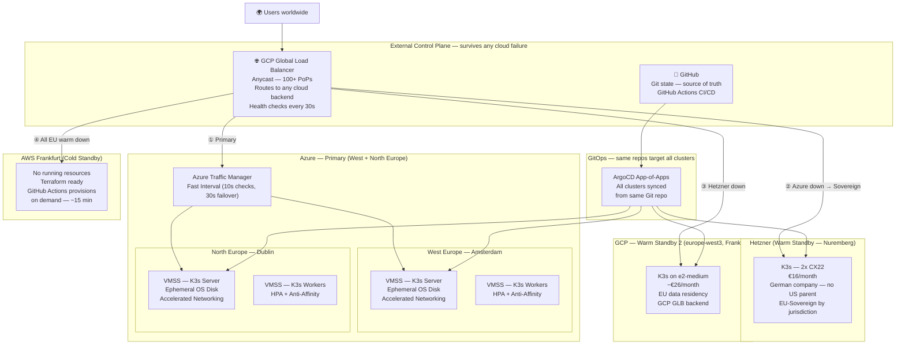

# cloud-native-ha-platform — Architecture

> **Portfolio project by Denis Riungu** — Production-grade, four-cloud Kubernetes platform
> with GitOps-driven deployment, automated failover, EU data sovereignty escape hatch,
> and unified OpenTelemetry observability. Built as a reference implementation of
> Platform Engineering and Sovereign Cloud patterns.
>
> *"Designed for two scenarios: the Crowdstrike incident (single hyperscaler failure) and
> the CLOUD Act scenario (US jurisdiction making a hyperscaler legally problematic for EU
> data). Either way, traffic reroutes automatically to EU-sovereign infrastructure."*

---

## For non-technical readers

Imagine your business runs on one electricity provider. If they have an outage, everything goes dark. Smart businesses have a backup generator — and the really smart ones have a backup generator from a different manufacturer, so a recall on one brand doesn't take down both.

This platform works the same way. Your application runs in Microsoft Azure. If Azure has a problem — whether it's a technical incident like the 2024 CrowdStrike outage that affected millions of computers, or a legal/political situation that makes storing European data on a US-owned cloud risky — the platform automatically moves traffic to a backup. The switch happens in under 60 seconds with no human action and no change to the application.

There are three backups in order:
1. **Second Azure region** (Dublin) — switches in 30 seconds if Amsterdam fails
2. **Hetzner** (a German cloud company) — switches in 60 seconds if all of Azure fails; Hetzner is important because it's a German company not subject to US law, which matters for EU data privacy
3. **Google Cloud** (Frankfurt) — a second warm backup for deeper failures
4. **Amazon AWS** (Frankfurt) — can be activated in 15 minutes as a last resort

Everything is managed from a single source of truth: a Git repository. When a developer makes a change, it automatically deploys to all environments. There are no manual steps, no "someone forgot to update the server." The platform tells you exactly what is running at all times and corrects itself if something drifts.

The monitoring system (Grafana/Uptime Kuma) provides a live dashboard showing which locations are healthy and how quickly the platform recovered from any incident — the MTTR (Mean Time To Recovery) number.

---

## Table of Contents

1. [Project Mission](#1-project-mission)
2. [Architecture Overview](#2-architecture-overview)
3. [Failure Layer Model](#3-failure-layer-model)
4. [Sovereign Cloud Design](#4-sovereign-cloud-design)
5. [CGI Challenge Project Scope](#5-cgi-challenge-project-scope) ← **deletable after Aug 22 presentation**
6. [Extra — Portfolio Extensions](#6-extra--portfolio-extensions)
7. [Technology Stack](#7-technology-stack)
8. [Cost Model](#8-cost-model)
9. [Decision Log](#9-decision-log)

---

## 1. Project Mission

Most cloud platforms are designed to survive one region failing.
This one is designed to survive two independent failure modes:

**The Crowdstrike scenario** — a software incident takes down a single hyperscaler entirely.
Traffic reroutes to a different cloud automatically. The platform never cares which
cloud is currently serving — it treats all four the same way.

**The CLOUD Act scenario** — US geopolitics make US-jurisdiction hyperscalers legally
problematic for EU data (Privacy Shield invalidation, executive orders, sanctions).
Traffic can be re-ordered in minutes to prefer EU-sovereign infrastructure (Hetzner,
GCP Frankfurt with EU data residency) over US-parent clouds (Azure, AWS) — without
changing a single line of application code.

The architecture separates three concerns that are usually tangled together:
- **Control plane** (DNS/routing, Git, CI) — lives outside any single cloud
- **Workload plane** (K8s clusters, apps) — distributed across four clouds
- **Data plane** (state, backups) — replicated to multiple storage providers

**The four clouds:**

| Cloud | Role | Jurisdiction | Monthly cost |
|---|---|---|---|
| Azure (West EU + North EU) | Primary — two regions | Microsoft (US), EU data residency | ~€80 |
| Hetzner (Nuremberg) | Warm standby 1 | German company, German DC, no US parent | €16 |
| GCP (europe-west3, Frankfurt) | Warm standby 2 | Google (US), EU data residency | ~€26 |
| AWS (eu-central-1, Frankfurt) | Cold standby | Amazon (US), EU data residency | €0 |

**The external routing layer** — GCP Global Load Balancer (Anycast, 100+ PoPs, routes to any backend regardless of cloud) OR Cloudflare Pro. Both are options; GCP GLB costs near zero at low traffic and earns GCP its place in the architecture as the Anycast entry point, not just another cluster.

When Azure goes dark: GCP GLB detects it in 30s, routes to Hetzner in 60s.
When Hetzner is also unavailable: GCP GLB routes to GCP Frankfurt (warm, already running).
When a sovereignty event occurs: one routing policy update switches preference to Hetzner → GCP → AWS → Azure.
When all EU options fail: GitHub Actions cold-starts AWS Frankfurt in ~15 minutes.

The only things that must survive everything: GitHub (not Azure-hosted) and the Anycast routing layer (GCP GLB — Google's network, independent of any single cloud's availability).

---

## 2. Architecture Overview



---

## 3. Failure Layer Model

This is the design thinking behind every architectural decision.

| Failure Scenario | What triggers it | Detection time | Recovery | MTTR |
|---|---|---|---|---|
| Single Azure VM dies | Hardware failure, OOM, crash | VMSS health probe ~30s | VMSS auto-replaces | ~2 min |
| Single Azure region fails | Datacenter, power, network | Traffic Manager Fast Interval ~30s | Reroutes to second Azure region | ~30s |
| All Azure fails (Crowdstrike scenario) | Software incident, Azure-wide outage | GCP GLB health check ~30s | Routes to Hetzner | ~60s |
| Hetzner also fails | Multi-provider incident | GCP GLB health check ~30s | Routes to GCP Frankfurt cluster | ~60s |
| All EU warm standby fails | Extreme multi-provider event | GCP GLB health check ~30s | GitHub Actions → AWS cold start | ~15 min |
| CLOUD Act / sovereignty trigger | Policy decision, manual or automated | Manual trigger or webhook | Routing policy reordered: Hetzner → GCP → AWS → Azure | ~5 min (policy update) |
| Git platform (GitHub) fails | GitHub outage | N/A — pause, not data loss | ArgoCD continues on last-synced state | 0 (no data loss) |
| GCP GLB (routing layer) fails | GCP global network incident | Browser DNS cache | Switch authoritative DNS to Cloudflare as backup | ~5 min manual |

**Physical geography and jurisdiction:**

| Site | Location | Jurisdiction | Cable / Grid | Sovereign? |
|---|---|---|---|---|
| Azure West Europe | Amsterdam, NL | Microsoft (US), EU data residency | AEConnect + FLAG Atlantic North | No — US parent |
| Azure North Europe | Dublin, IE | Microsoft (US), EU data residency | Separate Atlantic routes | No — US parent |
| Hetzner | Nuremberg, DE | German company, no US parent | Central EU backbone | **Yes — EU sovereign** |
| GCP europe-west3 | Frankfurt, DE | Google (US), EU data residency | Central EU backbone | Partial — US parent, EU data |
| AWS eu-central-1 | Frankfurt, DE | Amazon (US), EU data residency | Central EU backbone | No — US parent |
| GCP GLB routing layer | Anycast, 100+ PoPs | Google (US), distributed | Google's own network | Partial |

Dublin and Amsterdam are on physically separate submarine cable systems — this is why Azure chose them as a pair. Hetzner Nuremberg adds a third independent physical path on the Central EU backbone with a completely different corporate ownership chain. GCP Frankfurt is on the same physical grid as Hetzner but under a different company — useful as a second warm standby because the failure mode differs.

---

## 4. Sovereign Cloud Design

### The CLOUD Act problem for European enterprises

The US CLOUD Act (2018) requires US companies — Microsoft, Google, Amazon — to hand over
data stored anywhere in the world if a US court orders it. EU data residency guarantees
(Azure Germany, GCP Frankfurt, AWS Frankfurt) protect against accidental data crossing
borders but do **not** protect against a US government subpoena. The data centre is in
Germany; the company is American.

This is not theoretical. The EU-US Privacy Shield was invalidated in 2020 (Schrems II)
precisely because US surveillance law was incompatible with EU fundamental rights. A
similar challenge to the current Data Privacy Framework is already in progress.

Schwarz IT (Lidl/Kaufland parent, one of Europe's largest retailers) built **Stackit** —
their own sovereign cloud — specifically to address this. Stackit runs on OpenStack in
German data centres with no US parent company in the ownership chain. It is legally
impossible for a US court to subpoena data from Stackit because Stackit is a German company.

GAIA-X is the EU-level policy framework pushing the same direction: federated, sovereign,
interoperable cloud services subject only to EU law.

### The sovereignty escape hatch in this architecture

The platform has two routing modes, switchable in minutes without changing any application code:

**Normal mode** (performance-optimised):
```
GCP GLB → Azure (primary) → Hetzner (warm) → GCP Frankfurt (warm) → AWS (cold)
```

**Sovereignty mode** (EU-jurisdiction-first):
```
GCP GLB → Hetzner (primary — German company) → GCP Frankfurt (EU data residency) → AWS (EU data residency) → Azure (last resort)
```

Switching between modes is a single Cloudflare Load Balancing policy update or a GCP GLB
backend service priority change — approximately 5 minutes with the runbook.

### Hetzner as the sovereignty anchor

Hetzner is a German company (founded 1997, Gunzenhausen, Bavaria) with no US parent,
no US investors of significance, and no US government contracts. It is:
- ISO 27001 certified
- GDPR-compliant by default (German DPA supervision)
- **Not subject to the CLOUD Act** — a US court cannot compel Hetzner to hand over data

For European public sector clients, hospitals, financial institutions, and any company
handling GDPR-sensitive data, Hetzner in "sovereignty mode" provides a legally defensible
hosting arrangement that Azure, GCP, and AWS cannot match, regardless of their EU data
centre locations.

### The GCP angle for CGI

The CGI role was posted as GCP Cloud Engineer. The interviewers (Luca, Tim) are
Azure-focused — CGI's core practice. The architecture uses GCP in two ways:

1. **GCP Global Load Balancer as the Anycast routing layer** — earns GCP its place as the
   network-layer control plane. GCP GLB can route to Azure, Hetzner, or any backend
   regardless of cloud. This is a genuine GCP workload, not a token mention.

2. **GCP europe-west3 (Frankfurt) as warm standby 2** — K3s on Compute Engine e2-medium,
   managed by the same Ansible playbook and ArgoCD App-of-Apps as all other clusters.

This demonstrates GCP competence (GLB configuration, Compute Engine, Cloud DNS, IAM service
accounts) while keeping Azure as the primary — which is where CGI's existing practice lives.
The message: I can operate across both, and I designed the architecture to use each cloud
where it is strongest.

### Interview language for the sovereign cloud narrative

> "I designed this platform around two failure scenarios. The first is the Crowdstrike
> scenario — a hyperscaler software incident. The second is what I call the CLOUD Act
> scenario — US geopolitics making US-jurisdiction clouds legally problematic for EU data.
> The architecture handles both without touching the application. In sovereignty mode,
> traffic is automatically routed to Hetzner — a German company outside US jurisdiction —
> as the primary origin. This is the same reasoning behind Schwarz IT building Stackit and
> the broader GAIA-X initiative. European enterprises are not hypothetically concerned about
> this; they are actively building for it."

---

## 5. [CGI Challenge Project Scope]

> **This section is scoped to the CGI Cloud & DevOps Challenge (presented Aug 22, 2026).**
> **After the presentation, delete this section. The project continues as a portfolio piece.**
>
> Challenge brief: Deploy a containerised application to a Kubernetes cluster in two Azure
> regions with high availability, GitOps deployment, monitoring, backup, and DNS failover.

### Requirement 1 — Infrastructure Provisioning (Terraform + Ansible + cloud-init)

**Three clean layers — each does one thing:**

| Layer | Tool | What it provisions |
|---|---|---|
| Cloud resources | Terraform | Resource groups, VNets, VMSS, Traffic Manager, NSGs, Storage accounts, Managed Identity |
| OS configuration | Ansible | System packages, sysctl tuning, K3s install, firewall rules, node join token handoff |
| Bootstrap | cloud-init / Bash | One-time host prep: swap off, br_netfilter, ip_forward, hostnames |

**Hidden Azure gems used:**
- **Ephemeral OS Disks** — OS disk lives on VM local SSD, not managed disk. Boot 40% faster. Costs nothing extra. Most Terraform tutorials miss this.
- **Accelerated Networking** — bypass the hypervisor NIC stack, drop pod-to-pod latency by ~30%. One flag in Terraform: `enable_accelerated_networking = true`.
- **User-Assigned Managed Identity** — attached to VMSS, allows K3s nodes to pull images from ACR and read Key Vault secrets with zero credentials in code.
- **Remote Terraform state** — Azure Blob with lease-based locking. State never lives locally.

**Pre-commit hooks:** `tflint` + `checkov` block a `git push` if Terraform has lint errors or security misconfigurations.

### Requirement 2 — Kubernetes Deployment

**K3s** chosen over full K8s (kubeadm, AKS):
- Binary is 60MB, server starts in under 30 seconds
- Built-in Traefik ingress, CoreDNS, Flannel CNI — zero extra manifests to manage
- Identical on Azure, Hetzner, and AWS — same Ansible playbook targets all three
- K3s is what Rancher uses for production edge clusters

**ArgoCD App-of-Apps pattern:**
```
argocd/
  root-app.yaml           ← one Application that ArgoCD watches
  apps/
    hello-world.yaml      ← child Application
    monitoring.yaml       ← child Application (Prometheus + Grafana)
    uptime-kuma.yaml      ← child Application
    velero.yaml           ← child Application
    sealed-secrets.yaml   ← child Application
```
One `kubectl apply` of `root-app.yaml` bootstraps the entire cluster. Subsequent changes are Git commits — no manual Helm installs, no `kubectl apply` drift.

**Demo app:** NGINX hello-world with custom HTML showing region name, hostname, and timestamp. Proves which region is serving each request during the failover demo.

### Requirement 3 — High Availability

**Why pods don't all end up on one node by default — and how we fix it:**

Kubernetes scheduler places pods on any node with capacity. In a 2-node cluster, both replicas can land on node-1, leaving node-2 empty. One node failure takes everything down. Pod Anti-Affinity is the fix:

```yaml
affinity:
  podAntiAffinity:
    requiredDuringSchedulingIgnoredDuringExecution:
      - labelSelector:
          matchLabels:
            app: hello-world
        topologyKey: kubernetes.io/hostname
```

`required` (not `preferred`) means the scheduler will refuse to place a second pod on the same node. Guaranteed distribution.

**Pod Disruption Budget:**
```yaml
apiVersion: policy/v1
kind: PodDisruptionBudget
spec:
  minAvailable: 1
  selector:
    matchLabels:
      app: hello-world
```
Prevents `kubectl drain` (node maintenance, rolling VMSS update) from taking down the last pod. Zero-downtime guarantee during planned maintenance.

**HPA — Horizontal Pod Autoscaler:**
Scales hello-world from 2 to 10 replicas when CPU > 60%. k6 load test demonstrates this live during the presentation.

**VMSS auto-healing:**
Azure VMSS health probe pings port 80 every 30 seconds. Unhealthy VM is terminated and replaced automatically — no manual intervention, no pager alert needed.

### Requirement 4 — GitOps

**Flow:**
```
Developer pushes to main
    ↓
GitHub Actions CI: tflint + checkov + helm lint (2 min)
    ↓
ArgoCD detects divergence (polls every 3 min, or webhook push)
    ↓
ArgoCD syncs to both clusters (West EU + North EU)
    ↓
No manual kubectl. No SSH. No snowflake.
```

**Why GitOps reduces MTTR:**
When a node is lost and VMSS replaces it, the new node is bare. ArgoCD detects the pod count is wrong and re-deploys all apps within 3 minutes. The platform is self-healing not just at the VM level (VMSS) but at the application level (ArgoCD).

### Requirement 5 — Monitoring & Observability

**Stack: Prometheus + Grafana + Uptime Kuma + OTel Collector**

```
OTel Collector (DaemonSet — runs on every node)
  ↓ scrapes
All pods, node exporters, K3s metrics
  ↓ ships to
Prometheus (metrics) → Grafana dashboards
Loki (logs)          → Grafana log explorer
  ↓ alerting
Grafana Alerting → Slack / email
```

**Uptime Kuma** monitors:
- HTTP endpoint (both regions)
- Azure Traffic Manager DNS resolution
- Hetzner K3s endpoint (warm standby health)
- SSL certificate expiry
- VMSS node count

Uptime Kuma provides the MTTR visualization for the presentation — a clean status page showing when the region failed and when traffic restored.

**Azure Monitor (native, costs nothing extra):**
- VMSS activity logs → alert on scale events
- Azure Traffic Manager endpoint status → alert when a region is marked unhealthy
- Azure Blob (Velero destination) → alert on backup failures

### Requirement 6 — Backup & Recovery

**Velero** backs up all K8s resources and persistent volumes on a schedule:

```yaml
schedule: "0 * * * *"        # every hour
storageLocation: azure-blob   # primary
ttl: 720h                     # 30 days retention
```

**Multi-destination backup strategy:**
- **Primary:** Azure Blob (same subscription, fastest restore)
- **Secondary:** Hetzner Object Storage (survives Azure total failure)

Restore drill in the presentation:
1. Delete the hello-world namespace (`kubectl delete ns hello-world`)
2. `velero restore create --from-backup latest`
3. Show pods coming back within 90 seconds

### Requirement 7 — Security

| Control | Tool | What it does |
|---|---|---|
| Secret encryption | Sealed Secrets | Secrets encrypted with cluster public key, safe to commit to Git |
| Image vulnerability scanning | Trivy Operator | Scans every running image, fails builds with CRITICAL CVEs |
| No credentials in code | User-Assigned Managed Identity | Nodes authenticate to Azure services (ACR, Key Vault) without passwords |
| Network segmentation | NetworkPolicy | Default-deny, explicit allow rules between namespaces |
| Supply chain | tflint + checkov pre-commit | Blocks misconfigurations before they reach main |
| TLS everywhere | cert-manager + Let's Encrypt | Automatic certificate issuance and renewal |
| Resource tagging | Terraform | Every resource tagged: owner, environment, cost-center (FinOps) |

### Requirement 8 — DNS Failover Demo (live, with MTTR visualization)

**The demo flow for the presentation:**

```
1. Show both regions healthy in Uptime Kuma + Grafana
2. Run k6 load test → watch HPA scale pods live in K9s
3. Simulate West Europe failure:
   az vmss update -n k3s-west-eu --set virtualMachineProfile.networkProfile... [cut traffic]
   -- or -- block Traffic Manager health probe (NSG rule)
4. Uptime Kuma shows West EU goes RED within 10 seconds
5. Traffic Manager detects failure (Fast Interval: 30s)
6. Requests automatically hit North EU — Uptime Kuma shows full green
7. Point at MTTR: ~30 seconds, no human action required
8. Restore West EU — Traffic Manager re-adds it when health probe passes
```

**Azure Traffic Manager — Fast Interval explained:**
Default interval is 30s checks, 3 failures before remove = 90s MTTR. Fast Interval: 10s checks, 3 failures = 30s MTTR. Costs $1/month extra per endpoint. Worth every cent for the demo impact.

**K9s as the live demo navigator:**
K9s gives a real-time terminal UI showing pod distribution across nodes, HPA events, and resource pressure. During the presentation, switch between `k9s` and Grafana to show both the cluster view and the metrics view. Hiring managers who know Kubernetes will immediately recognise that you're comfortable in a live cluster, not reading from a script.

---

## 5. Extra — Portfolio Extensions

> **This section is Denis's own work — not scoped to any challenge.**
> **These are the ideas and findings that make this a permanent portfolio asset.**

### Multi-Hyperscaler HA — the full architecture

**The problem with single-hyperscaler "multi-region" HA:**

Azure Traffic Manager is DNS-based, but its DNS nameservers (`ns1-xx.azure-dns.com` etc.) run on Azure infrastructure. A Crowdstrike-style incident that freezes Azure's control plane can make Traffic Manager's DNS servers unreachable — even if the VMs themselves are fine. Single hyperscaler = single point of failure at the DNS layer.

**Cloudflare as the universal abstraction:**

Cloudflare's DNS runs on its own Anycast network (not Azure, not AWS, not GCP). Even if all three major hyperscalers simultaneously had incidents, Cloudflare would still be resolving DNS — because it has 300+ PoPs spread across every continent, running on its own backbone.

**The layered failover design:**

```
Layer 0: Cloudflare (external DNS authority + HTTP proxy)
         Health checks: poll all origin pools every 30s
         TTL: 30 seconds (near-instant DNS propagation)

Layer 1: Azure origin pool (primary)
         Azure Traffic Manager endpoint
         → West Europe K3s (active)
         → North Europe K3s (active, warm)
         Internal MTTR: ~30s (Traffic Manager Fast Interval)

Layer 2: Hetzner origin pool (secondary)
         2x CX22 in Nuremberg, K3s pre-installed
         ArgoCD synced to same Git repo — already up-to-date
         Cloudflare switches here when Azure origin is unhealthy
         MTTR from Azure failure: ~60s (30s Cloudflare detect + 30s DNS propagate)

Layer 3: AWS Frankfurt origin pool (cold standby)
         No running resources — zero cost until needed
         GitHub Actions workflow: terraform apply on trigger (~12 min)
         ArgoCD syncs immediately after cluster is up
         MTTR from Hetzner also failing: ~15 min
```

**Why Azure Load Balancer is not the right tool here:**
Azure Load Balancer (ALB) is Layer 4, operates within a single Azure region, and shares the failure domain of the VMs it serves. It goes dark with Azure. For cross-cloud failover, the control must be external: Cloudflare Load Balancing ($5/month on Pro plan) replaces ALB at the global layer and routes across providers.

**Cost of the complete multi-hyperscaler setup:**

| Component | Provider | Monthly cost |
|---|---|---|
| DNS authority + proxy + health checks | Cloudflare Pro | $25 |
| Primary: 2-region K3s (West + North EU) | Azure VMSS (min config) | ~€80 |
| Warm standby | Hetzner 2x CX22 | €16 |
| Cold standby | AWS (no running resources) | $0 |
| Backup storage | Azure Blob + Hetzner Object Storage | ~€5 |
| **Total** | | **~€125/month** |

Enterprise equivalent: $50,000/month on professional managed services. This does the same thing for €125.

**Extending to international (global users):**

For truly global reach beyond EU:

| Region | Provider | Cost | Role |
|---|---|---|---|
| EU | Azure West/North EU + Hetzner | ~€100 | Primary |
| US East | AWS us-east-1 (2x t3.medium) | ~$60 | Warm standby |
| US West | Fly.io (containers) | ~$10 | Static cache + health endpoint |
| APAC | Cloudflare Workers | $0 | Edge logic + caching |

Cloudflare Workers run JavaScript at the edge — they can handle static content, API routing decisions, and health-check logic globally for $0-5/month. Combined with origin clusters in EU and US, you have genuine multi-continent HA for under €200/month.

---

### Cluster API (CAPI) — provision clusters the GitOps way

Most teams use Terraform to provision clusters and Kubernetes to manage workloads. CAPI collapses those two into one: you provision Kubernetes clusters using Kubernetes CRDs, managed by a management cluster. Infrastructure-as-code becomes infrastructure-as-Kubernetes-objects.

Providers available:
- **CAPZ** — Azure (official, maintained by Microsoft)
- **CAPA** — AWS (official, maintained by AWS)
- **CAPH** — Hetzner (community, maintained by Syself, production-grade)

Example: to provision a K3s cluster on Hetzner, you `kubectl apply` a `HetznerCluster` CRD. CAPH calls the Hetzner API and builds the cluster. ArgoCD can manage the CAPI manifests — so your cluster provisioning is in Git alongside your application manifests.

**Why this matters for cross-cloud agility:** When Azure fails, you don't `terraform apply` a Hetzner cluster manually. The Hetzner cluster is already declared as a CRD in your management cluster. It was provisioned by CAPI when you first set up the platform. GitOps handles the rest.

---

### Liqo — workloads that migrate autonomously

Liqo creates a virtual flat cluster across multiple independent K8s clusters. When you mark a namespace as "offloadable," Liqo transparently moves pods to whichever cluster has available capacity — including across cloud providers.

**What it looks like in practice:**
- Azure cluster loses 2 of 3 nodes (VMSS replacement in progress)
- Liqo detects capacity is constrained
- Pod scheduler moves non-critical pods to the Hetzner cluster
- The application doesn't know. The user doesn't notice.
- VMSS replaces the nodes, Liqo moves pods back

No manual failover. No DNS change. No human action. The pods just follow capacity.

This is the pattern used by research computing clusters that need to burst across institutions — but it applies equally to cross-cloud resilience.

---

### Cilium Cluster Mesh — encrypted flat network across clouds

Cilium is the eBPF-based CNI that replaced Flannel in most production K8s clusters (it's now the default in EKS, GKE, and many AKS configs). Its Cluster Mesh feature connects independent clusters into a flat network using encrypted WireGuard tunnels.

**What this enables:**
- A pod in Hetzner calls `api.default.svc.cluster.local` — the DNS resolves to the Azure pod (or Hetzner pod, whichever is healthy)
- Services are visible across cluster boundaries without exposing them to the public internet
- NetworkPolicy spans clusters — security controls work across the mesh

**The eBPF angle:**
eBPF runs programs directly in the Linux kernel, bypassing iptables entirely. This gives Cilium:
- 40% lower network latency vs iptables-based CNIs
- Per-packet observability (Hubble UI shows real-time traffic flows)
- Runtime security with Tetragon (Cilium's eBPF-based runtime threat detection)

Cilium + Hubble + Tetragon is the full observability + security stack at the network layer. No agent injection, no sidecar, no performance overhead from a service mesh.

---

### OpenTelemetry — the observability standard replacing everything else

OpenTelemetry (OTel) is the CNCF standard for metrics, logs, and traces — a single collection pipeline that replaces Datadog agents, Prometheus exporters, and vendor-specific APM tools. Every major company is migrating to it.

**The LGTM stack (Grafana's open-source OTel backend):**
- **L**oki — logs
- **G**rafana — dashboards
- **T**empo — distributed traces
- **M**imir — long-term metrics storage (Prometheus-compatible)

Deploy the OTel Collector as a DaemonSet — it runs on every node, scrapes all pods' metrics, collects logs, and receives traces. Even an NGINX hello-world emits metrics the OTel Collector can scrape. The architecture is:

```
All pods → OTel Collector (DaemonSet)
               ↓              ↓             ↓
           Prometheus       Loki          Tempo
               ↓              ↓             ↓
                    Grafana (single pane of glass)
```

One Grafana dashboard shows CPU/memory, pod logs, and request traces — correlated by time. When something breaks, you see the trace (which request), the log (what the app said), and the metric (what the system looked like) — all in one place, at the same timestamp.

---

### ArgoCD App-of-Apps — the production GitOps pattern

The naive GitOps pattern: one ArgoCD Application per microservice. 20 services = 20 Applications to manage. The App-of-Apps pattern: one parent Application manages all child Applications. Bootstrap the entire cluster with a single `kubectl apply`:

```yaml
# root-app.yaml — the only thing you ever manually apply
apiVersion: argoproj.io/v1alpha1
kind: Application
metadata:
  name: root
spec:
  source:
    repoURL: https://github.com/your-org/cloud-native-ha-platform
    path: k8s/argocd/apps
  destination:
    server: https://kubernetes.default.svc
```

ArgoCD finds all YAML files in `k8s/argocd/apps/`, each of which is an Application pointing at a different part of the repo. Add a new service: add one YAML file, push to Git. ArgoCD deploys it. No manual Helm installs, no `kubectl apply` drift.

---

### Crossplane — infrastructure as Kubernetes CRDs

Where CAPI manages K8s clusters, Crossplane manages everything else: databases, storage buckets, DNS records, VMs. You `kubectl apply` a `RDSInstance` CRD and Crossplane calls the AWS API to create the RDS instance. The entire infrastructure state becomes Kubernetes objects — managed by the same GitOps loop as your applications.

**Why this is genuinely cutting-edge:**
Most teams have two separate worlds: Terraform for infra, Kubernetes for apps. Crossplane merges them. Your ArgoCD App-of-Apps can deploy both application manifests and infrastructure CRDs in the same sync. Infrastructure drift is detected by Kubernetes controllers, not by Terraform plan runs.

It's experimental for most teams but production-ready for teams building platform engineering practices. Having Crossplane manifests in this repo — even as stubs — signals awareness of where the industry is heading.

---

### .devcontainer — zero-setup developer experience

One JSON file that lets anyone fork this repo, open it in GitHub Codespaces or VS Code Dev Containers, and immediately have a complete environment:

```json
{
  "image": "mcr.microsoft.com/devcontainers/base:ubuntu",
  "features": {
    "ghcr.io/devcontainers/features/terraform:1": {},
    "ghcr.io/devcontainers/features/kubectl-helm-minikube:1": {},
    "ghcr.io/devcontainers/features/ansible:1": {},
    "ghcr.io/devcontainers/features/github-cli:1": {}
  },
  "postCreateCommand": "helm plugin install https://github.com/databus23/helm-diff"
}
```

K9s, k6, tflint, checkov — all pre-installed. No "but it works on my machine." Any recruiter who forks the repo gets a working environment in 3 minutes. This is what modern platform engineering teams expect.

---

### Sealed Secrets — the right way to GitOps secrets

The naive approach: base64-encode secrets and commit them. The wrong approach: exclude secrets from Git and manage them manually (now you have configuration drift). Sealed Secrets encrypts secrets with the cluster's public key — the `SealedSecret` CRD is safe to commit to a public repository. Only the cluster can decrypt it.

```bash
# Create a sealed secret
echo -n 'my-password' | kubectl create secret generic my-secret \
  --dry-run=client --from-file=password=/dev/stdin -o yaml | \
  kubeseal --format yaml > my-sealed-secret.yaml
# Commit my-sealed-secret.yaml to Git — it's encrypted, safe to push
```

The alternative (Vault, External Secrets Operator) is more powerful but adds operational complexity. Sealed Secrets is the right choice for a platform that should be simple to operate.

---

### Platform Engineering framing

The narrative that turns this from a "Kubernetes challenge" into a portfolio anchor:

> Platform Engineering is the discipline of building internal developer platforms — infrastructure abstractions that let developers ship code without managing Kubernetes, Terraform, or cloud APIs directly. This repo is a reference implementation: commit code, GitOps deploys it. No manual kubectl. No SSH. No snowflake. The platform self-heals at every layer (VM via VMSS, pod via ArgoCD, region via Traffic Manager, cloud via Cloudflare).

This framing resonates at the Principal Engineer and Engineering Manager level — the people who make hiring decisions. They're not looking for someone who knows `kubectl get pods`. They're looking for someone who thinks about the platform their team builds on.

---

## 6. Technology Stack

| Layer | Tool | Role |
|---|---|---|
| DNS + Global proxy | Cloudflare Pro | External DNS authority, health checks, CDN, DDoS |
| IaC — cloud resources | Terraform | VMSS, VNets, Traffic Manager, Storage, Identity |
| IaC — OS config | Ansible | K3s install, sysctl, firewall, join token |
| IaC — bootstrap | cloud-init / Bash | OS prep: swap off, kernel modules, hostname |
| Container orchestration | K3s | Lightweight K8s on Azure, Hetzner, AWS |
| GitOps | ArgoCD (App-of-Apps) | Continuous sync from Git to all clusters |
| CI/CD | GitHub Actions | Lint, validate, helm diff, release |
| Observability | OTel Collector + Prometheus + Loki + Grafana | Unified metrics, logs, traces |
| Uptime monitoring | Uptime Kuma | HTTP + DNS monitoring, MTTR visualization |
| Backup | Velero | K8s state + PV backup to Azure Blob + Hetzner Object |
| Security — secrets | Sealed Secrets | Encrypted secrets safe to commit to Git |
| Security — images | Trivy Operator | CVE scanning, policy enforcement |
| Security — identity | User-Assigned Managed Identity | Zero credentials in code |
| Network policy | K3s built-in + Cilium (extra) | Default-deny, explicit allow |
| Cluster mesh (extra) | Cilium Cluster Mesh | Encrypted cross-cloud flat network |
| Cluster provisioning (extra) | Cluster API (CAPI) | GitOps-driven cluster lifecycle management |
| Pod migration (extra) | Liqo | Autonomous cross-cluster workload offloading |
| Infra CRDs (extra) | Crossplane | Cloud resources as Kubernetes objects |
| Demo navigation | K9s | Real-time cluster terminal UI |
| Load testing | k6 | HPA demo, MTTR measurement |
| Pre-commit quality | tflint + checkov | Block misconfigs before they reach main |

---

## 7. Cost Model

### Zero-spend demo mode (CGI presentation constraint)

Luca explicitly asked not to spend money. The CGI scope runs on near-zero cost:

| Resource | Config | Cost strategy |
|---|---|---|
| Azure VMSS — West EU | Standard_B2s (2 vCPU, 4GB) | **Stop VMs when not demoing.** No compute charge for stopped VMs. ~€28/month if running 24/7, ~€2 if stopped except demo day. |
| Azure VMSS — North EU | Standard_B2s | Same stop/start approach |
| Azure Traffic Manager | Fast Interval, 2 endpoints | ~$0.54/month — effectively free |
| Azure Blob (state + Velero) | LRS, minimal size | ~€0.50/month |
| All software (K3s, ArgoCD, Prometheus, Grafana, Velero, Sealed Secrets, Trivy) | Open source | €0 |
| **Total — CGI demo (VMs stopped)** | | **~€3/month** |
| **Total — CGI demo (VMs running 24/7)** | | **~€57/month** |

**Stop/start pattern from CloudCommerce project:** VMs stopped between sessions, Elastic/static IPs keep SSH config and kubeconfig valid. Same approach used there — proven to work.

**Multi-cloud extras — designed but not running for CGI:**
Hetzner, GCP Frankfurt, AWS Frankfurt are coded and Terraform-ready but **not provisioned** during the presentation. This is intentional and is itself a FinOps demonstration:

> "I've designed and coded for four clouds. For this demo I'm running only what the
> challenge requires, at near-zero cost. If you want to see Hetzner or GCP come online,
> I can run terraform apply right now — it takes about 12 minutes."

That answer is more impressive than having everything running and burning money.

### Full four-cloud sovereign stack (portfolio target — post-presentation)

| Component | Provider | Jurisdiction | Monthly cost |
|---|---|---|---|
| Azure Traffic Manager (routing layer) | Azure | Microsoft (US) | ~$0.54 |
| Azure — 2 regions (Standard_B2s) | Azure VMSS | Microsoft (US) | ~€56 |
| Hetzner warm standby 1 — EU sovereign | 2x CX11 (€3.79 each) | German company | €8 |
| GCP europe-west3 warm standby 2 | 2x e2-micro ($4.40 each) | Google (US) | ~€8 |
| AWS cold standby | No running resources | Amazon (US) | €0 |
| Backup — Azure Blob (primary) | Azure | Microsoft (US) | ~€1 |
| Backup — Hetzner Object Storage | Hetzner | German company | €1 |
| **Total — four-cloud sovereign** | | | **~€75/month** |

*Note: GCP GLB at $18/month minimum is excluded — Azure Traffic Manager handles routing for €0.54/month. GCP GLB is documented as an architecture option for organisations with higher traffic where the per-request cost beats the flat Traffic Manager fee.*

**The FinOps argument:** Enterprise equivalent (AKS managed, Datadog, managed backup) costs €2,000–5,000/month. This delivers the same resilience for €75/month by using K3s (no control plane fee), B2s/CX11/e2-micro (smallest viable nodes), and open-source observability.

---

## 8. Decision Log

| Decision | Chosen | Rejected | Reason |
|---|---|---|---|
| K8s distribution | K3s | AKS, kubeadm | AKS adds control plane cost + vendor lock-in. K3s runs identically on Azure, Hetzner, AWS — same Ansible playbook. |
| GitOps tool | ArgoCD | Flux CD | ArgoCD has a better UI for demos. Flux is more lightweight for CI integration. Either is valid; ArgoCD wins for presentation visibility. |
| DNS authority | Cloudflare | Azure DNS, Route 53 | Both Azure DNS and Route 53 are single-hyperscaler. Cloudflare is external — survives any cloud failure. |
| Warm standby cloud | Hetzner | Second AWS region | Hetzner CX22 = €8/node/month. AWS t3.medium = $35/node/month. Same resilience, 4x cheaper. CAPH means Hetzner clusters are first-class CAPI targets. |
| Secret management | Sealed Secrets | Vault, ESO | Vault adds operational complexity (HA Vault cluster, unsealing). ESO requires external secret store. Sealed Secrets is self-contained, Git-native, sufficient for this scope. |
| Monitoring | OTel Collector + Grafana stack | Datadog, New Relic | Cost: Datadog = $23/host/month. Grafana OSS = €0. OpenTelemetry is the vendor-neutral standard — not locked to any paid APM. |
| CNI | Flannel (K3s default) → Cilium (extra) | Calico, Weave | Flannel works out of the box with K3s. Cilium is the upgrade path for eBPF performance, Hubble observability, and Cluster Mesh cross-cloud networking. |
| IaC layers | Terraform + Ansible + cloud-init | Terraform alone, Pulumi | Terraform provisions cloud resources. Ansible configures OS. cloud-init does one-time host bootstrap. Three tools, three concerns, clean separation. |
