# cloud-native-ha-platform

**By Denis Riungu**

## What this is

My submission for CGI's Cloud & DevOps Challenge is a Kubernetes platform,
built entirely through code, that survives real failures: a server dying,
a cluster going down, a whole region becoming unreachable.

There are two identical Kubernetes clusters, one in Azure West Europe and
one in Germany West Central, provisioned with Terraform and configured
with Ansible. A small web app runs on both, spread across multiple
servers so losing one never takes it down. If a whole region fails,
traffic moves to the other one automatically. Beyond what the challenge
asks for, there are two extras: the same automation pattern applied to a
Google Cloud server, and a GitOps pipeline so deployments happen by
pushing to Git instead of running commands by hand.

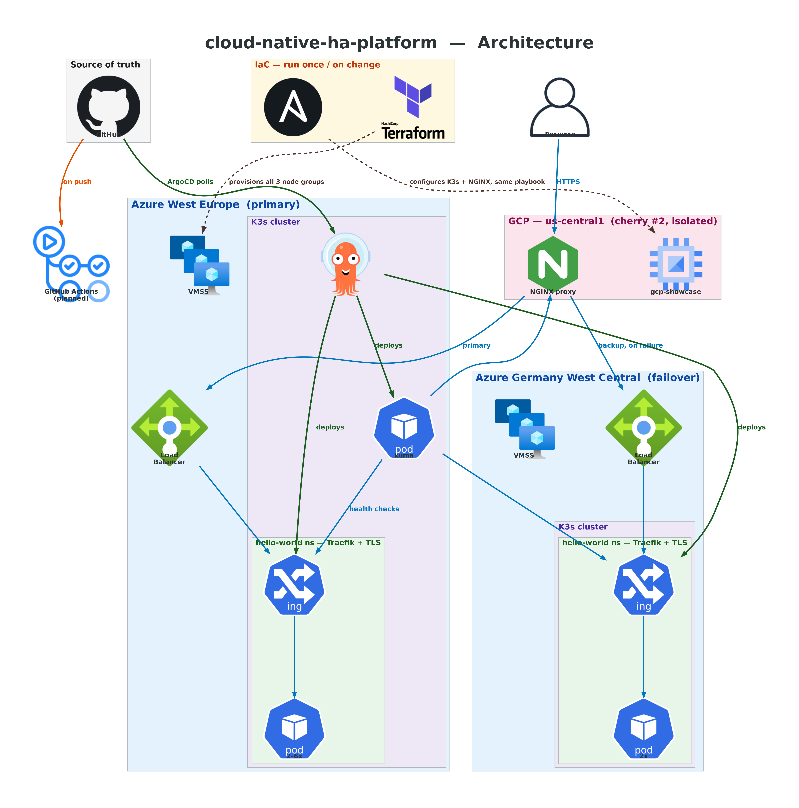
*Above: Green arrows are GitOps (ArgoCD pulling from Git). Blue is real traffic.
Dashed brown is one-time infrastructure provisioning. GitHub Actions is
shown as planned, not yet built.*

## The build pipeline: scaffold and commands together

The diagram above shows what talks to what while the platform is
*running*. This one shows how it gets *built*: which command triggers
which real file, and what that command hands off to the next stage.

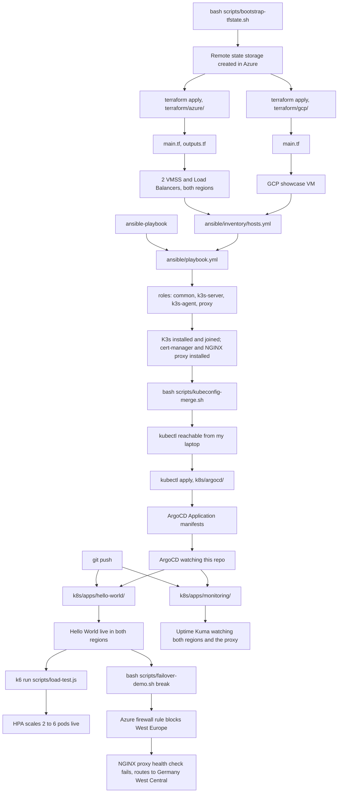
```mermaid
flowchart TD
    CMD0["bash scripts/bootstrap-tfstate.sh"] --> OUT0["Remote state storage created in Azure"]

    OUT0 --> CMD1["terraform apply, terraform/azure/"]
    CMD1 --> TFAZ["main.tf, outputs.tf"]
    TFAZ --> OUT1["2 VMSS and Load Balancers, both regions"]

    OUT0 --> CMD2["terraform apply, terraform/gcp/"]
    CMD2 --> TFGCP["main.tf"]
    TFGCP --> OUT2["GCP showcase VM"]

    OUT1 --> A1["ansible/inventory/hosts.yml"]
    OUT2 --> A1
    CMD3["ansible-playbook"] --> A2["ansible/playbook.yml"]
    A1 --> A2
    A2 --> A3["roles: common, k3s-server, k3s-agent, proxy"]
    A3 --> OUT3["K3s installed and joined; cert-manager and NGINX proxy installed"]

    OUT3 --> CMD3b["bash scripts/kubeconfig-merge.sh"]
    CMD3b --> OUT3b["kubectl reachable from my laptop"]

    OUT3b --> CMD4["kubectl apply, k8s/argocd/"]
    CMD4 --> K1["ArgoCD Application manifests"]
    K1 --> OUT4["ArgoCD watching this repo"]

    CMD5["git push"] --> K2["k8s/apps/hello-world/"]
    CMD5 --> K3["k8s/apps/monitoring/"]
    OUT4 --> K2
    OUT4 --> K3
    K2 --> OUT5["Hello World live in both regions"]
    K3 --> OUT5b["Uptime Kuma watching both regions and the proxy"]

    OUT5 --> CMD6a["k6 run scripts/load-test.js"]
    CMD6a --> OUT6a["HPA scales 2 to 6 pods live"]

    OUT5 --> CMD6b["bash scripts/failover-demo.sh break"]
    CMD6b --> OUT6b["Azure firewall rule blocks West Europe"]
    OUT6b --> OUT7["NGINX proxy health check fails, routes to Germany West Central"]
```

*Each command leads into the real file it touches, then into what that
step produces, feeding the next command. The last two branches, `k6` and
the failover script, are live demos rather than one-time build steps.
Both can be run again at any time against the already-built platform.*

## The trade-offs behind this architecture

Every major decision here came from a real constraint, not a preference.
Worth stating plainly, up front:

- **Self-managed K3s on plain VMs, not AKS (Azure's managed Kubernetes).**
  Requirement 8 was planned as a live demo: actually running `tcpdump`
  and inspecting firewall rules on a real node in front of the panel, not
  just describing it. AKS worker nodes don't get a public IP by default,
  so there's no direct network path to SSH into one. Reaching one
  normally needs a bastion host, a VPN, or Microsoft's own `kubectl debug
  node` command instead of a plain SSH session. A plain VM gives that
  access directly, with no extra infrastructure to set up mid-demo.
- **A self-hosted NGINX proxy, not Azure Traffic Manager.** Traffic
  Manager isn't free. It has a base monthly cost plus per-query charges,
  for as long as it exists. The brief's own rule is zero money spent on
  infrastructure, and it explicitly names a self-hosted proxy as an
  equally valid option to a managed traffic-routing service.
- **`Standard_D2s_v3` VMs, not the cheaper `Standard_B2s`.** Not a
  choice: `B2s` had zero available capacity on this subscription,
  confirmed directly against Azure's own SKU catalog. `D2s_v3` costs
  2.5x more per hour, verified against Azure's real pricing, and it's
  the reason Azure isn't quite at zero cost the way GCP is.
- **Self-signed certificates, not a public CA.** The brief explicitly
  accepts either, and a public certificate would need a real registered
  domain, which the brief's own "no domain" rule rules out entirely.
- **One GCP VM as a separate showcase, not part of the graded failover
  path.** Keeps the one component outside Azure isolated from the actual
  HA (High Availability) demo, so a problem with it can never break
  Requirement 5's live proof.

Full detail on each of these, including the real incidents that forced
some of them, lives in the requirement pages linked below.

## Map: jump straight to what you need

**Checking a claim against CGI's actual wording?** [CGI-Challenge-Brief.md](CGI-Challenge-Brief.md)
has the original brief, requirement by requirement, exactly as CGI sent
it. Every page below links straight to its own section of it.

**If you only read one thing, read this:** the live failover demo under
Requirement 5. A real region is simulated as down, and the recovery is
watched happening automatically across a browser, an independent
monitoring dashboard, and a raw command line, all at the same time.

Every requirement below is its own short, self-contained page: what was
built, the live evidence, and the real incidents hit along the way,
clearly separated.

| # | What was asked | What I built, in one line | Full detail |
|---|---|---|---|
| 1 | Kubernetes cluster, built through code | 2 independent clusters, Terraform + Ansible, verified live | [`requirement-1-kubernetes-cluster.md`](requirement-1-kubernetes-cluster.md) |
| 2 | "Hello World," reachable in a browser | Deployed by GitOps: pushing to Git is the deploy | [`requirement-2-hello-world.md`](requirement-2-hello-world.md) |
| 3 | Round-robin traffic + autoscaling under load | 2 to 6 pods live under real load, round-robin proven at the same time | [`requirement-3-autoscaling-roundrobin.md`](requirement-3-autoscaling-roundrobin.md) |
| 4 | Ingress with a valid TLS certificate | Traefik + cert-manager, self-signed, auto-issued | [`requirement-4-ingress-tls.md`](requirement-4-ingress-tls.md) |
| 5 | Multi-region HA with automatic failover | A second cluster + self-hosted proxy, live failover demo | [`requirement-5-multi-region-ha.md`](requirement-5-multi-region-ha.md) |
| 6 | Monitoring concept | Two-layer approach, plus a live dashboard | [`requirement-6-monitoring-concept.md`](requirement-6-monitoring-concept.md) |
| 7 | Backup & recovery concept | Two scenarios, backed by a real measured incident | [`requirement-7-backup-recovery-concept.md`](requirement-7-backup-recovery-concept.md) |
| 8 | DNS debugging methodology | TCP/IP-model-framed, real commands, real evidence | [`requirement-8-dns-debug-runbook.md`](requirement-8-dns-debug-runbook.md) |

**Beyond the 8 requirements:** [The GCP showcase (cherry #2)](#the-gcp-showcase-cherry-2), [checking the cost claim, not just asserting it](#checking-the-cost-claim-not-just-asserting-it), and [screenshots](#screenshots).

**Real incidents hit and fixed during the build.** Worth knowing these
exist on their own, since they're some of the strongest evidence this
was actually built and debugged, not just described:

| Incident | What happened | Where |
|---|---|---|
| The wrong certificate | Browser showed Traefik's default cert, not the real one, from a `TLSStore` misconfiguration | [`requirement-4-ingress-tls.md`](requirement-4-ingress-tls.md) |
| GCP OAuth scope + severe I/O wait | `gcloud` silently granted the wrong scope; the Always Free tier's disk caused 91.8% I/O wait | [The GCP showcase](#the-gcp-showcase-cherry-2) |
| The six-hour proxy install saga | A stuck update-checker, then duplicate `ansible-playbook` runs fighting over the same lock | [`requirement-5-multi-region-ha.md`](requirement-5-multi-region-ha.md) |
| The NSG priority rejection | The failover script used an invalid Azure priority value, 90, below the allowed minimum | [`requirement-5-multi-region-ha.md`](requirement-5-multi-region-ha.md) |
| The pod-scheduling deadlock | A hard anti-affinity rule and a mismatched autoscaler limit left a pod permanently stuck | [`requirement-3-autoscaling-roundrobin.md`](requirement-3-autoscaling-roundrobin.md) |
| The B2s capacity limit | The cheaper VM size had zero available capacity, forcing a 2.5x costlier fallback | [Checking the cost claim](#checking-the-cost-claim-not-just-asserting-it) |

## Keeping this project isolated from everything else

CGI's own challenge brief offers a sandbox Azure environment on request,
but there wasn't time to wait on that request inside a tight four-day
window. Instead, I provisioned my own equivalent sandbox before touching
any real infrastructure:

- **Two accounts, split by role.** The root account only ever acted as
  the administrator that set the boundary up once. A second,
  deliberately limited identity, `CGI Challenge Sandbox`, does all of
  the actual build work from there on.
- **A hard boundary around the project.** The sandbox identity's access
  is restricted to exactly the two resource groups this project uses, so
  the project can never accidentally reach, or be reached by, anything
  else already in the same account.
- **No standing permission to expand its own access.** The sandbox
  identity holds only the specific permissions it needs to do its job,
  not the ability to grant itself, or anyone else, more.

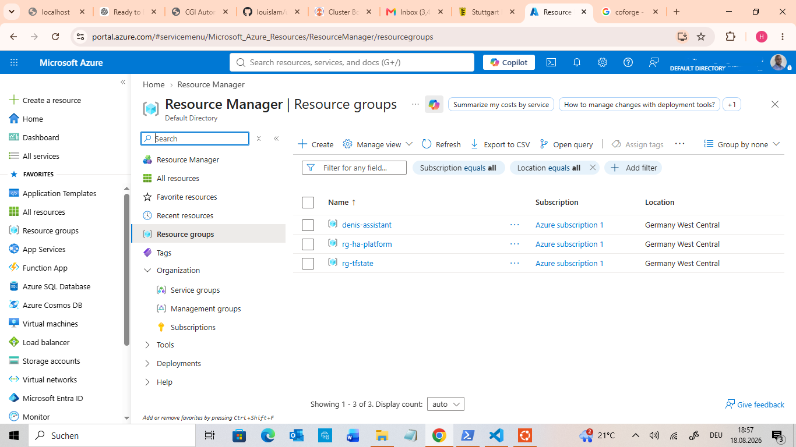
*Above: The two resource groups this project owns, sitting alongside an
unrelated resource group already in the account: proof this project has
its own clean space, not a shared one.*

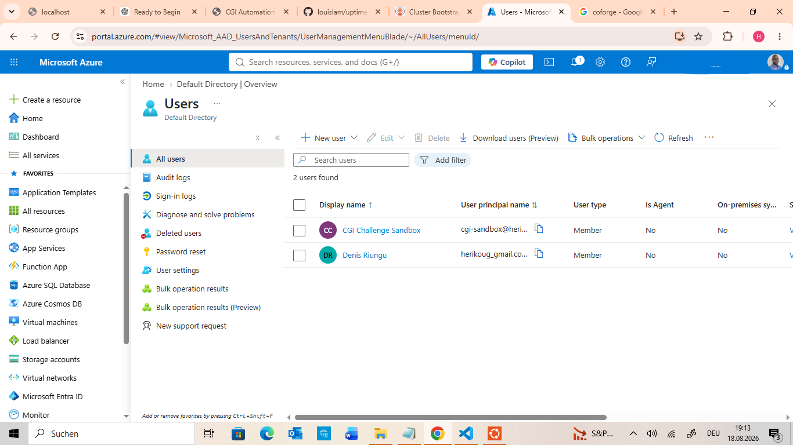
*Above: Two separate identities in the same account: the administrator account
that set everything up, and the sandbox identity that actually builds
the challenge.*

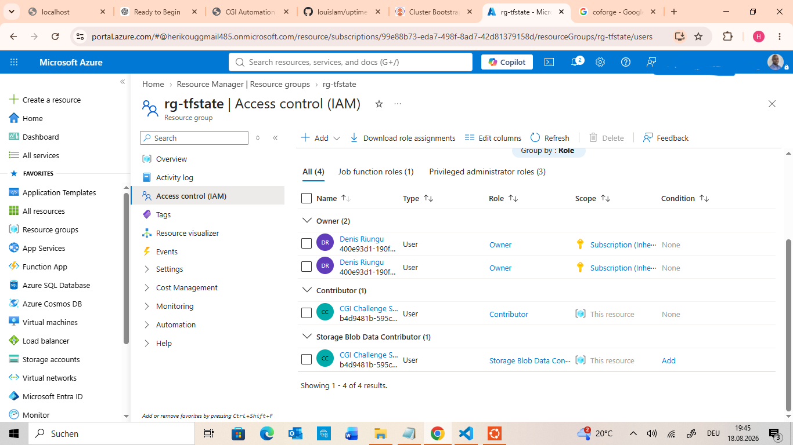
*Above: The actual access breakdown on the Terraform state resource group: the
administrator holds full ownership, while the sandbox identity holds
only the specific permissions it needs to do its job, with no permission
to grant access to anyone else, including itself.*

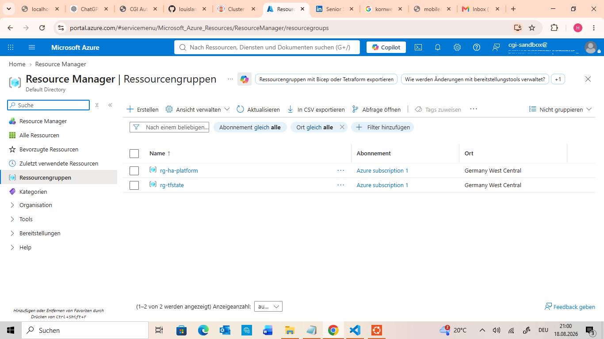
*Above: Signed in as the sandbox identity itself, this is the whole world it
can see: exactly the two resource groups this project owns, and nothing
else.*

One consequence of creating these resource groups by hand, before
Terraform ever ran: Terraform didn't know they already existed, and
refused to quietly create a duplicate on top of them. That's the
correct, safe behavior. The fix was `terraform import`, a standard way
to bring an already-existing resource under Terraform's management
instead of recreating it. Worth knowing that a resource group's own
region is just metadata about where its record lives. It doesn't
control where the resources inside it actually get created, so this had
no effect on the real regional design (see the requirement pages for how
that design itself later changed).

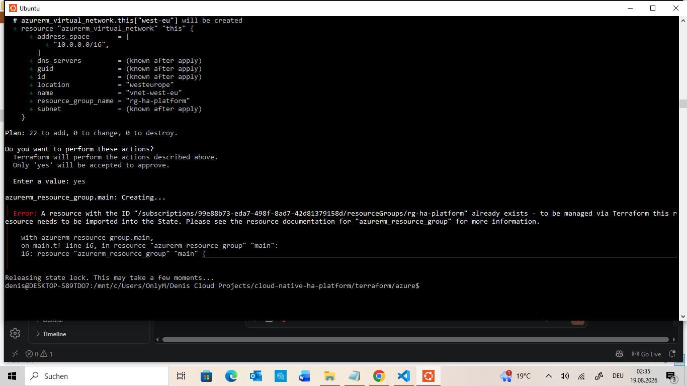
*Above: Terraform noticing the resource group already exists and stopping,
rather than silently creating a conflicting duplicate.*

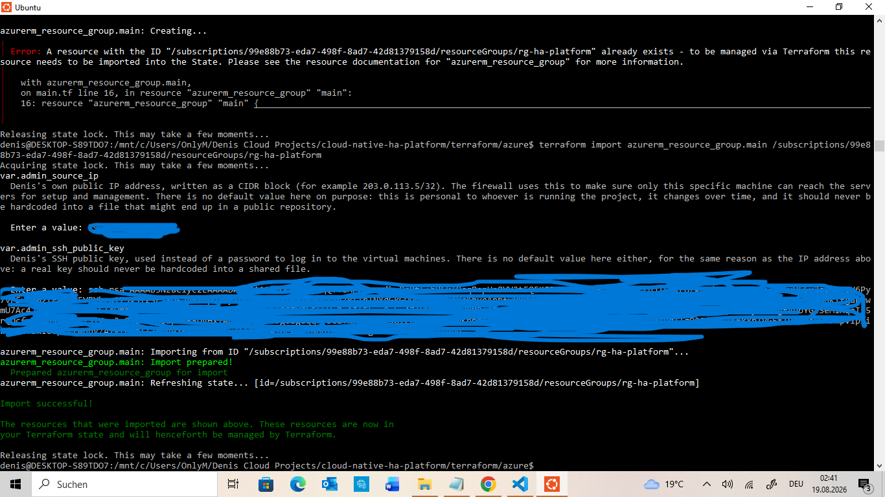
*Above: The fix: bringing the existing resource group under Terraform's
management with `terraform import`, rather than recreating it. Personal
details in the scrollback, IP address and SSH key, are manually blacked
out.*

**Everything past this point, installing Kubernetes, deploying Hello
World through GitOps, the autoscaling demo, the TLS certificate, and the
multi-region failover, lives in its own page.** See the
[Map](#map-jump-straight-to-what-you-need) above for Requirements 1
through 5, each with its own live evidence and its own incidents. What
follows here is everything the Map doesn't cover: the GCP showcase, the
real cost numbers, and one long debugging story.

### The GCP showcase (cherry #2)

GCP (Google Cloud Platform) is the one deliberate differentiator tied
directly to the actual job title this project was written for. The
point being proven is that the same Terraform and Ansible pattern works
identically on a completely different cloud provider, not that a third
region joins the failover story. This VM never runs Hello World and is
never a failover target. It's its own separate showcase, and it also
ends up hosting Requirement 5's proxy as an independent process. See
[requirement-5-multi-region-ha.md](requirement-5-multi-region-ha.md) for
why the proxy has to live outside both Azure regions to do its job.

**Getting the account itself set up** took its own sequence: a fresh GCP
project, isolated from an existing unrelated project already on the same
account (the same reasoning as the separate Azure sandbox identity), the
Compute Engine API enabled, and a billing account linked. That last part
is required by Google even to stay entirely within the Always Free tier;
it's not itself a sign of anything being charged.

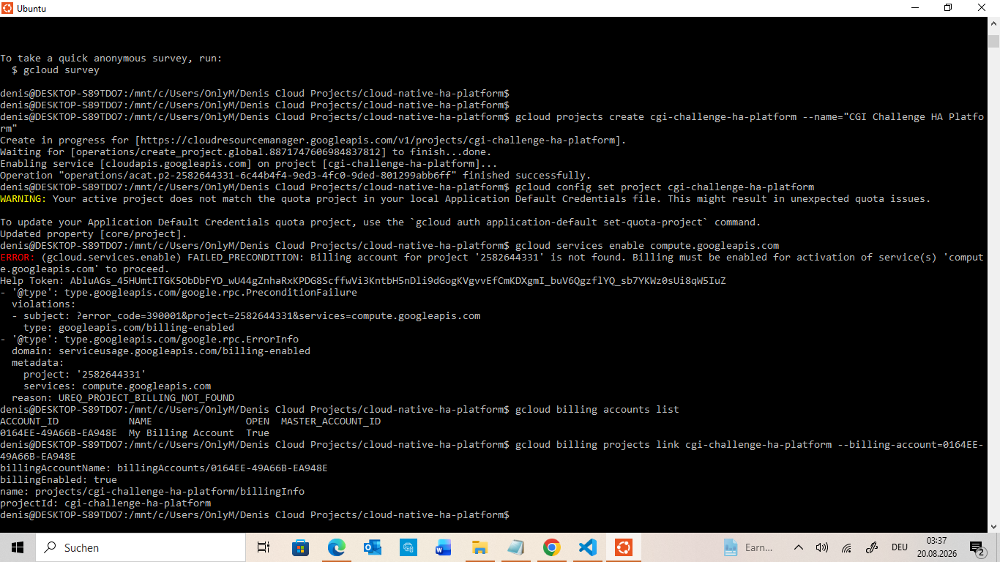
*Above: A dedicated project, isolated from other work on the same account, with
billing linked, required before Google allows almost anything, free
tier or not.*

**Authenticating Terraform to actually use the account** turned out to
be the first real snag. `gcloud auth application-default login` kept
completing "successfully" while quietly granting a narrower permission
scope than requested. That was only confirmed once an actual `terraform
apply` failed on it directly:

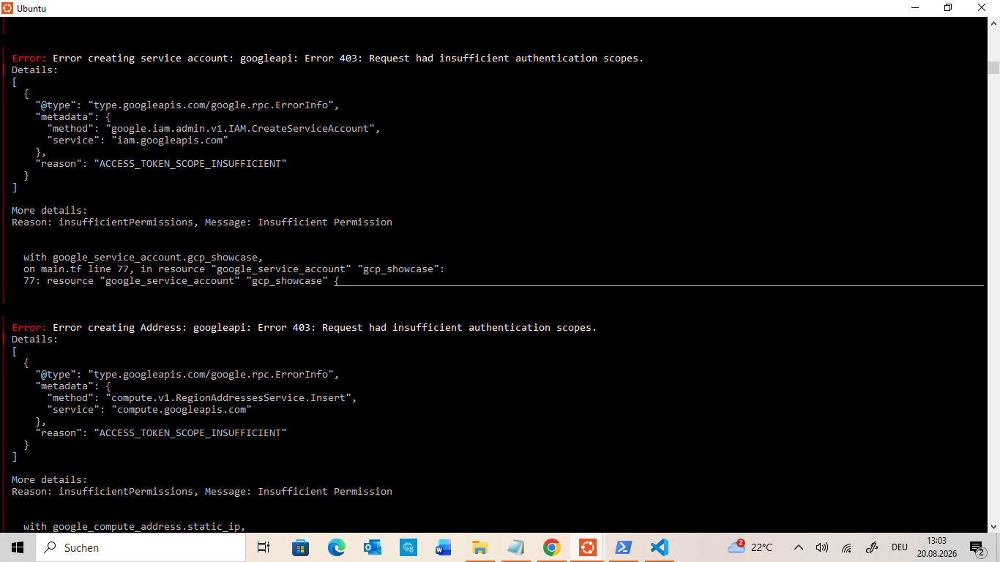
*Above: `ACCESS_TOKEN_SCOPE_INSUFFICIENT`. The credential file existed and
looked valid, but didn't actually carry the permission Terraform needed
to create anything.*

The fix was requesting exactly one scope explicitly, `cloud-platform`,
instead of the default bundle of several, which stopped Google's
consent screen from silently narrowing what got granted. Once that was
sorted, the same remote state backend already built for Azure could
just be reused. A different `key`, the filename within that same
storage account, keeps this project's state separate from Azure's,
without needing an entirely separate GCP-native backend just for one
small VM.

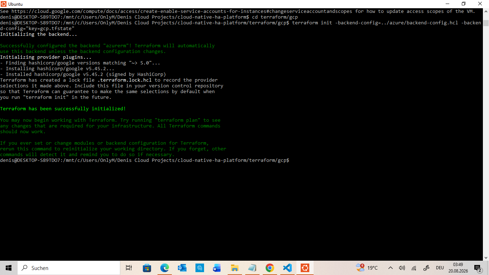
*Above: Same Azure storage account, same backend, a different key: no reason
to build a second one just because the resources being tracked happen
to be on a different cloud.*

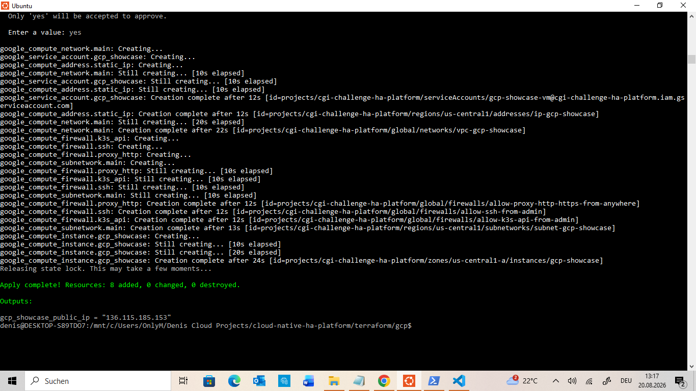
*Above: Network, firewall rules, a dedicated identity with no key file, a
static IP, and the VM itself, all live.*

**Then Ansible, same roles, unmodified:**

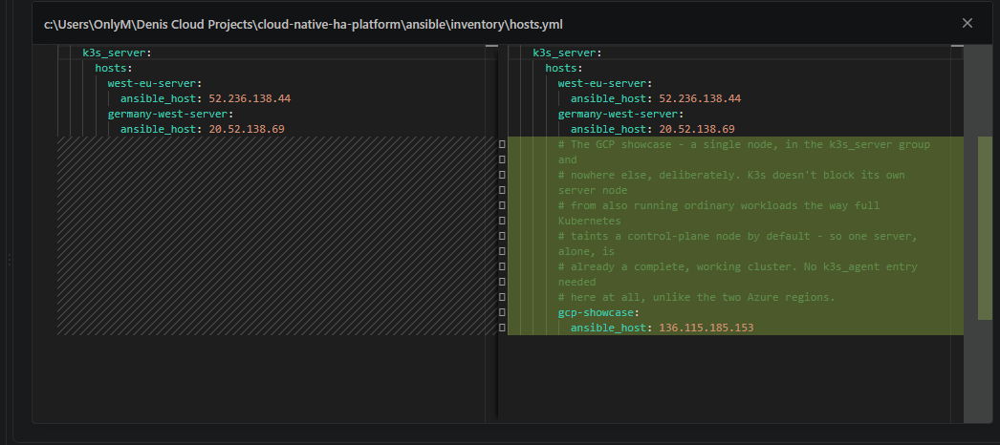
*Above: One new entry, in the same `k3s_server` group as both Azure regions. A
single K3s server is already a complete cluster on its own, so no
worker node was needed.*

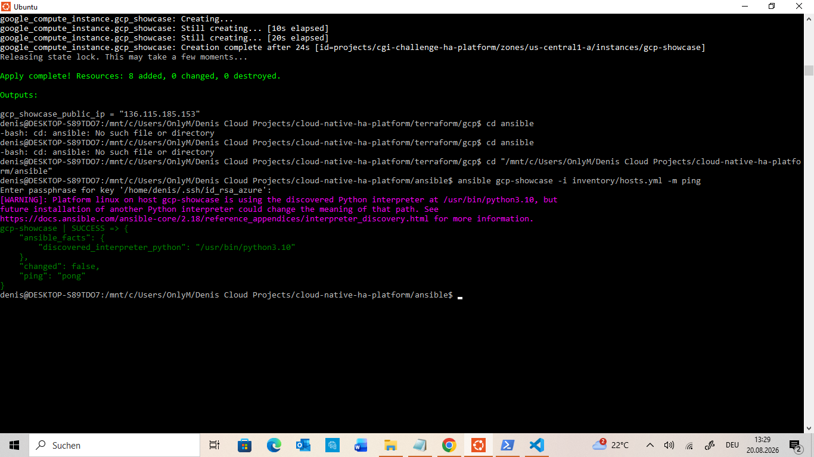
*Above: Confirming SSH actually works, before touching anything else.*

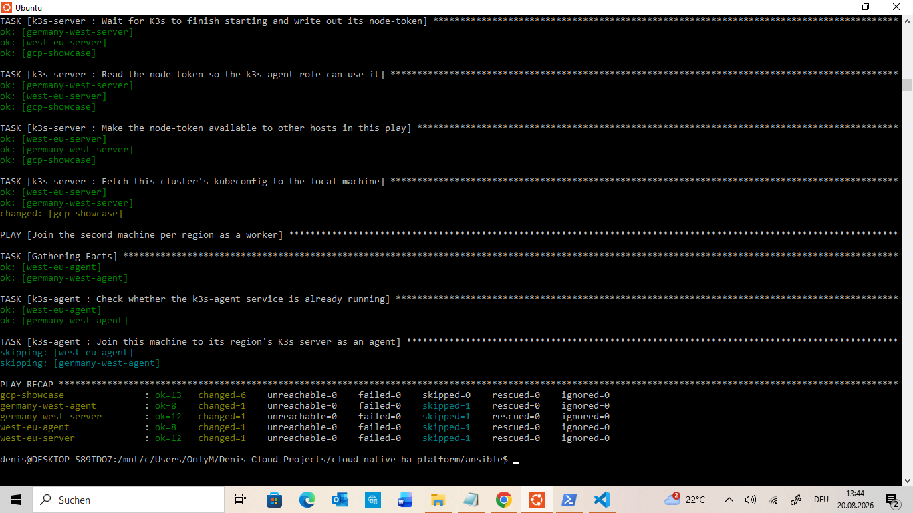
*Above: The same `common` and `k3s-server` roles already proven on Azure,
pointed at a different cloud's API entirely, with zero GCP-specific
code in either role.*

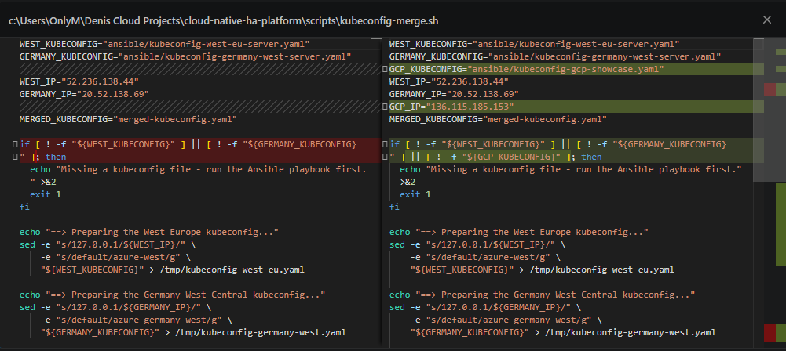
*Above: Same script, same reasoning, one more region added to what it merges.*

**Then the second real incident.** `kubectl` against the new cluster
failed with a TLS handshake timeout, a different and more interesting
problem than a firewall block (already ruled out, since the IP matched
and a raw TCP connection to the port succeeded). The actual cause was
visible directly in K3s's own logs on the node:

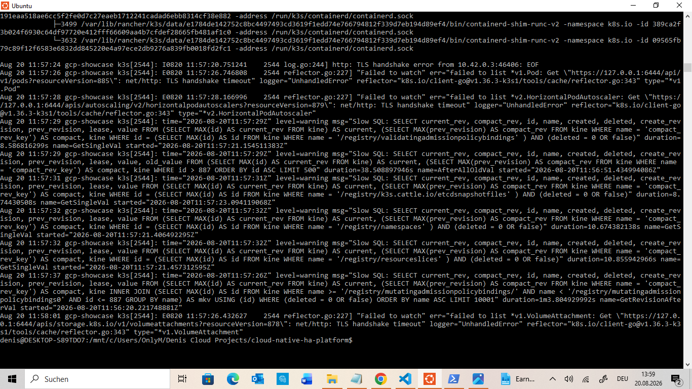
*Above: Database queries that should take milliseconds were taking 8, 38, even
over 60 seconds. K3s's own components were failing to reach K3s's own
API in time, which is exactly why a request from outside also timed
out.*

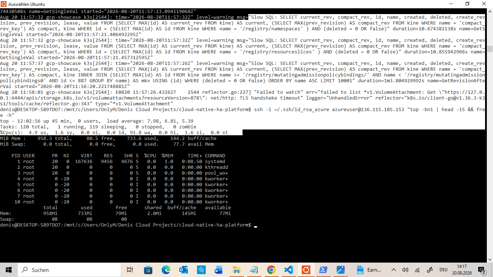
*Above: Not a CPU or memory problem: `%wa` (I/O wait) confirms the disk itself
was the bottleneck.*

The root cause: the Always Free tier's storage allowance is specifically
standard, spinning-disk (HDD) persistent disk, confirmed directly from
Google's own documentation before considering any fix, since switching
to faster storage would have introduced real, ongoing cost. K3s's
internal datastore does frequent small writes, which is a poor fit for
that specific kind of disk, and every extra default component (Traefik,
K3s's built-in ServiceLB) added its own constant reconciliation traffic
on top of an already-struggling disk. Neither is needed here, since this
showcase never runs an app requiring an ingress controller or a
LoadBalancer Service, so both got disabled specifically for this one
node, and K3s was cleanly reinstalled.

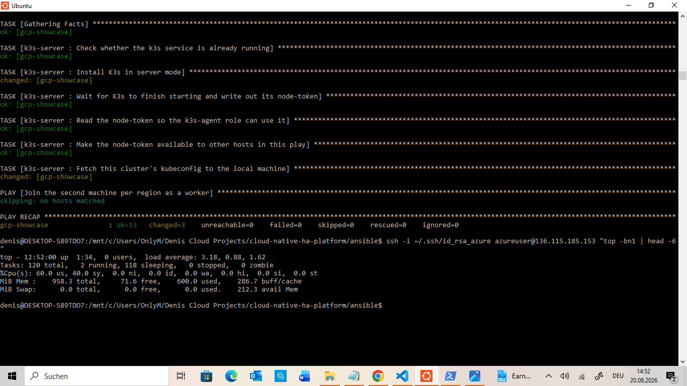
*Above: `%wa` dropped from 91.8% to 0.0%, confirmed before even attempting
`kubectl` again.*

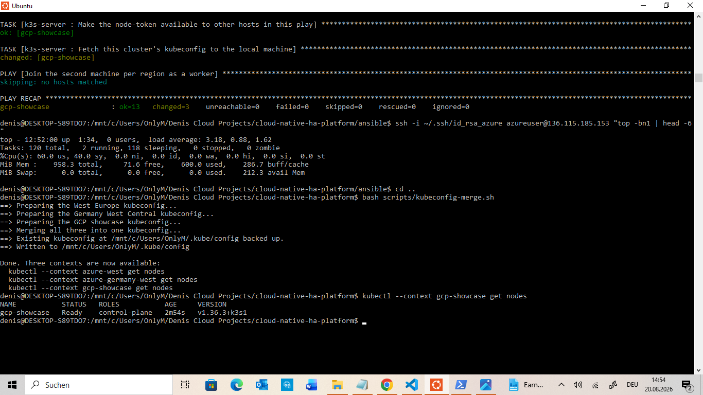
*Above: All three clusters, two Azure regions and this one, now live in a
single merged kubeconfig, each reachable by its own context.*

### Checking the cost claim, not just asserting it

The brief's "don't spend any money" rule deserves real evidence, not
just a paragraph promising it was followed.

**GCP is genuinely €0.00**, confirmed directly in Google Cloud's own
billing reports for the `cgi-challenge-ha-platform` project, covering
the full build window:

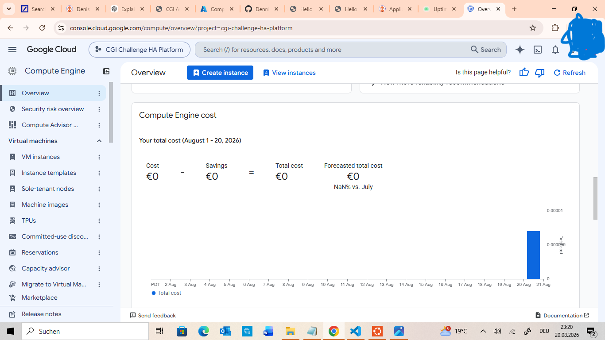

**Azure is not €0.** Worth saying plainly rather than hiding it. Cost
Management, scoped to `rg-ha-platform`, shows real charges: the two
running VMSS instances (`vmss-...eu west`, `vmss-...de west central`)
are the largest line items, plus small amounts for the Load Balancers'
Public IPs and disks:

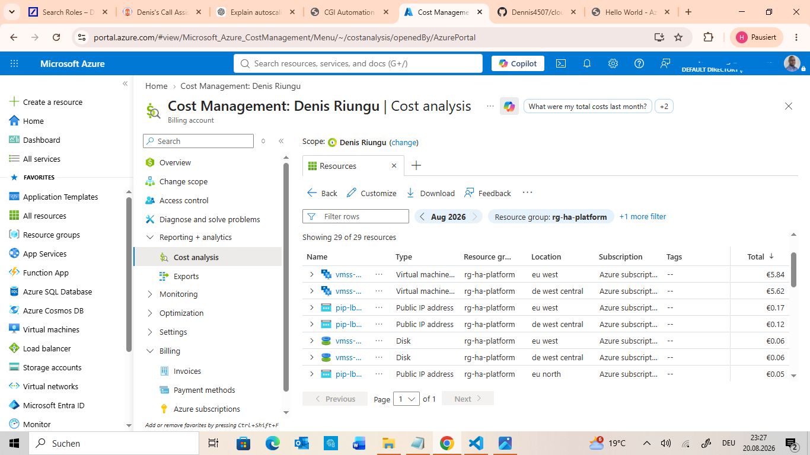

That's not a contradiction of the "spend zero" rule, for a specific
reason. GCP's Always Free tier is a genuinely permanent, zero-cost offer
for one small VM. Azure has no equivalent free tier at the scale this
project actually needs: a real Kubernetes cluster, in two regions, is
Requirement 1 and Requirement 5's literal graded deliverable, not an
optional extra the brief's rule was written to rule out. The brief's own
wording targets "infrastructure services, domains, or certificates",
avoidable extras like a purchased domain or a paid DNS failover service,
both of which this project genuinely avoided (see the pricing comparison
in [requirement-5-multi-region-ha.md](requirement-5-multi-region-ha.md)).
Running compute for the actual Kubernetes cluster isn't in that
category. It's the thing being graded.

**Was there a cheaper VM size that could have worked instead?** Azure
calls a VM size a SKU (Stock Keeping Unit). Yes, and it was tried first:
`terraform/azure/variables.tf` already documents this. `Standard_B2s`
(2 vCPU, 4 GB memory) was the original choice specifically because it's
the smallest size that comfortably runs Kubernetes, chosen to keep cost
close to zero. Azure reported no available capacity for it on this
subscription, in either West Europe or North Europe, a real limitation
hit live during the build, not a preference. `Standard_D2s_v3` replaced
it: not the cheapest possible size, but a mainstream one with no
capacity restriction, and with more memory (8 GB instead of 4 GB) as a
side effect.

Checked against Azure's own published retail pricing for West Europe,
`Standard_B2s` is **$0.048 per hour** and `Standard_D2s_v3` is **$0.12
per hour**, two and a half times more expensive, not a marginal
difference. Had B2s actually been available, the real Azure total shown
above would likely have landed somewhere around €4 to €5 instead of
roughly €12, scaling down proportionally with the hourly rate. The gap
between the two isn't a design choice. It's the cost of a capacity
constraint that had no workaround on this specific subscription. What
*is* a design choice, and what kept even the D2s_v3 total this low, is
deallocating the VMs between build sessions rather than leaving them
running continuously.

### Requirement 5's traffic router, and a six-hour lesson in checking my own work

The same GCP (Google Cloud Platform) showcase VM also runs Requirement
5's actual traffic router: an NGINX reverse proxy, installed as a plain
systemd service, deliberately independent of the K3s cluster running
alongside it on the same machine. It sits in front of both Azure
regions, West Europe as the primary backend and Germany West Central as
a passive-health-checked backup. If West Europe stops answering,
NGINX's own `max_fails` / `fail_timeout` settings mark it down and start
sending traffic to Germany West Central instead, with no DNS change and
no manual step involved.

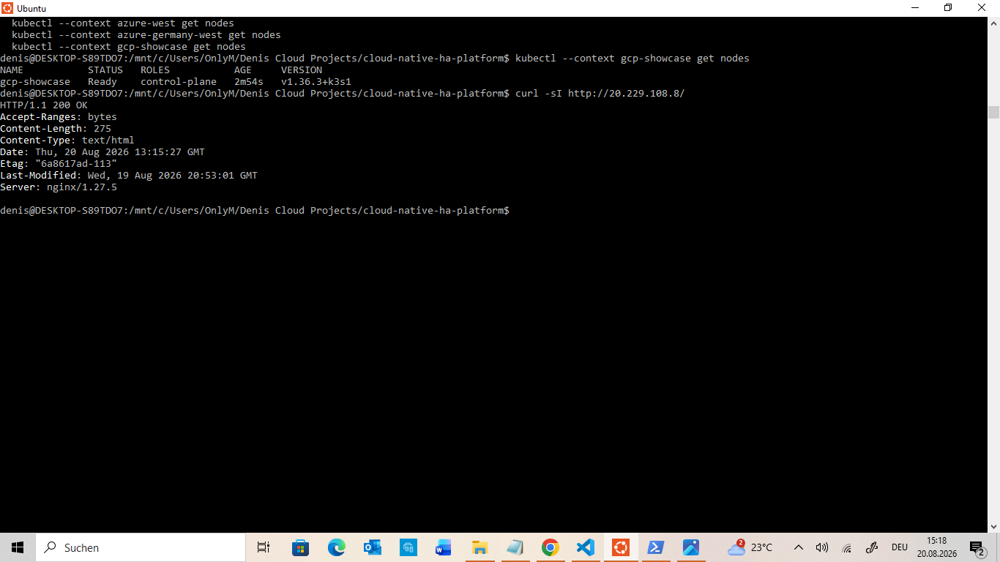
*Above: All three `kubectl` contexts healthy, and a direct `curl` to the GCP
node's IP already returning `200 OK` from the NGINX that ships with a
fresh Ubuntu image: confirmed clean before the proxy role touched
anything.*

Installing that proxy turned into the longest single debugging session
of this whole build, close to six hours, across three separate but
related problems. It's documented in full because the actual lesson
(the third problem) is more valuable than the demo itself: a clean
architecture doesn't protect you from a sloppy operating habit.

**Problem 1: the install itself hung.** The Ansible run reached the
`Install NGINX` task and simply stopped producing output.

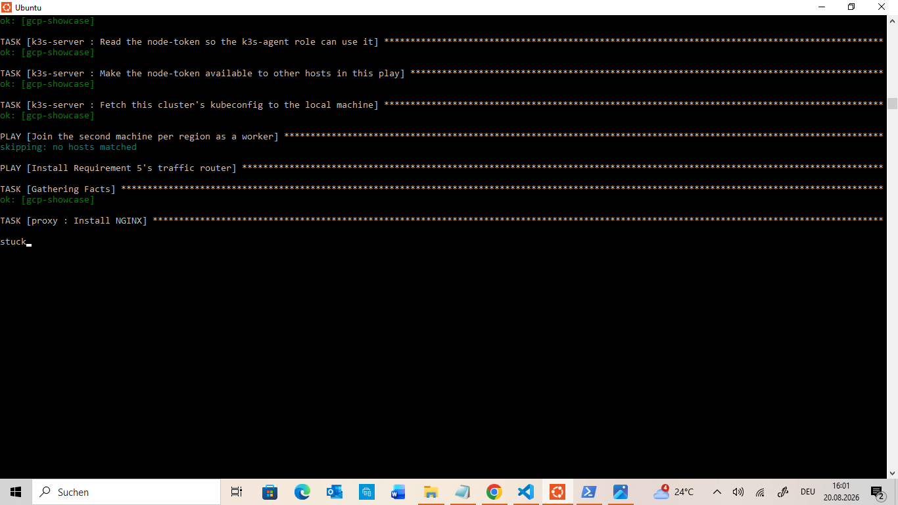
*Above: No error. The play just stopped advancing after this task started.*

`ps aux | grep -i apt`, run over a second SSH (Secure Shell) session
against the same node, found the actual cause: Ubuntu's own background
`update-notifier/apt-check` process, the thing that silently checks for
available package updates, sitting in Linux process state `D` (marked
`DN+` in the listing below). A `D`-state process is in *uninterruptible
sleep*: the kernel has it blocked on I/O (Input/Output, in this case
disk reads or writes) that hasn't completed yet, and **`kill -9` cannot
touch it**. `SIGKILL` is delivered to the process, not to the kernel
operation it's waiting on, so the process simply cannot respond to any
signal until that I/O either finishes or the machine reboots. This is
the same slow `pd-standard` (HDD) disk from the earlier I/O-wait
incident above, showing up in a new place. This time it wasn't K3s's
own database being slow, it was Ubuntu's routine update check, and it
happened to be holding the exact same `apt`/`dpkg` package-manager lock
that `apt-get install nginx` also needed.

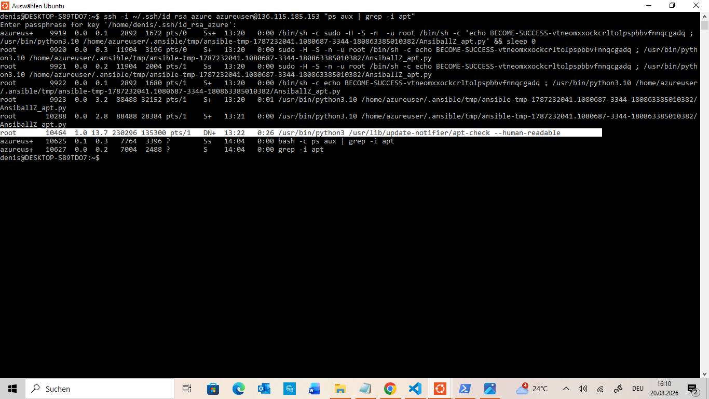
*Above: `DN+` in the `STAT` column: uninterruptible sleep. This process cannot
be killed. Only a reboot, or the I/O finally completing on its own,
clears it.*

**Problem 2: the first fix wasn't the whole fix.** Masking the systemd
timers that normally trigger `apt-check` (`apt-daily.timer`,
`apt-daily-upgrade.timer`, `motd-news.timer`) and rebooting looked like
a complete fix. `systemctl disable --now` reported success, cleanly
removing each timer's symlink. But retrying the playbook stalled again,
this time even earlier, at `Gathering Facts`, before NGINX's own task
had even started. Something *other* than those three known timers was
still triggering the same slow-disk contention on every boot, most
likely a login-banner script or a `cloud-init` step running
independently of systemd's timer system. Rather than keep hunting for
that exact remaining trigger with the clock running, the fix that
actually shipped (`ansible/roles/proxy/tasks/main.yml`) goes one level
more direct: `chmod 0000` on `/usr/lib/update-notifier/apt-check`
itself, so the program cannot be executed *at all*, however it gets
called. Removing every permission from the binary makes the question
"what's still triggering it?" stop mattering.

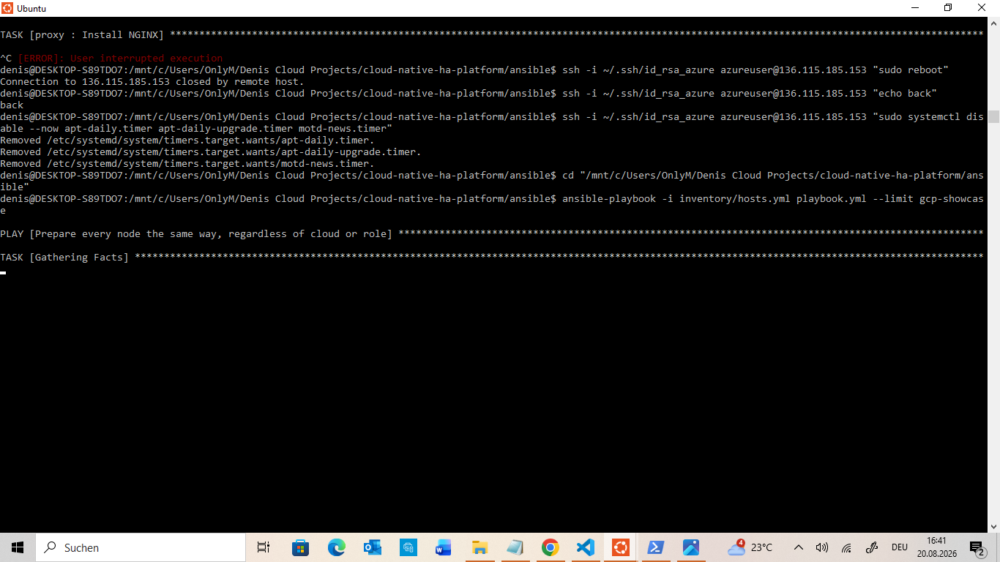
*Above: The masking command succeeded (three timer symlinks removed), and the
retry got further into the play before stalling again: proof the first
fix was real but incomplete, not proof it had failed outright.*

**Problem 3: the actual root cause, and the one that mattered most.**
After the `chmod 0000` fix, the playbook was retried several more times
over the next hour without any of those retries clearly finishing or
clearly failing. Each one looked "stuck" in roughly the same place,
which looked at the time like the same disk problem recurring yet
again. It wasn't. Running `ps aux | grep ansible-playbook`, a check I
should have made standard *before* the very first retry and didn't,
showed two separate `ansible-playbook` processes running at once,
started thirteen minutes apart, both targeting the same node with
`--limit gcp-showcase`. Each retry had been launched without first
confirming the previous one had actually exited, and every one of those
overlapping processes was fighting the others for the exact same remote
`apt`/`dpkg` lock, manufacturing fresh contention on top of a disk that,
by this point, had already been fixed. Denis caught this himself,
correctly, mid-session: *"dont we first need to check that no other
ansible playbook is running? you keep making me run playbook but not
check thats how we ended up with three playbooks."* That's now a
standing rule for every retry going forward, on this project or any
other: check `ps aux | grep ansible-playbook` first, and `pkill -9 -f
ansible-playbook` to clear any leftover process, *before* launching
another one, not after the second or third hang.

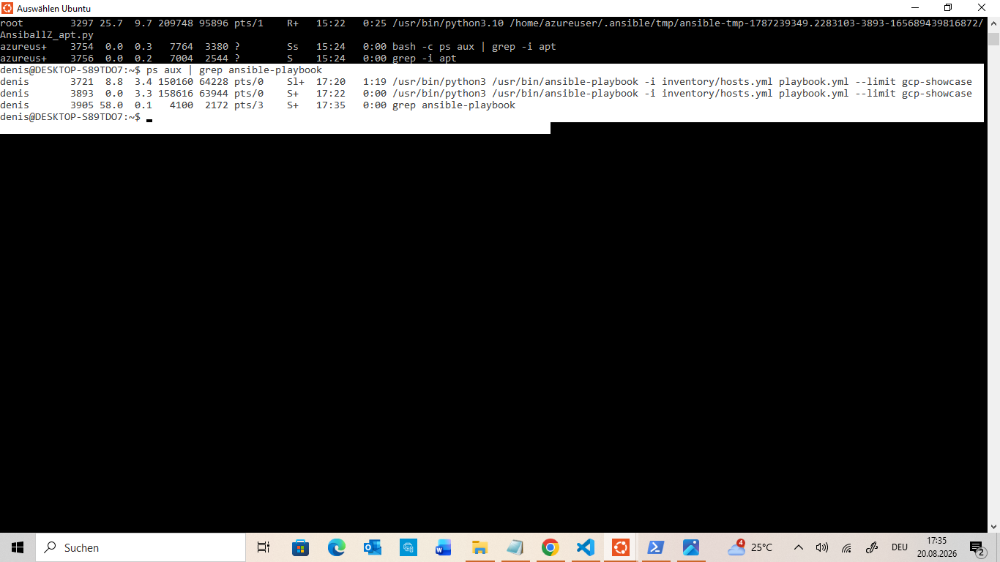
*Above: The actual root cause of most of this session's apparent "hanging":
`ps aux | grep -i apt` shows a clean node with nothing stuck. The real
problem was one command away, in `ps aux | grep ansible-playbook`.*

Once those duplicate processes were killed and the retry was launched
alone, the play ran straight through without a single further pause.

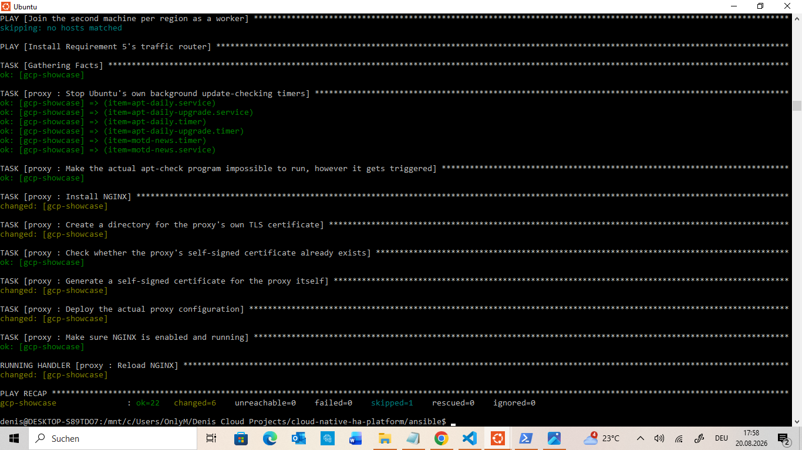
*Above: `PLAY RECAP ... ok=22 changed=6 unreachable=0 failed=0`. The same role
that stalled for hours completed cleanly once it was only running
once.*

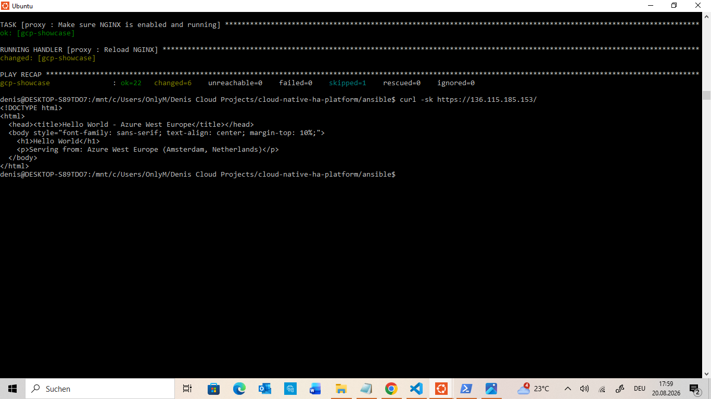
*Above: `curl -sk https://136.115.185.153/`. The `-k` flag accepts the proxy's
own self-signed certificate, the same free, zero-dependency approach
used by `cert-manager` inside each K3s cluster, returning West Europe's
Hello World HTML, proxied end to end over TLS.*

The honest read on the six hours: the first two problems were real and
worth documenting (a slow Always-Free disk can wedge an unrelated apt
install through nothing more exotic than an OS's own background update
checker), but they were solved within the first ninety minutes. The
other four-plus hours were spent fighting a problem I had personally
caused by retrying without checking, a reminder that in operations
work, an unverified assumption ("that process must have exited by now")
costs far more time than the two seconds it takes to actually check.

## Screenshots

90 screenshots live in [`docs/screenshots/`](docs/screenshots/),
numbered in build order and referenced throughout this document. Every
one of them is real output from this actual build, not a mockup. Rather
than duplicate that navigation here, see the
[Map](#map-jump-straight-to-what-you-need) at the top for the fastest
way to find a specific one, by requirement or by incident.

- [x] Requirements 1-5: all live, all demoed, all screenshotted
- [x] Requirements 6-8: written concept docs, each with real supporting
      evidence rather than staged examples. See
      [`requirement-6-monitoring-concept.md`](requirement-6-monitoring-concept.md),
      [`requirement-7-backup-recovery-concept.md`](requirement-7-backup-recovery-concept.md),
      [`requirement-8-dns-debug-runbook.md`](requirement-8-dns-debug-runbook.md)
- [x] Every real incident hit during the build, kept in rather than
      edited out. See the incidents table in the Map
- [x] The cost claim checked against real billing data, not just
      asserted

## How this is being built

Every piece of infrastructure code has its own explanatory comments
written directly alongside it, so the reasoning for a decision lives
right next to the decision itself.
[docs/cli-output-recap-reminder.md](docs/cli-output-recap-reminder.md)
explains the recurring tool output shown throughout this document, the
Ansible, Terraform, and kubectl fields that appear in screenshot after
screenshot, field by field.

## Author

Denis Riungu, [LinkedIn](https://linkedin.com/in/denis-riungu)
