# cloud-native-ha-platform

**By Denis Riungu**

## What this is

My submission for CGI's Cloud & DevOps Challenge: a Kubernetes platform,
built entirely through code, that survives real failures - a server dying,
a cluster going down, a whole region becoming unreachable.

Two identical Kubernetes clusters (Azure West Europe and Germany West
Central), provisioned with Terraform and configured with Ansible. A small
web app runs on both, spread across multiple servers so losing one never
takes it down - and if a whole region fails, traffic moves to the other one
automatically. Two extras beyond what the challenge asks for: the same
automation pattern applied to a Google Cloud server, and a GitOps pipeline
so deployments happen by pushing to Git, not running commands by hand.


*Generated with Python's `diagrams` library. Green arrows are GitOps (ArgoCD
pulling from Git); blue is real traffic; dashed brown is one-time
infrastructure provisioning. GitHub Actions is shown as planned, not yet
built - see the CI section below.*

## The build pipeline — scaffold and commands together

The diagram above shows what talks to what while the platform is
*running*. This one shows how it gets *built* — which command triggers
which real file, and what that command hands off to the next stage.

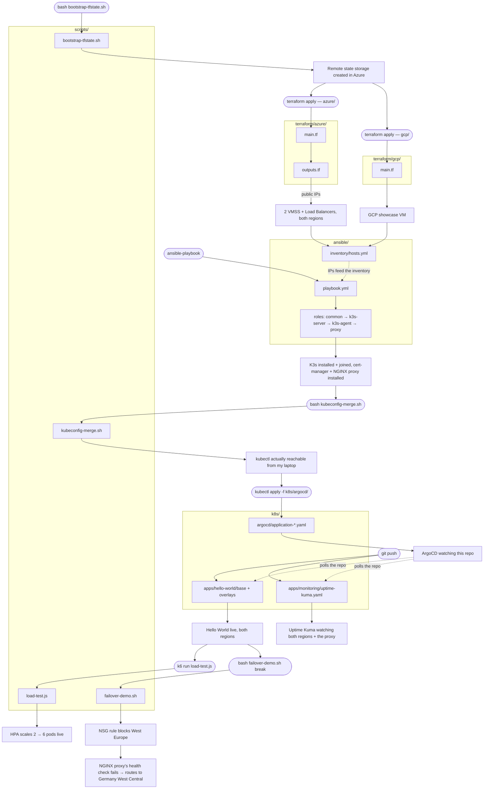
```mermaid
flowchart TD
    subgraph BOOT["scripts/"]
        B1[bootstrap-tfstate.sh]
        B2[kubeconfig-merge.sh]
        B3[load-test.js]
        B4[failover-demo.sh]
    end
    subgraph TFAZ["terraform/azure/"]
        TFAZ1[main.tf]
        TFAZ2[outputs.tf]
    end
    subgraph TFGCP["terraform/gcp/"]
        TFGCP1[main.tf]
    end
    subgraph ANS["ansible/"]
        A1[inventory/hosts.yml]
        A2[playbook.yml]
        A3["roles: common → k3s-server → k3s-agent → proxy"]
    end
    subgraph K8S["k8s/"]
        K1[argocd/application-*.yaml]
        K2["apps/hello-world/base + overlays"]
        K3[apps/monitoring/uptime-kuma.yaml]
    end

    CMD0(["bash bootstrap-tfstate.sh"]) --> B1 --> OUT0[Remote state storage created in Azure]

    OUT0 --> CMD1(["terraform apply — azure/"])
    CMD1 --> TFAZ1 --> TFAZ2
    TFAZ2 -->|"public IPs"| OUT1[2 VMSS + Load Balancers, both regions]

    OUT0 --> CMD2(["terraform apply — gcp/"])
    CMD2 --> TFGCP1 --> OUT2[GCP showcase VM]

    OUT1 --> A1
    OUT2 --> A1
    CMD3(["ansible-playbook"]) --> A2 --> A3
    A1 -.->|"IPs feed the inventory"| A2
    A3 --> OUT3["K3s installed + joined, cert-manager + NGINX proxy installed"]

    OUT3 --> CMD3b(["bash kubeconfig-merge.sh"])
    CMD3b --> B2 --> OUT3b["kubectl actually reachable from my laptop"]

    OUT3b --> CMD4(["kubectl apply -f k8s/argocd/"])
    CMD4 --> K1 --> OUT4[ArgoCD watching this repo]

    CMD5(["git push"]) --> K2
    CMD5 --> K3
    OUT4 -.->|"polls the repo"| K2
    OUT4 -.->|"polls the repo"| K3
    K2 --> OUT5[Hello World live, both regions]
    K3 --> OUT5b[Uptime Kuma watching both regions + the proxy]

    OUT5 --> CMD6a(["k6 run load-test.js"])
    CMD6a --> B3 --> OUT6a["HPA scales 2 → 6 pods live"]

    OUT5 --> CMD6b(["bash failover-demo.sh break"])
    CMD6b --> B4 --> OUT6b[NSG rule blocks West Europe]
    OUT6b --> OUT7["NGINX proxy's health check fails → routes to Germany West Central"]
```

*Solid arrows are commands producing real files or resources; dotted
arrows are one thing feeding another without a command in between —
Terraform's output IPs feeding Ansible's inventory, and ArgoCD's own
continuous polling of this repository. The bottom two branches
(`k6` and the failover script) are the live demos, not one-time build
steps — both can be run again at any time against the already-built
platform.*

## The trade-offs behind this architecture

Every major decision here came from a real constraint, not a preference.
Worth stating plainly, up front:

- **Self-managed K3s on plain VMs, not AKS (Azure's managed Kubernetes).**
  Requirement 8 needs direct node-level access — a real shell to run
  `tcpdump` and inspect firewall rules with. AKS keeps worker nodes off
  the public internet with no SSH by default; a plain VM gives that
  access directly.
- **A self-hosted NGINX proxy, not Azure Traffic Manager.** Traffic
  Manager isn't free — it has a base monthly cost plus per-query
  charges, for as long as it exists. The brief's own rule is zero money
  spent on infrastructure, and it explicitly names a self-hosted proxy as
  an equally valid option to a managed traffic-routing service.
- **`Standard_D2s_v3` VMs, not the cheaper `Standard_B2s`.** Not a
  choice — `B2s` had zero available capacity on this subscription,
  confirmed directly against Azure's own SKU catalog. `D2s_v3` costs
  2.5x more per hour, verified against Azure's real pricing, and it's
  the reason Azure isn't quite at zero cost the way GCP is.
- **Self-signed certificates, not a public CA.** The brief explicitly
  accepts either, and a public certificate would need a real registered
  domain — which the brief's own "no domain" rule rules out entirely.
- **One GCP VM as a separate showcase, not part of the graded failover
  path.** Keeps the one component outside Azure isolated from the actual
  HA (High Availability) demo, so a problem with it can never break
  Requirement 5's live proof.

Full detail on each of these, including the real incidents that forced
some of them, lives in the requirement pages linked below.

## Map — jump straight to what you need

**If you only read one thing:** the live failover demo under
Requirement 5 — a real region simulated as down, watched recovering
automatically across a browser, an independent monitoring dashboard, and
a raw command line, at the same time.

Every requirement below is its own short, self-contained page — what was
built, the live evidence, and the real incidents hit along the way,
clearly separated.

| # | What was asked | What I built, in one line | Full detail |
|---|---|---|---|
| 1 | Kubernetes cluster, built through code | 2 independent clusters, Terraform + Ansible, verified live | [`requirement-1-kubernetes-cluster.md`](requirement-1-kubernetes-cluster.md) |
| 2 | "Hello World," reachable in a browser | Deployed by GitOps — pushing to Git is the deploy | [`requirement-2-hello-world.md`](requirement-2-hello-world.md) |
| 3 | Round-robin traffic + autoscaling under load | 2 → 6 pods live under real load, round-robin proven at the same time | [`requirement-3-autoscaling-roundrobin.md`](requirement-3-autoscaling-roundrobin.md) |
| 4 | Ingress with a valid TLS certificate | Traefik + cert-manager, self-signed, auto-issued | [`requirement-4-ingress-tls.md`](requirement-4-ingress-tls.md) |
| 5 | Multi-region HA with automatic failover | A second cluster + self-hosted proxy, live failover demo | [`requirement-5-multi-region-ha.md`](requirement-5-multi-region-ha.md) |
| 6 | Monitoring concept | Two-layer approach, plus a live dashboard | [`requirement-6-monitoring-concept.md`](requirement-6-monitoring-concept.md) |
| 7 | Backup & recovery concept | Two scenarios, backed by a real measured incident | [`requirement-7-backup-recovery-concept.md`](requirement-7-backup-recovery-concept.md) |
| 8 | DNS debugging methodology | TCP/IP-model-framed, real commands, real evidence | [`requirement-8-dns-debug-runbook.md`](requirement-8-dns-debug-runbook.md) |

**Beyond the 8 requirements:** [The GCP showcase (cherry #2)](#the-gcp-showcase-cherry-2) · [Checking the cost claim, not just asserting it](#checking-the-cost-claim-not-just-asserting-it) · [Screenshots](#screenshots)

**Real incidents hit and fixed during the build** — worth knowing these exist on their own, since they're some of the strongest evidence this was actually built and debugged, not just described:

| Incident | What happened | Where |
|---|---|---|
| The wrong certificate | Browser showed Traefik's default cert, not the real one — a `TLSStore` misconfiguration | [`requirement-4-ingress-tls.md`](requirement-4-ingress-tls.md) |
| GCP OAuth scope + severe I/O wait | `gcloud` silently granted the wrong scope; the Always Free tier's disk caused 91.8% I/O wait | [The GCP showcase](#the-gcp-showcase-cherry-2) |
| The six-hour proxy install saga | A stuck update-checker, then duplicate `ansible-playbook` runs fighting over the same lock | [`requirement-5-multi-region-ha.md`](requirement-5-multi-region-ha.md) |
| The NSG priority rejection | The failover script used an invalid Azure priority value (90, below the allowed minimum) | [`requirement-5-multi-region-ha.md`](requirement-5-multi-region-ha.md) |
| The pod-scheduling deadlock | A hard anti-affinity rule and a mismatched autoscaler limit left a pod permanently stuck | [`requirement-3-autoscaling-roundrobin.md`](requirement-3-autoscaling-roundrobin.md) |
| The B2s capacity limit | The cheaper VM size had zero available capacity, forcing a 2.5x costlier fallback | [Checking the cost claim](#checking-the-cost-claim-not-just-asserting-it) |

## Keeping this project isolated from everything else

CGI's own challenge brief offers a sandbox Azure environment on request, but
with a tight four-day window and a full schedule, there wasn't time to wait
on that request being fulfilled. Rather than build directly on a personal
account with other work in it, I provisioned my own equivalent sandbox:
before touching any real infrastructure, the Azure side was set up so that
this project can never accidentally reach - or be reached by - anything else
in the same account. The root account only ever acted as the administrator
who set this boundary up once; a second, deliberately limited identity
(`CGI Challenge Sandbox`) does all of the actual work from here on, and its
access is restricted to exactly the two resource groups this project uses.


*The two resource groups this project owns, sitting alongside an unrelated
resource group already in the account - proof this project has its own
clean space, not a shared one.*


*Two separate identities in the same account: the administrator account that
set everything up, and the sandbox identity that actually builds the
challenge.*


*The actual access breakdown on the Terraform state resource group: the
administrator holds full ownership, while the sandbox identity holds only
the specific permissions it needs to do its job - and, importantly, no
permission to grant access to anyone else, including itself.*


*Signed in as the sandbox identity itself: this is the whole world it can
see - exactly the two resource groups this project owns, and nothing else.*

One consequence of creating these resource groups by hand, before Terraform
ever ran: Terraform didn't know they already existed, and refused to quietly
create a duplicate on top of them - the correct, safe behavior. The fix was
`terraform import`, a standard way to bring an already-existing resource
under Terraform's management instead of recreating it. Worth knowing that a
resource group's own region is just metadata about where its record lives;
it doesn't control where the resources inside it actually get created, so
this had no effect on the real regional design (see below for how that
design itself later changed).


*Terraform noticing the resource group already exists and stopping, rather
than silently creating a conflicting duplicate.*


*The fix: bringing the existing resource group under Terraform's management
with `terraform import`, rather than recreating it. Personal details in the
scrollback (IP address, SSH key) are manually blacked out.*

## Where things stand right now

This project is being built in small, deliberate steps rather than all at
once, so this section will keep changing as it goes. As of today: all of
the Azure infrastructure is live in the real subscription - the network,
firewall, load balancers, identity, and both regions' virtual machine
scale sets, four servers total, two in West Europe and two in Germany West
Central. That's Requirement 1's actual infrastructure done. The next step
is installing Kubernetes on these servers with Ansible, then confirming
`kubectl get nodes` shows all of them Ready.

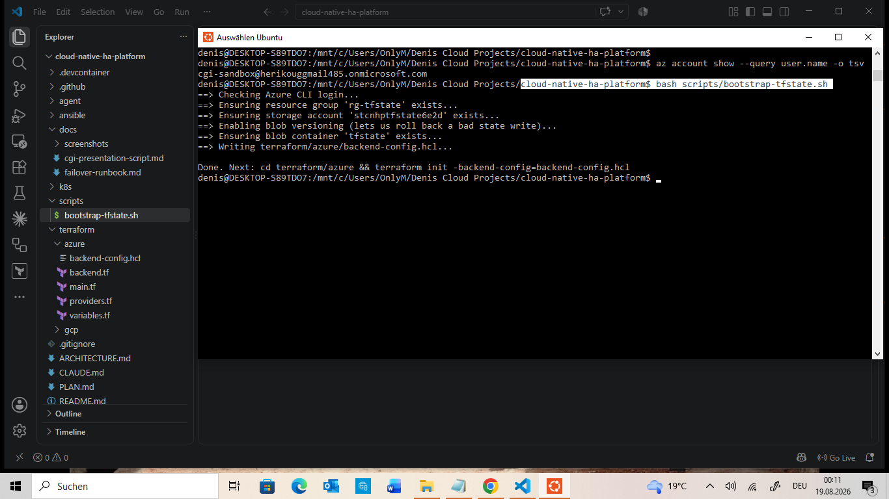
*The one-time setup script creating the dedicated Azure storage that will
hold Terraform's record of everything it builds.*

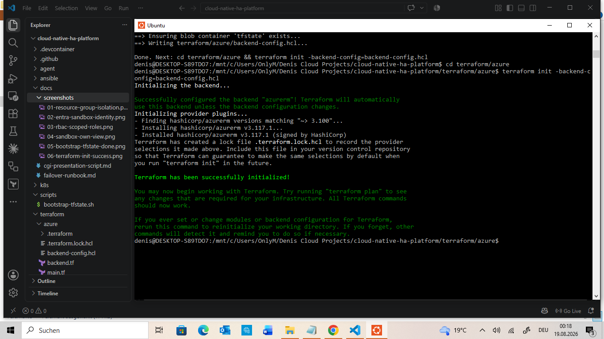
*Terraform confirming it can reach that storage and is ready to start
managing real infrastructure.*

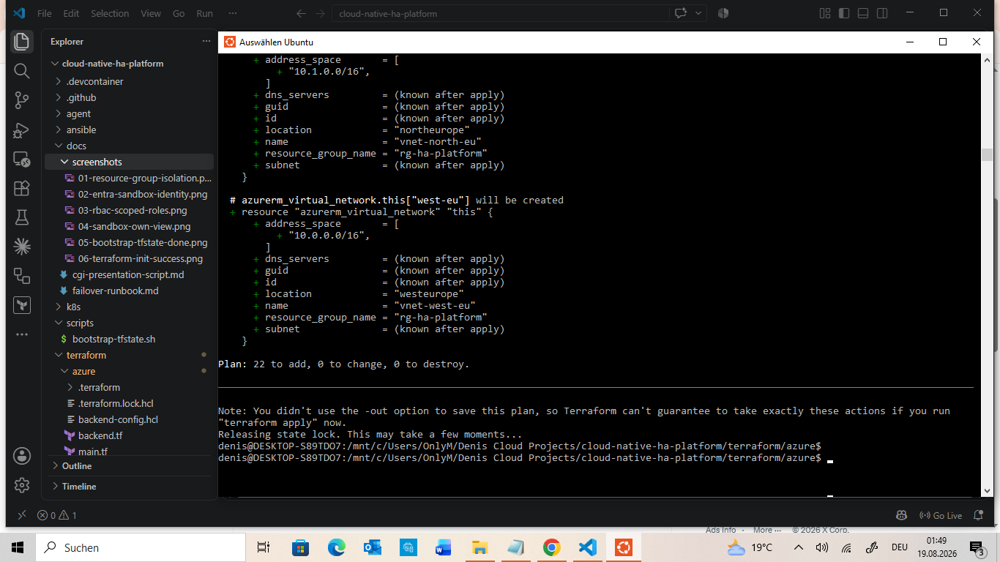
*The complete infrastructure plan, validated end to end: 22 resources ready
to create, nothing changed or destroyed - the network, firewall, load
balancers, identity, and both regions' virtual machines, all matching the
design exactly.*

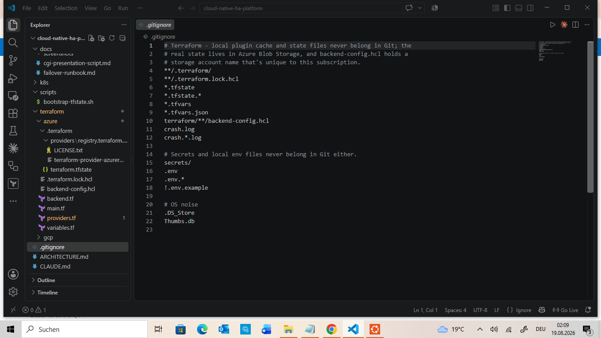
*The actual rule that keeps Terraform's state, and anything else sensitive,
out of version control entirely - not a claim, the real configuration.*

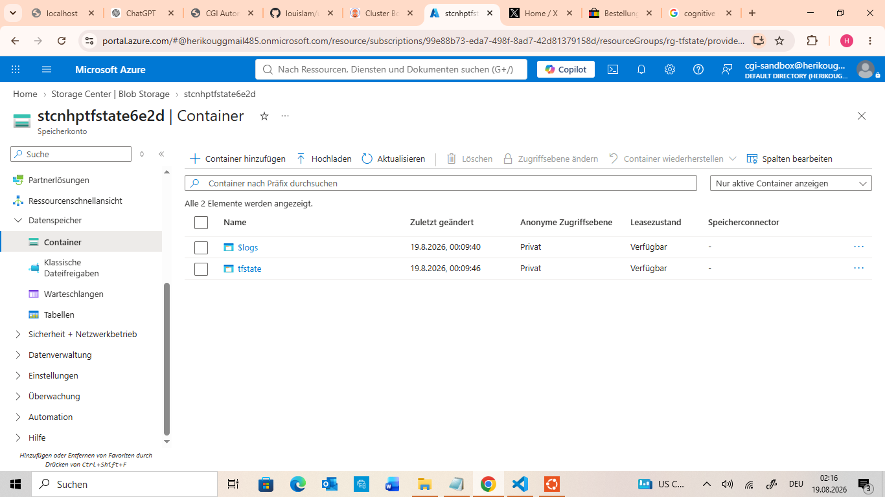
*Inside that storage account: the `tfstate` container, sitting there in the
Azure Portal - proof this is a real, working remote backend, not just files
on a laptop.*

**The virtual machines Terraform is about to create only accept login by SSH
("Secure Shell," the encrypted way to log into a remote machine's command
line) key, never a password** - that was a deliberate security choice made back
when this infrastructure was first designed, since no password means there
is nothing for an attacker to brute-force. The public key is what gets
uploaded to Azure and installed on the machines; the matching private key,
which never leaves this computer, is what actually proves it's really me
when I connect later.

A second tradeoff surfaced the same way, once real virtual machines were
actually attempted: the original design used an "ephemeral" OS ("Operating
System") disk, which stores the operating system on the virtual machine's
own local storage
instead of over the network. It boots noticeably faster and costs nothing
extra, since it reuses space already included in the machine's price - but
it only works if the operating system image is small enough to fit in that
local space. `Standard_B2s` (chosen specifically to keep this project's cost
near zero) only has 8 GB of local storage, and the Ubuntu image needed more
room than that. Azure rejected it outright the moment the virtual machines
were actually created, rather than at any earlier check:

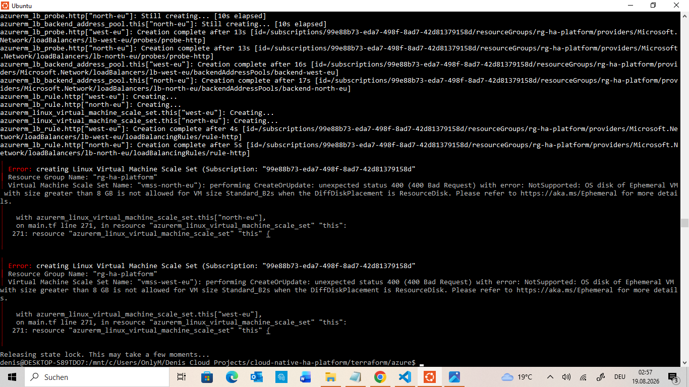
*19 of the 21 resources succeeded before this - the network, firewall,
load balancers, and identity were all unaffected. Only the two virtual
machine scale sets failed, both for the same reason.*

The fix was switching to a normal, network-attached managed disk instead -
a few cents a month, a slightly slower boot, but guaranteed to work on this
VM size. Boot speed was never part of the actual design or any of the 8
requirements, so this was a pragmatic call rather than a real setback: try
the faster option first, hit a genuine platform limit, adjust.

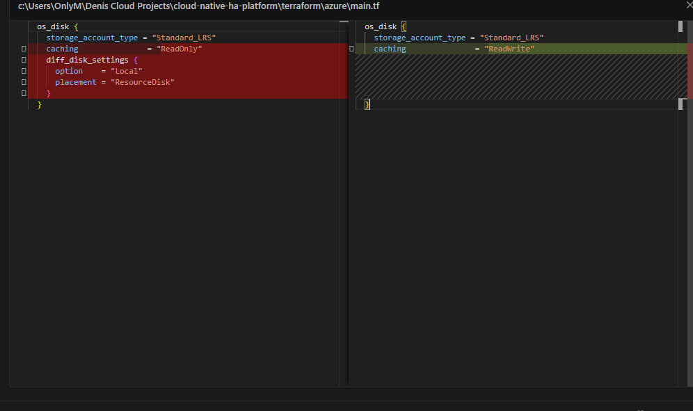
*Removing the ephemeral disk settings in favor of a plain managed disk - a
four-line change once the real limitation was understood.*

A third, more significant issue surfaced next: Azure refused to create
either virtual machine at all, in either region, reporting the requested
size as unavailable due to "capacity restrictions."

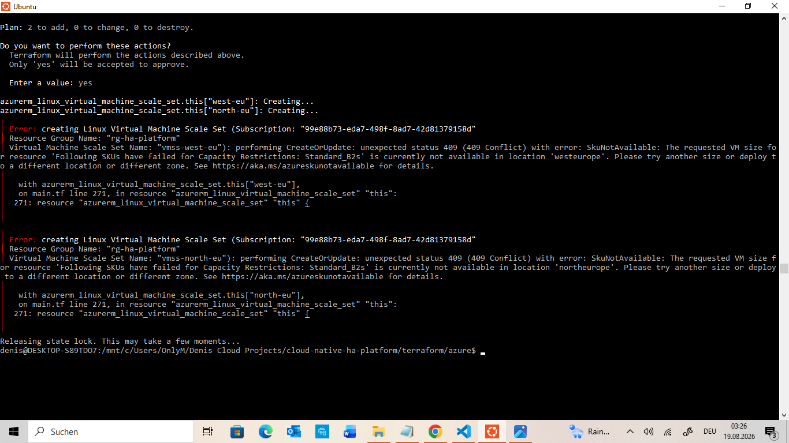
*Azure rejecting `Standard_B2s` in both West Europe and North Europe
simultaneously, each for the same reason: no available capacity for this
subscription.*

Rather than guess at a fix, this one was investigated directly against
Azure's own SKU ("Stock Keeping Unit" - Azure's term for a specific virtual
machine size, like `Standard_B2s`) catalog API ("Application Programming
Interface" - the interface a program uses to ask a service a question
directly, rather than through its web portal) - querying which virtual
machine sizes this specific subscription is actually allowed to use in
which regions.

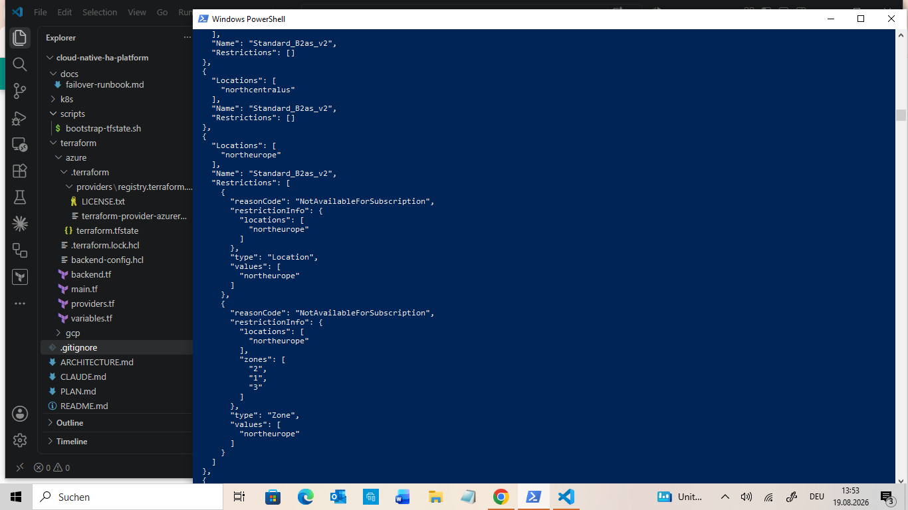
*Azure's own catalog data: North Europe carries a `NotAvailableForSubscription`
restriction for this subscription, regardless of which VM size is chosen.*

The result was clear: North Europe is restricted for this subscription
across every size checked, not just the one originally chosen - the whole
region is closed off, unrelated to any setting in this project's code.
Germany West Central, by contrast, came back clean. Since the resource
group itself already lived in Germany West Central (from the isolation
setup earlier), and West Europe was unaffected, the fix was replacing North
Europe with Germany West Central as the second region, rather than hunting
for a differently-sized VM that might work in a region this subscription
can't actually use. Every resource name that said "north-eu" was also
renamed to "germany-west" at the same time, so nothing in the code claims
to be running somewhere it isn't.

Before changing the real infrastructure, that fix was verified cheaply
first: a single throwaway virtual machine, created directly (not through
Terraform) with the exact size the code now uses, in the exact region it
would now run in.

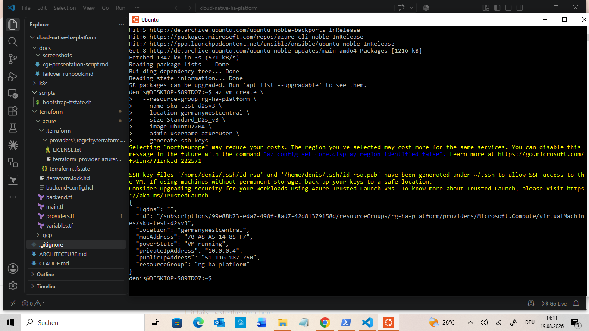
*The throwaway test VM, running - proof the fix actually works before
committing the real infrastructure to it. Deleted immediately after.*

With the region and VM size both confirmed, the real `terraform apply` ran
clean: the old North Europe network resources were destroyed automatically
(they were tied to a region this subscription can't use), and everything
was recreated in Germany West Central alongside West Europe.

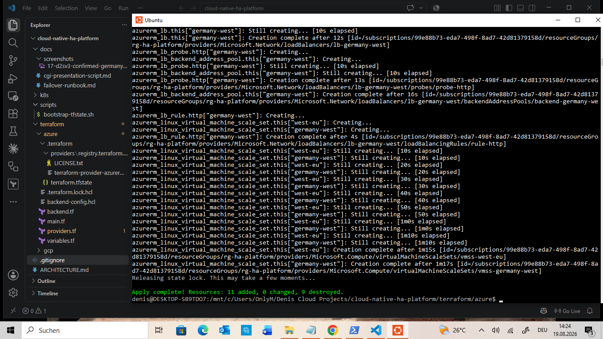
*`Apply complete! Resources: 11 added, 0 changed, 9 destroyed.` Both virtual
machine scale sets created successfully - this is Requirement 1's actual
infrastructure, live.*

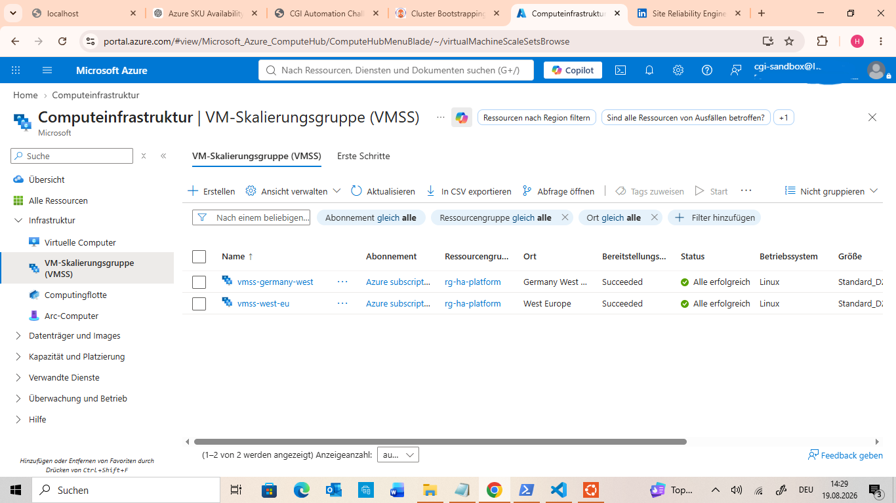
*`vmss-west-eu` and `vmss-germany-west`, both showing "Succeeded" - the same
result confirmed from the Azure side, not just the terminal.*

One deliberate distinction worth being explicit about: each virtual machine
also gets its own public IP address, added specifically so Ansible (and I)
can reach individual machines directly over SSH. That address is purely an
administrative access path - it has nothing to do with this platform's
actual availability design. If Azure ever replaces a broken instance
automatically, the replacement gets a brand-new public IP; the old one is
simply gone. The address real traffic (or the failover proxy) ever talks to
is the load balancer's frontend IP from Phase 1, which never changes
regardless of what happens to the instances behind it. Application
availability never depends on any single machine's address - only my own
SSH access does.

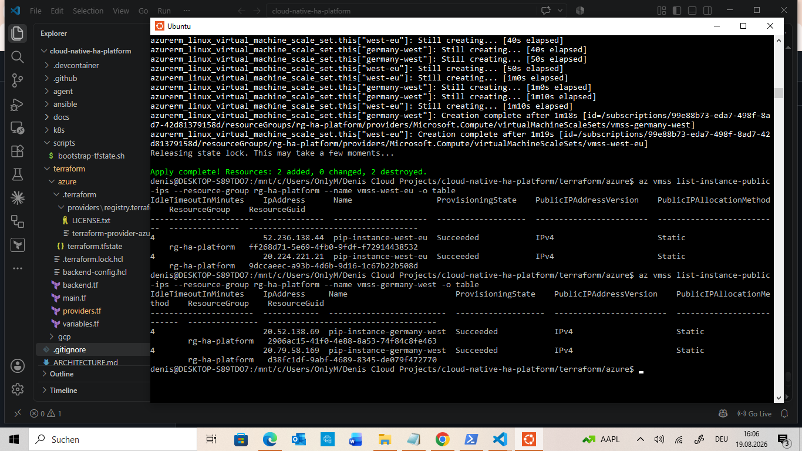
*All four machines, each with its own address - the exact IPs Ansible will
connect to next.*

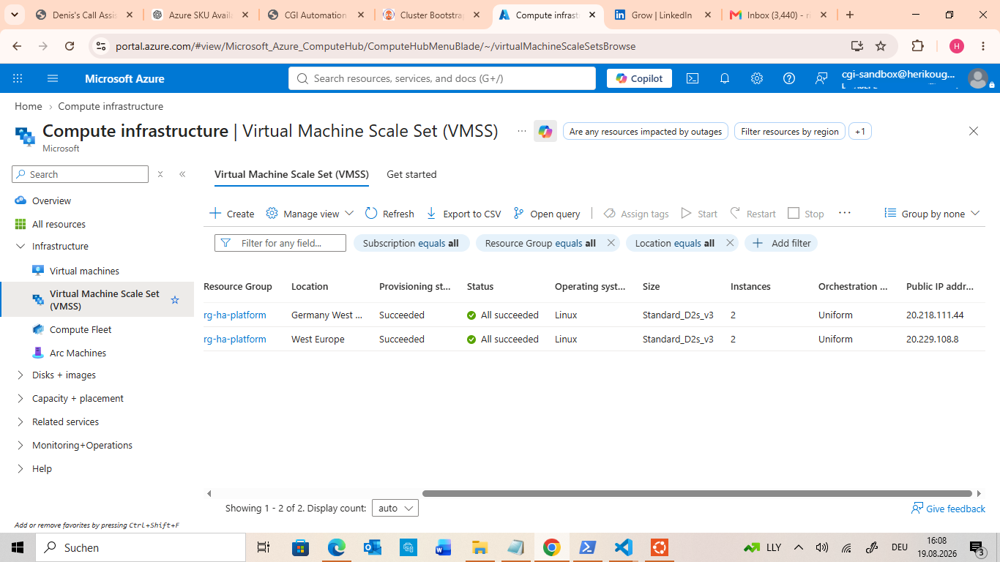
*The Azure Portal's scale set overview shows only one IP per region -
`20.229.108.8` for West Europe, `20.218.111.44` for Germany West. That's not
a smaller number of real IPs; it's the load balancer's frontend address,
which is what that summary view is built to show. The screenshot above it
shows the other four addresses - two per region, one per virtual machine -
because that command asked specifically for instance-level IPs instead of
the scale set's own summary. Same infrastructure, two different views of it,
each showing exactly what it's designed to show.*

One more real incident worth including, because it's genuinely instructive
rather than just a mistake to fix quietly: while first testing whether
Ansible could reach all four machines over SSH, two of them - one per
region - consistently timed out, while the other two connected fine every
time. The cause turned out to be `automatic_instance_repair`, a feature
built back in Phase 1 specifically to replace any machine that fails the
load balancer's health check. That health check watches port 80 - but
nothing was listening on port 80 yet, since the actual application hadn't
been deployed. Every instance had been failing that check since the moment
it booted, and Azure had already quietly replaced two of them mid-session,
each with a brand-new public IP that no longer matched what was written in
the inventory. Confirmed directly: querying the scale sets showed each
"agent" instance now had a different address than the one originally
recorded.

This was real self-healing working exactly as designed - genuinely good
news - but actively disruptive while there's nothing meaningful for the
health check to measure yet. The fix was disabling `automatic_instance_repair`
for now, with a note to re-enable it once the Hello World app is actually
deployed and port 80 has something real behind it - not a permanent
decision, a sequencing one.

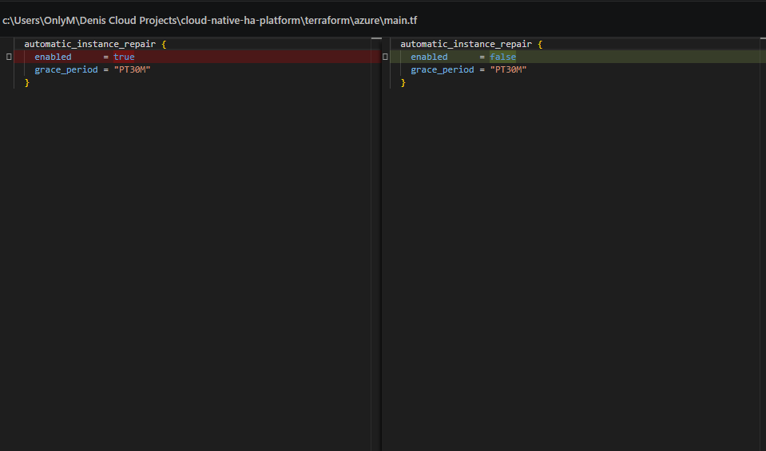
*Turning the feature off with a one-line change, applied in place with no
disruption to the machines already running.*

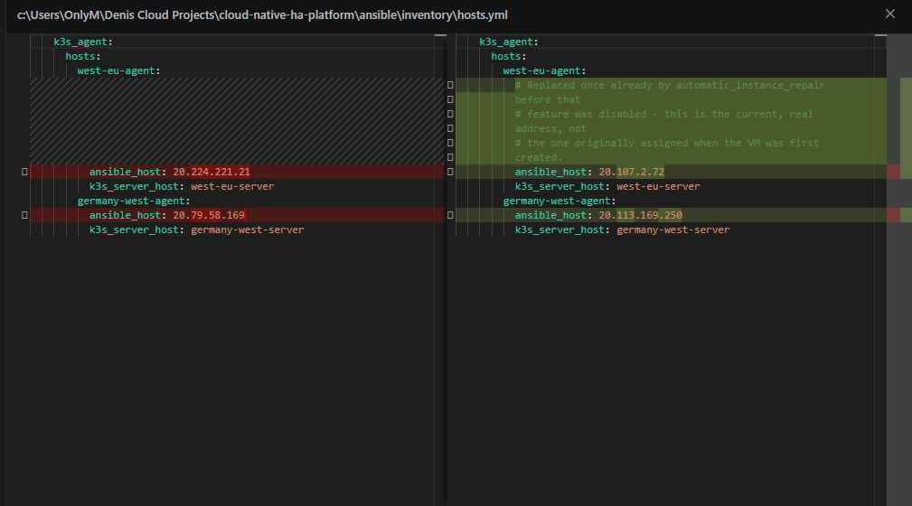
*Both replaced addresses corrected in the Ansible inventory, with a note
explaining why they don't match the originally-assigned IPs.*

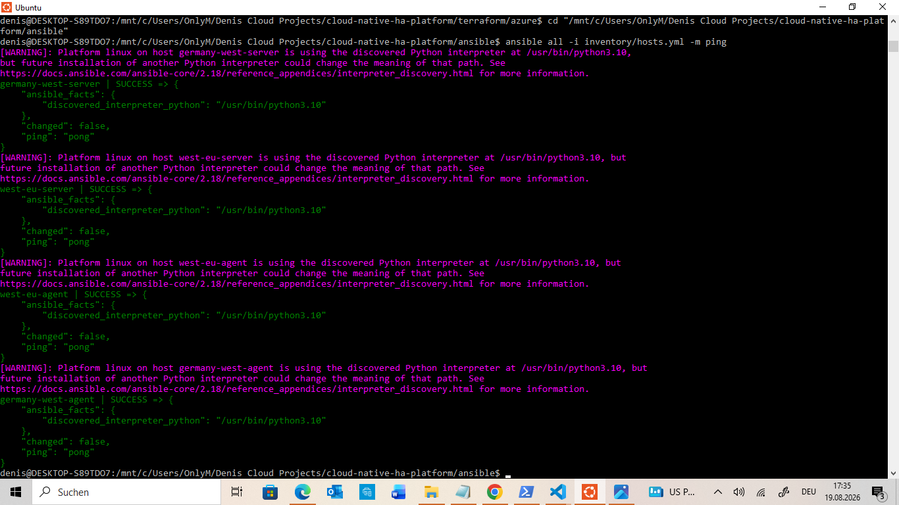
*Every host responding `"ping": "pong"` - full connectivity confirmed,
after tracking down why two of the four addresses had silently changed.*

### Getting Kubernetes actually installed and joined

With all four machines reachable, the next step was installing Kubernetes
itself. The first part went smoothly: every machine got the same basic
setup, and one machine per region became the control plane without any
trouble. The second part - joining the other machine in each region to
that control plane as a worker - did not go smoothly, and it took three
separate rounds of digging to actually fix.

**Round one.** The join step just hung, with no error at all.

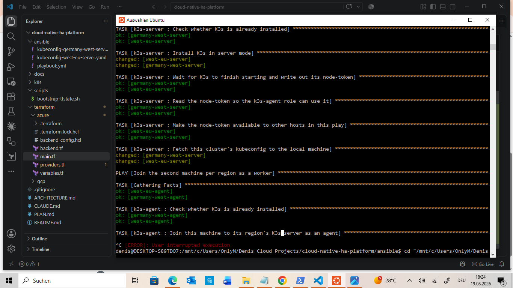
*Nothing wrong reported - just silence, until it was interrupted by hand.*

It turned out the firewall only allowed the Kubernetes API port (6443) to
be reached from my own laptop, not from the other virtual machine in the
same region - which is exactly what a worker needs to do to join its
control plane. That rule was added and applied.

**Round two.** Running the setup again looked like it worked, but
`kubectl get nodes` still only showed one machine per region, not two. The
reason: the very first attempt had gotten far enough to download Kubernetes
before it hung, so the second attempt saw "it's already installed" and
skipped the step entirely - even though the machine had never actually
finished joining anything. The fix was checking whether the service was
truly running, not just whether the software was present.

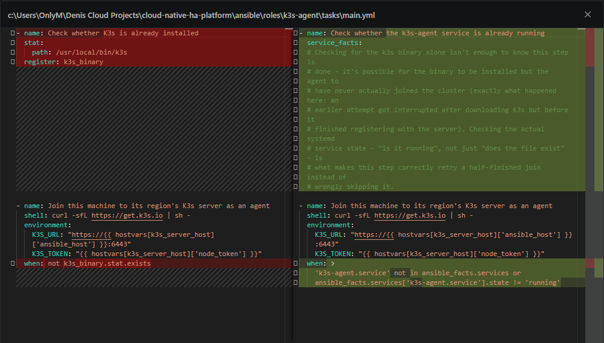
*A more honest check - "is this actually working," not just "does the file
exist."*

**Round three.** Even with that fixed, the join still failed. This time,
checking directly from one machine to the other confirmed the real cause:
the worker was trying to reach its control plane's *public* internet
address, and even though both machines sit in the same private network,
Azure did not treat that connection as internal traffic - so the firewall
rule from round one never actually applied to it.

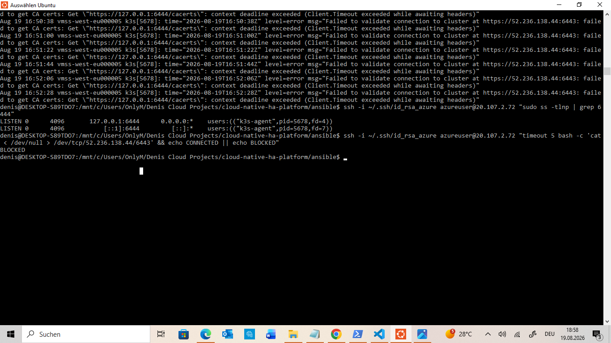
*A direct, one-line test settled it before guessing again.*

The real fix was pointing each worker at its control plane's private
address instead of its public one - which the firewall rule correctly
allows, and which is also simply the right way to do it: machines in the
same network talking to each other should use their private addresses, not
bounce out to the internet and back.

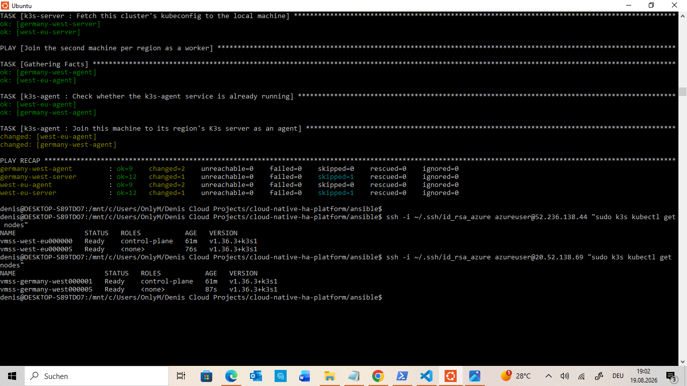
*The result: both regions show two `Ready` nodes - confirmed here from
inside each cluster, over SSH. Requirement 1's own wording asks for more
than that, though: it specifically wants this checked from the challenge
participant's own machine, not from a session on the server itself. That
turned out to still be one incident away.*

### Making `kubectl` itself work from my own laptop

Two clusters existing is not the same thing as being able to reach them.
Requirement 1 is specific about this: running `kubectl get nodes` from my
own machine, not from a terminal already sitting on one of the servers,
needs to show both `Ready` nodes. Getting there surfaced three separate
problems, stacked on top of each other.

The first was mundane: the `kubectl` already installed on this laptop
turned out to be version 1.16, from 2019 - untouched since long before this
project started. Kubernetes enforces a version-skew policy between client
and server, and a gap that large simply refuses to work. Fixed with the
official install script, which brought it up to 1.36 - the same version the
cluster itself runs.

The second was a merge script quietly writing to the wrong place. Ansible
already fetches each cluster's kubeconfig from its server, and
`scripts/kubeconfig-merge.sh` combines both into one file with two named
contexts. It ran without error, but `kubectl config get-contexts` afterward
showed only a single, generic `default` entry - as if the merge had never
happened at all.

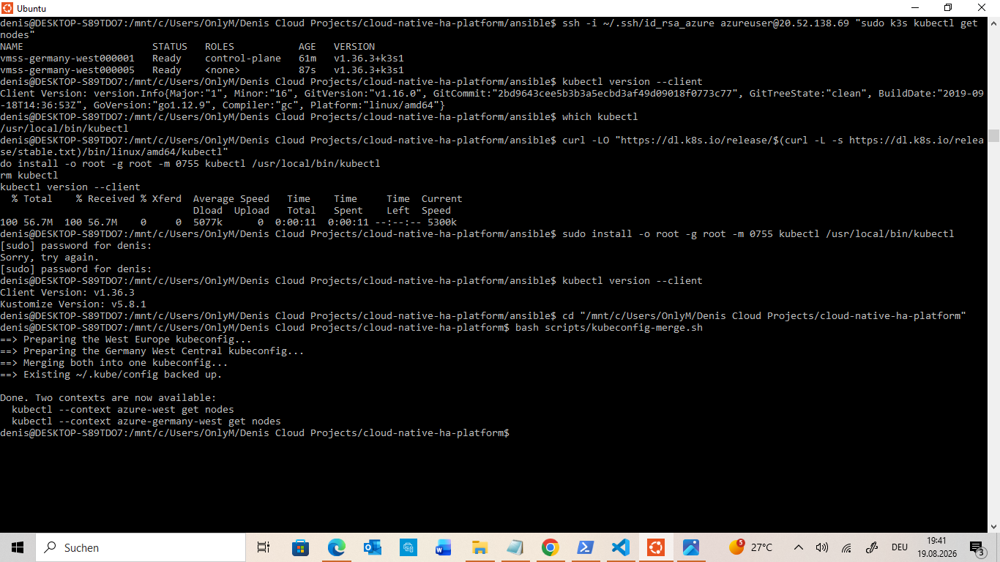
*The script's own messages all say "done" - the problem was invisible from
its output alone.*

Ruling things out one at a time is what found it. First the merge logic
itself - reproduced by hand, and it worked fine. Then line endings, the
first suspect - checked directly, and they were plain Unix `LF` ("Line
Feed" - a single character marking the end of a line), not the Windows
`CRLF` ("Carriage Return Line Feed" - Windows' two-character version of the
same thing) that would have caused this. That left one line: `echo
$KUBECONFIG`. This laptop already had that environment variable set,
pointing at a completely different file on the Windows side
(`/mnt/c/Users/OnlyM/.kube/config`) - left over from also running `kubectl`
straight from Windows, not just from WSL ("Windows Subsystem for Linux,"
the Ubuntu environment inside Windows this whole project actually runs
from). The script had been faithfully writing its merged result to the
plain default location, `~/.kube/config` - `kubectl` itself was just never
looking there. The fix: read `$KUBECONFIG` if it's already set, and only
fall back to the default when it isn't.

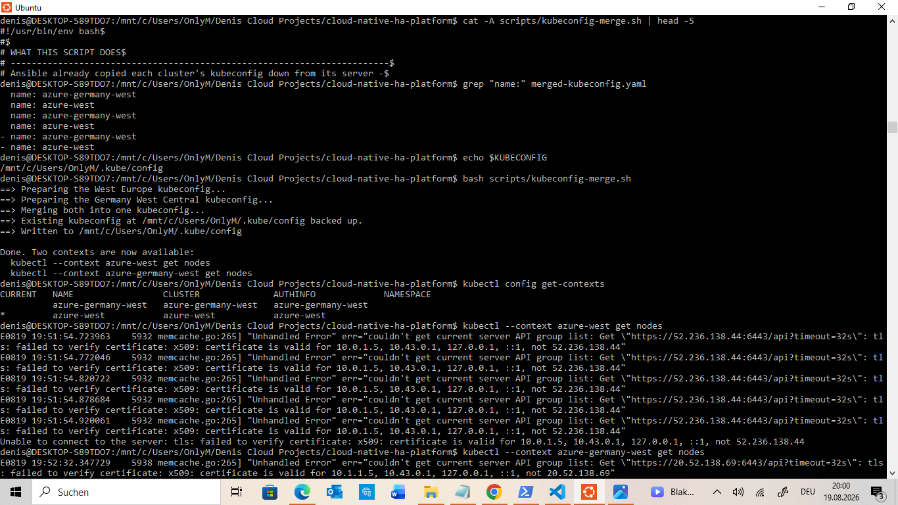
*`echo $KUBECONFIG` revealing the Windows-side path, then the script
re-run - both contexts now show up correctly. And immediately, a third,
different error appears underneath it.*

That third error was the real one: a certificate. Kubernetes' API server
encrypts every connection to it using TLS ("Transport Layer Security" - the
encryption behind `https://`), including connections from `kubectl` itself, and K3s
generates that certificate exactly once, the moment it first starts -
listing only the addresses it already knows about at that instant. Both
servers' certificates covered their private IP, the cluster's internal
service address, and localhost - never the public IP this laptop actually
connects through, because that address is assigned by Azure from outside
the machine, not something the operating system itself has any way to know
about at install time.

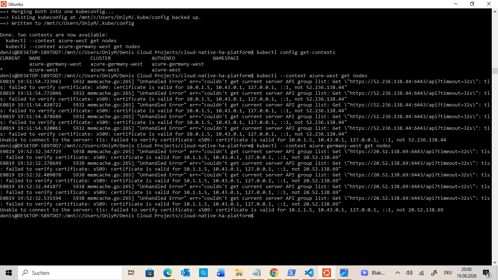
*Same shape of error on both clusters - each one naming its own private
address as valid, and the public one it was actually asked for as not.*

The fix was a single added argument at install time - `--tls-san
<public-ip>` - telling K3s to also issue the certificate for that address.
Because the certificate is only ever generated once, this only takes effect
on a fresh install, not a running one: both control-plane nodes needed a
clean uninstall, and since a fresh server also means a fresh join token,
both worker nodes needed to rejoin from nothing too. Confirmed clean on all
four machines first, then one full `ansible-playbook` run rebuilt the
entire platform from scratch - itself a small proof of the point of
automating any of this in the first place.

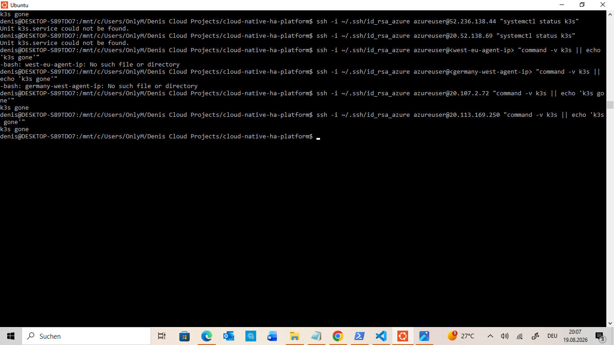
*Neither the `k3s` binary nor its systemd service exist anymore on any of
the four machines - a clean slate, not a half-removed one.*

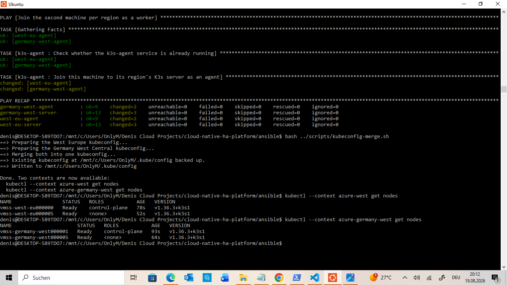
*The rebuild, the kubeconfig merge, and both `kubectl --context ... get
nodes` calls - run from this laptop, not over SSH, exactly as Requirement 1
asks for it. Both regions show two `Ready` nodes. This is Requirement 1,
fully satisfied.*

### Hello World, deployed by GitOps instead of by hand (Requirements 2, 3, 4)

With both clusters reachable, the next question was how the actual
application should get onto them. The straightforward way is `kubectl
apply` - write the YAML, run one command, done. Instead, this project
deploys Hello World through ArgoCD, following a practice called GitOps: a
Git repository is treated as the single source of truth for what should be
running, and a tool - here, ArgoCD - continuously watches that repository
and reconciles the cluster to match it automatically. Nobody runs a deploy
command; pushing to Git *is* the deploy.

One ArgoCD installation runs on West Europe and manages both clusters from
there, rather than installing a separate, disconnected ArgoCD per region -
partly because it's a more convincing thing to demonstrate (one push,
both regions update), and partly because it's simply less to maintain. The
actual Kubernetes manifests are organized with Kustomize: one shared base
(the Deployment, Service, HPA, Ingress, and cert-manager's `ClusterIssuer`)
that both regions build on, plus a small overlay per region containing only
what's genuinely different between them - each one's own identity text and
its own certificate request.

Installing ArgoCD itself hit one immediate, narrow limit: one of its own
Custom Resource Definitions (a CRD - a way to teach Kubernetes about a new
object type it didn't originally know, the same mechanism cert-manager uses
for `Certificate`) is large enough that `kubectl apply`'s normal method -
storing a full copy of what was applied inside an annotation on the object,
so it can diff against it next time - exceeded Kubernetes' hard 256KB limit
on any single annotation.

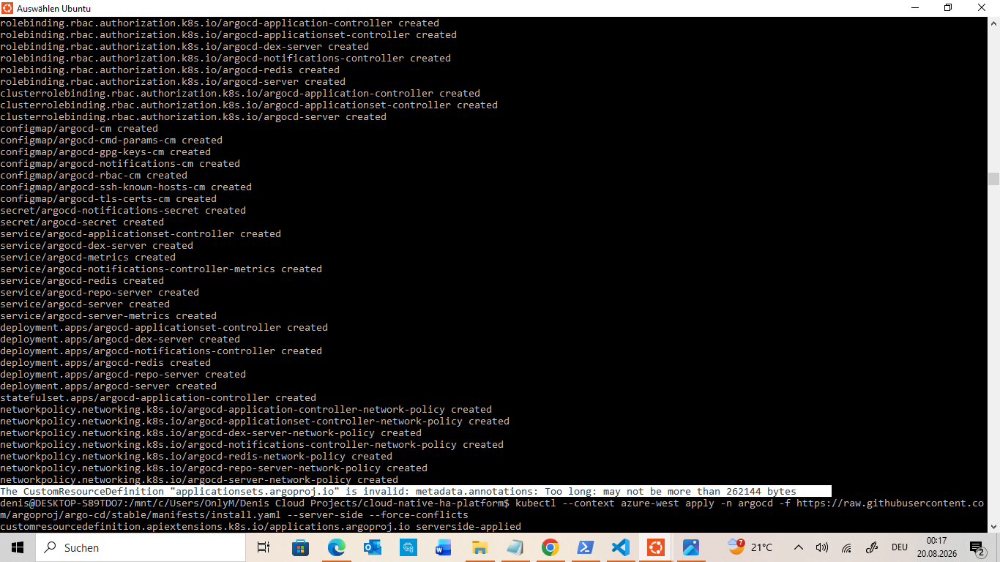
*`metadata.annotations: Too long: may not be more than 262144 bytes` -
every other resource in the same install already succeeded above this
line; only this one object hit the limit.*

The fix was `--server-side`, which tracks the same diff on the API server
itself instead of in that annotation, sidestepping the limit entirely.

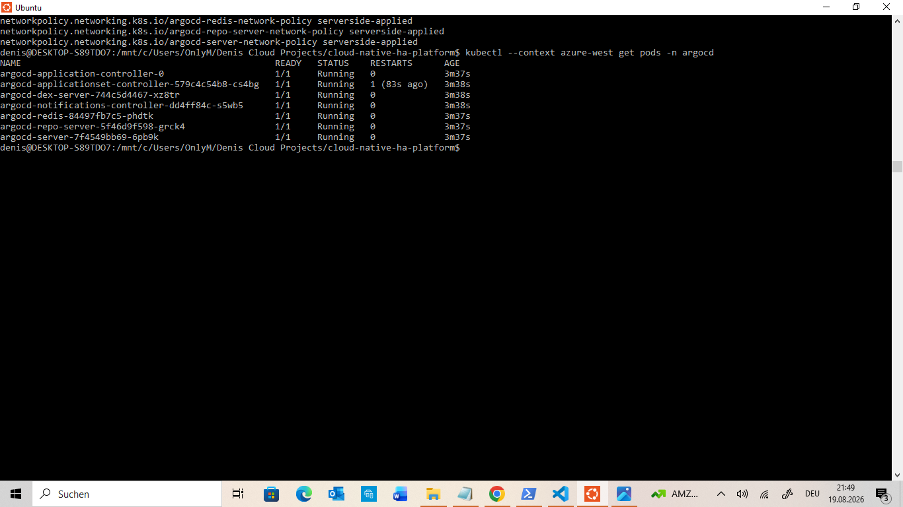
*Seven pods, all `Running` - the control plane that everything else in this
section deploys through.*

Connecting ArgoCD to Germany West Central - a second, separate cluster it
needs to manage remotely - surfaced the same category of firewall gap as
the K3s join incident earlier, just between two clusters instead of two
nodes in one cluster: traffic from a pod on West Europe reaching Germany
West Central's public address doesn't count as "internal" to Azure, even
though both belong to the same project. The firewall needed an explicit
rule allowing each region's own known addresses to reach the other's
Kubernetes API port - written generally, by port and by known address, so
any future tool needing this kind of access is already covered, not just
ArgoCD. ArgoCD reported this as `InvalidSpecError` - it simply didn't
recognize Germany West Central as a cluster it was allowed to deploy to,
until the firewall rule and the cluster registration were both actually in
place.

A second gap appeared right after: the sync itself failed because
cert-manager - the tool that actually issues the self-signed certificate
Requirement 4 needs - had never been installed on either cluster. The
`ClusterIssuer` and `Certificate` manifests were written assuming it would
already be there; it wasn't, because installing it had never actually made
it into the list of steps.

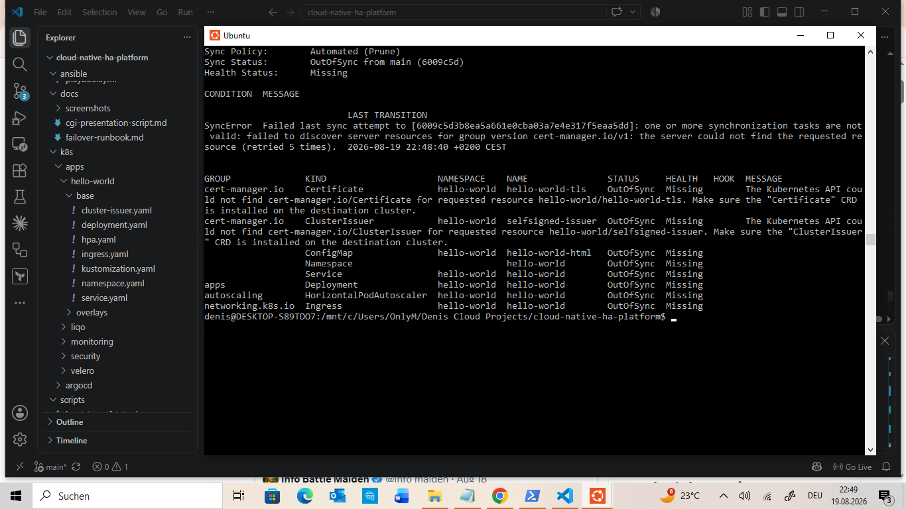
*"Make sure the 'Certificate' CRD is installed on the destination
cluster" - ArgoCD's own error naming the actual missing piece.*

Installed on both clusters the same way as ArgoCD itself - trusting
cert-manager's own official installer rather than hand-writing it.

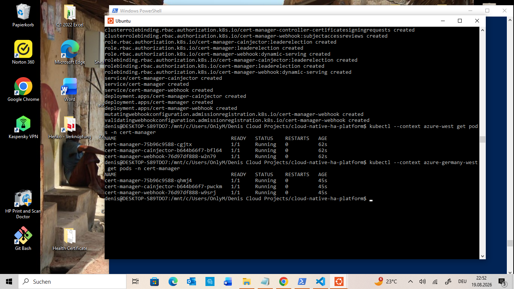
*Three pods per cluster, six total - the piece that was missing.*

With both gaps closed, the sync actually succeeded, and ArgoCD's own
health checks - not just "did the command exit with 0," but "is the
resulting Deployment actually passing its readiness checks" - confirmed
it.

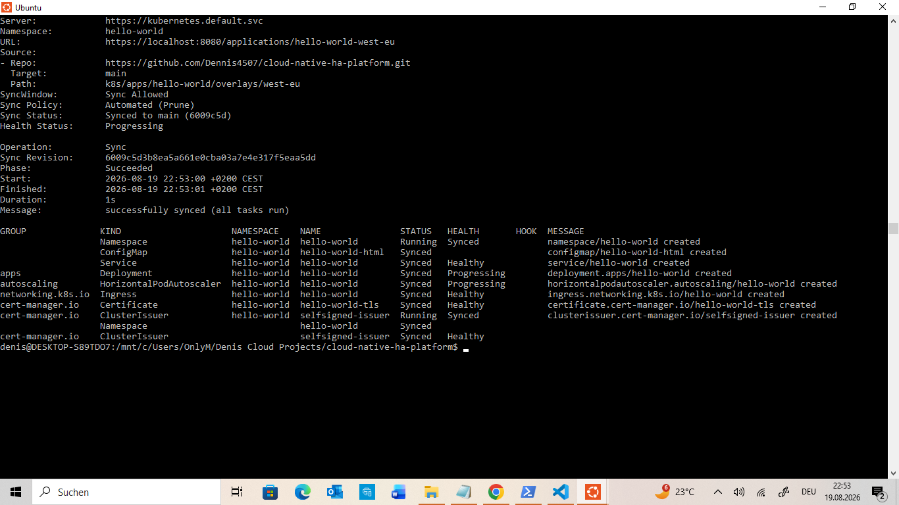
*Every resource ArgoCD manages for this region - `Synced` and `Healthy`.*

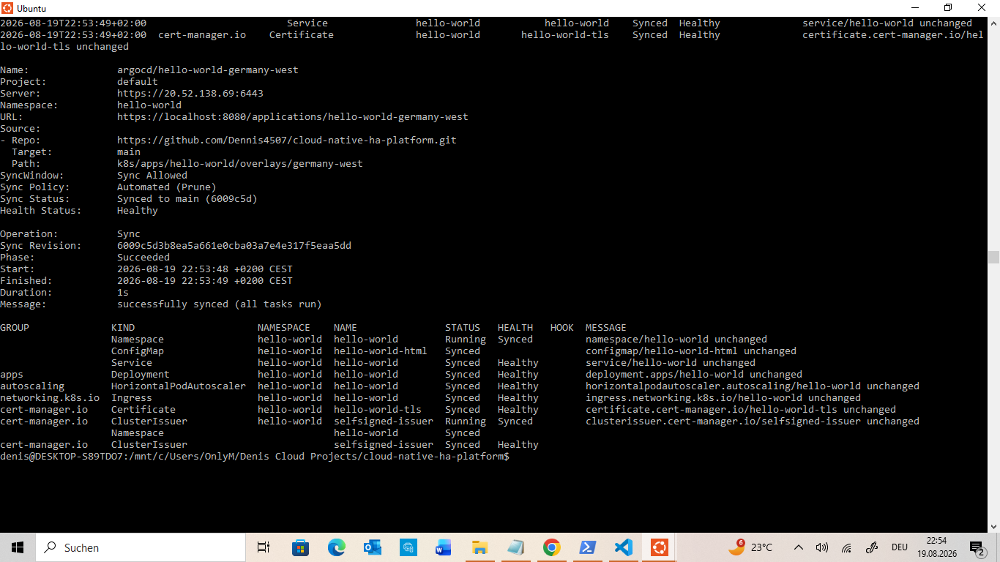
*The same result, independently, for the second region.*

### The certificate that looked right until it was actually checked

Everything above reported success - `Healthy` in ArgoCD, a certificate
object that existed and was marked ready. But checking the actual browser,
rather than trusting the green status, told a different story: the
certificate presented was Traefik's own generic built-in one, not the real
certificate cert-manager had issued.

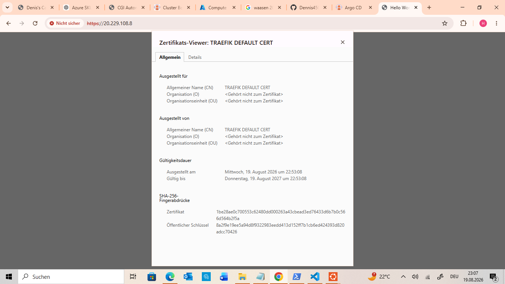
*`TRAEFIK DEFAULT CERT` - technically a certificate, just not the one this
project actually built.*

The reason: Traefik decides which certificate to present using SNI
("Server Name Indication" - the hostname a browser sends during the TLS
handshake, before it even asks for a specific page), matched against the
hostnames configured on each Ingress. This project deliberately has no
hostname at all - raw IPs only, per the "don't spend money on domains"
rule - so Traefik had nothing to match against, and silently fell back to
its own default rather than erroring. The real certificate was never
broken; Traefik simply never knew to offer it.

The fix is a `TLSStore` - one of Traefik's own custom resource types - that
names a specific certificate as the *default*, used for any connection that
doesn't match a more specific rule. One per region, since each runs its own
separate Traefik instance with its own certificate.

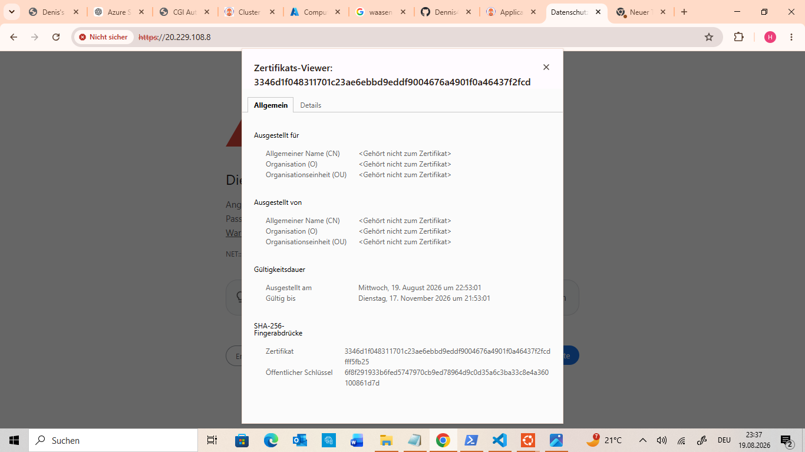
*Issued at the exact second cert-manager created it, expiring roughly 90
days later - cert-manager's own default duration. Genuinely the right
certificate this time, not just a status field saying so.*

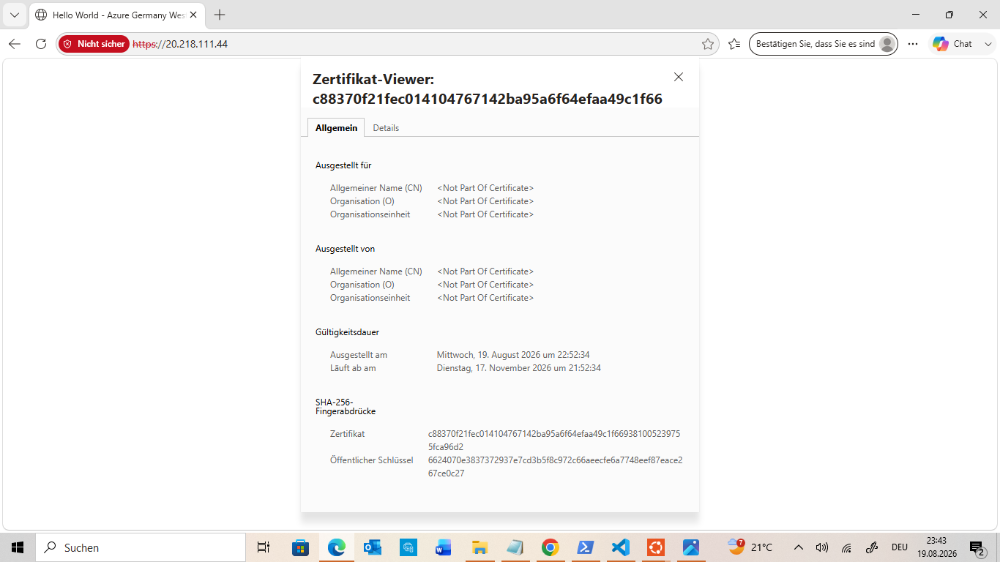
*Same result, independently, for the second region.*

### The result

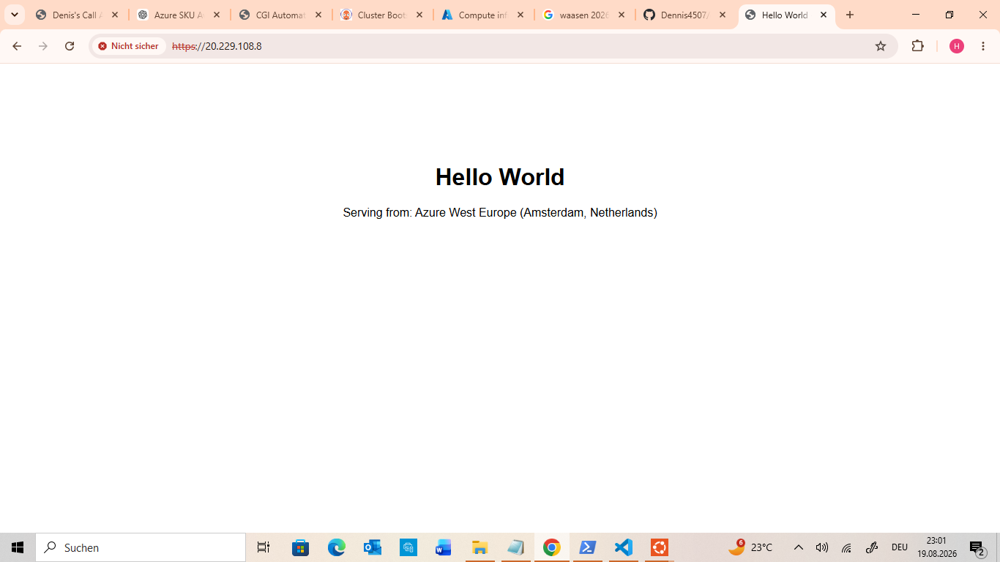
*Requirements 2 and 4, actually working: a real certificate, terminated by
Traefik, in front of the application.*

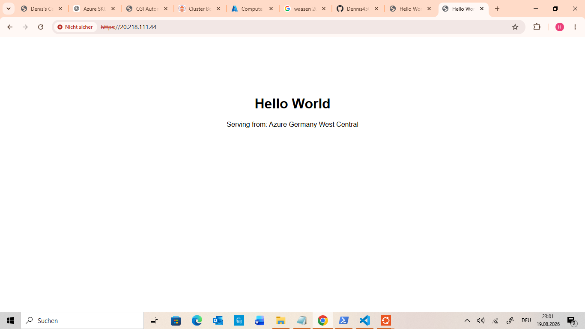
*The same application, the same certificate mechanism, an entirely
separate cluster and region.*

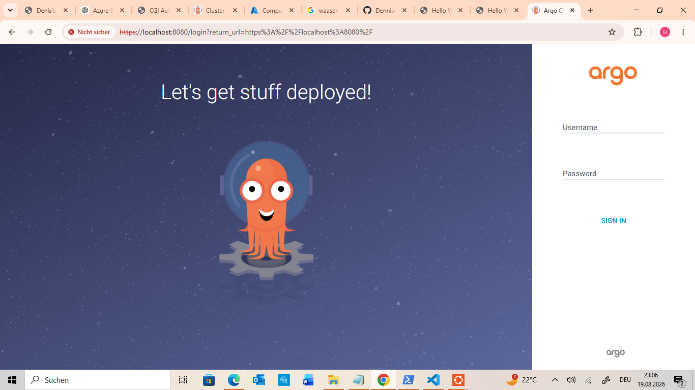
*The GitOps control plane itself - the thing that turned a `git push` into
both regions updating automatically.*

**A deliberate choice worth being explicit about:** ArgoCD is reached here
through `kubectl port-forward` - a temporary tunnel from this laptop into
the cluster - rather than through a permanent public link. A real Ingress
for ArgoCD is entirely possible (it officially supports being served under
a URL subpath, so it could share the same address as Hello World without
needing a second one), but for a project this temporary and disposable, the
extra public attack surface isn't worth it just for convenience - the
tunnel already does the job, and it costs one command to bring back
whenever it's actually needed.

This is also honestly closer to how real production teams run it than a
public link would be: enterprises rarely expose ArgoCD to the open
internet either. The far more common pattern is keeping it reachable only
from inside a private network or VPN, behind real company logins (SSO -
"Single Sign-On," so nobody's juggling a separate ArgoCD-specific password)
rather than the one shared `admin` account this project uses, with
fine-grained permissions controlling which teams can even see or sync
which applications - not everyone gets the same full access this project's
sandbox admin account has.

The same question applies to how ArgoCD notices a change in Git in the
first place - covered earlier in this section (periodic polling, every few
minutes, with a webhook as an optional speed-up, not a replacement). Real
production setups almost always run both together: polling as the
always-on safety net that keeps working even if a webhook delivery ever
fails or was never configured, with a webhook layered on top so the common
case reacts in seconds instead of minutes. That webhook, though, needs
Git's hosting service to be able to reach ArgoCD directly - which needs
exactly the kind of permanent public address this project deliberately
chose not to build. The two decisions are connected, not separate ones.

### Choosing how Requirement 5's traffic routing actually works

Requirement 5 asks for traffic to switch to the second region automatically
if the first one fails, and the brief itself names two acceptable ways to
do it: "simulated with a proxy-server as load balancer, OR with a PaaS
cloud-native service" (PaaS - "Platform as a Service," a cloud product
where the provider runs the underlying system for you, rather than a
server you manage yourself). Before building anything, it was worth
actually checking whether a PaaS option - the kind of DNS-based failover
product a cloud provider sells - was realistically usable here, rather
than assuming the free, self-hosted route by default.

Every DNS-based option that was checked hit the same wall, for one of two
reasons: real, unavoidable cost, or requiring an actual registered domain
name - which the brief explicitly forbids spending money on.

Every row below was checked directly against each provider's own current
pricing page or official documentation, not recalled from memory - worth
saying plainly, since it would be easy to assume the self-hosted route was
chosen just because it seemed simplest, rather than because every
alternative was actually verified first.

| Option | Free DNS hosting? | Free health-check failover? | Needs a domain? |
|---|---|---|---|
| Azure Traffic Manager | - | No free tier at all - and critically, it bills for *health checks themselves*, continuously, whether or not any real traffic is happening | Yes |
| Azure Front Door | - | No - **$35/month minimum** on the Standard tier, $330/month on Premium, plus per-request and data-transfer charges on top | Yes |
| Azure DNS (plain) | Small monthly cost | Doesn't do health-based failover at all - just returns whatever static record it's given | Yes |
| GCP Cloud DNS | Small monthly cost | Doesn't do health-based failover itself either - that's Cloud Load Balancing's job, a separate product | Yes |
| GCP Cloud Load Balancing | - | Confirmed absent from Google's own official Always Free product list entirely - a real, ongoing cost | Yes |
| AWS Route 53 | $0.50 per hosted zone/month | The widely-quoted "50 free health checks" only covers endpoints *hosted on AWS* - an external Azure address costs $0.75/health check/month instead | Yes |
| Cloudflare | Free authoritative DNS | Health-check-based failover ("Load Balancing") is confirmed, from Cloudflare's own docs, as a paid add-on - not included in the free plan | Yes |
| Cloudflare Workers | Free (100k requests/day, no domain needed for the Worker's own address) | Would need custom code, not a built-in product - but genuinely possible in principle | Not for the Worker itself, but its own `fetch()` calls to a backend **cannot target a bare IP address at all** - Cloudflare's own docs confirm subrequests only accept a real DNS hostname, so reaching either region's raw IP would still need a domain added to Cloudflare first |
| NS1 | - | Now IBM's enterprise "NS1 Connect" product line following an acquisition - not a self-serve free option | Yes |

The domain requirement is the one that matters most: every single option
in that table needs a real registered domain name somewhere in the chain,
regardless of how its health-check pricing works out - and the brief's own
cost rule rules that out entirely, on its own, independent of everything
else in the table. Cloudflare Workers looked like it might be the one
genuine exception - it's free, and it doesn't need a domain for its *own*
address (Cloudflare hands out a free `workers.dev` subdomain automatically)
- but the domain requirement turns out to just move, not disappear: a
Worker's own outbound `fetch()` calls are documented as unable to target a
bare IP address at all, only a real hostname. Since both regions are
reached by raw IP with no domain behind either one, the Worker could never
actually reach them either. Worth checking properly before ruling it out
on a guess, and worth being honest that it came very close to being the
better answer.

A plain script - Python, or anything else - implementing the same
health-check-and-forward logic by hand was also considered. It doesn't
change the underlying decision, though: a script still needs somewhere to
run continuously, outside both Azure regions, for free - the exact same
hosting question already answered by the GCP VM. NGINX already does this
specific job (check a backend's health, forward to whichever's up) in a
few lines of built-in configuration, well-tested already - no real reason
to reimplement it by hand instead.

That makes the self-hosted proxy not a fallback chosen because the "real"
option was too expensive - it's literally the other option the brief names
outright. The PaaS route was checked seriously and is genuinely blocked
for this project's specific constraints, not skipped by default.

**Where the proxy actually runs** is its own small decision. It can't run
as a workload inside either K3s cluster, and it can't run in a different
Availability Zone within the same region as one of them either - both
would mean the proxy fails alongside the exact region it's supposed to
detect as failed, since this demo simulates a regional failure at the
network level, not a single datacenter's worth. It ends up running as its
own independent process on the GCP VM (built separately as its own
showcase, described below) - the one piece of infrastructure in this
project that's genuinely outside both Azure regions and doesn't depend on
any one laptop staying switched on.

**A known limitation, worth stating rather than hiding:** NGINX's health
check on the backup server (Germany West Central) is *passive* - it only
learns a server is down by watching real requests to it fail, and a backup
server receives zero real requests while the primary is healthy. So if
Germany West Central failed at the same moment West Europe did, the proxy
wouldn't discover that until the exact moment it tried to fail over to it -
too late to matter. Open-source NGINX has no built-in active check (probing
an upstream on a timer, independent of real traffic); that's an NGINX Plus,
paid, feature. Two ways to close this gap without paying for NGINX Plus:
either a small script polling both regions (or Uptime Kuma's own API, since
Kuma is already tracking this) on a timer and regenerating `nginx.conf` if
something changes, or dropping the reverse-proxy model entirely in favor of
a DNS-based GSLB (Global Server Load Balancer) like Traffic Manager - active
probing of every endpoint, backups included, is one of that model's real
architectural advantages, separate from the pricing already ruled it out
above. Not built here, on purpose - see the appendix in `CLAUDE.md` for why
extra live moving parts were deliberately kept out of the 4-day scope.

### Requirement 5, finished: the live failover demo

With the proxy built and a third Uptime Kuma monitor added for its own
address (`https://136.115.185.153/`), the actual demo - breaking West
Europe and watching the platform recover on its own, live, from three
independent vantage points at once - was run for real.

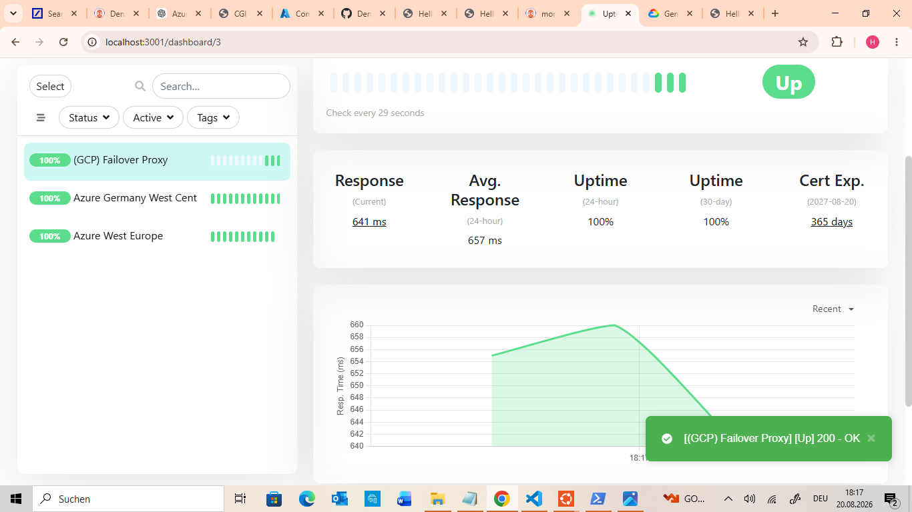
*Uptime Kuma watching all three addresses independently: West Europe and
Germany West Central directly, plus the proxy's own address as a fourth,
separate signal.*

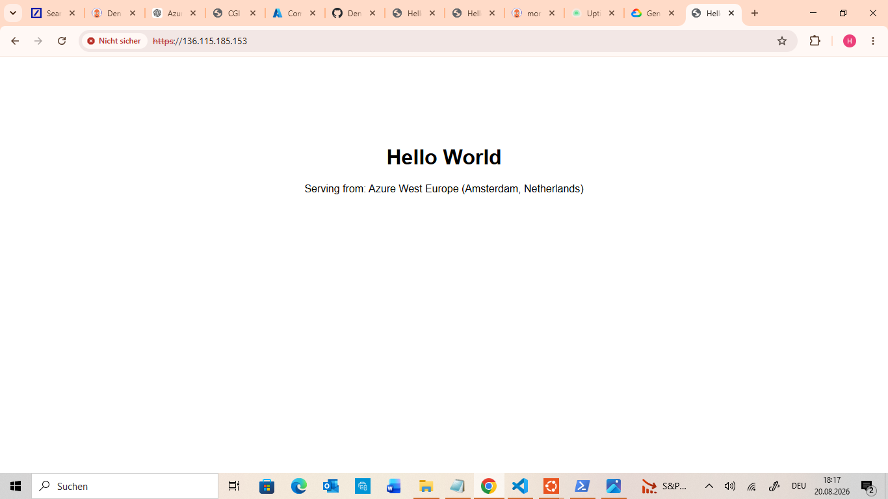
*The starting point everything else below gets compared against.*

`scripts/failover-demo.sh break` hit a real Azure constraint on the first
attempt: NSG (Network Security Group) rule priorities have to fall between
100 and 4096, and the script's original value of 90 was rejected outright.
Fixed by moving it to 105 - still below `AllowHTTPFromAnywhere`'s own 120,
so it's still evaluated first under NSG's first-match-wins ordering, just
inside the range Azure actually accepts.

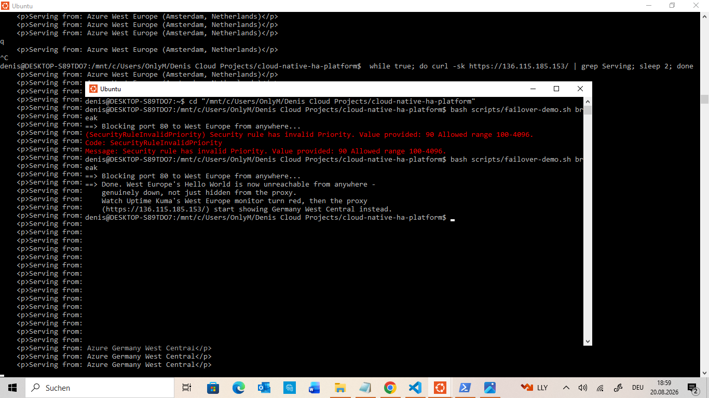
*Left in, on purpose, rather than cropped out - a wrong flag value caught
and fixed against a real API response is a more honest demonstration than
a script that only ever ran once.*

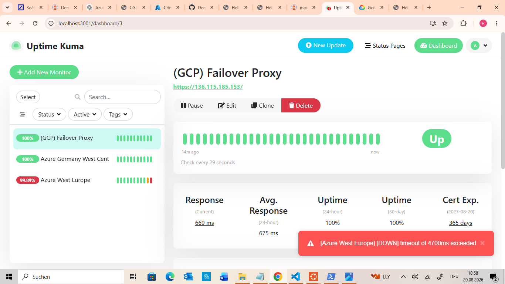
*"[Azure West Europe] [DOWN] timeout of 4700ms exceeded" - this monitor
hits West Europe directly, not through the proxy, so it has no way of
knowing the proxy even exists. It failed on its own, for the same real
reason.*

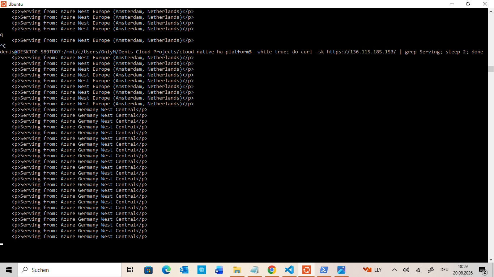
*The repeating `curl` loop's output, uncut - a long run of "Azure West
Europe," then a clean, permanent switch to "Azure Germany West Central"
the moment NGINX's passive health check (`max_fails=2`) tripped.*


*Same address, `https://136.115.185.153/`, same page structure, different
region - exactly what "the user experienced nothing, the platform rerouted
itself" looks like on screen.*

`scripts/failover-demo.sh restore` removed the NSG rule, and the same
three signals recovered on their own, in reverse, with no manual step
telling the proxy to switch back:

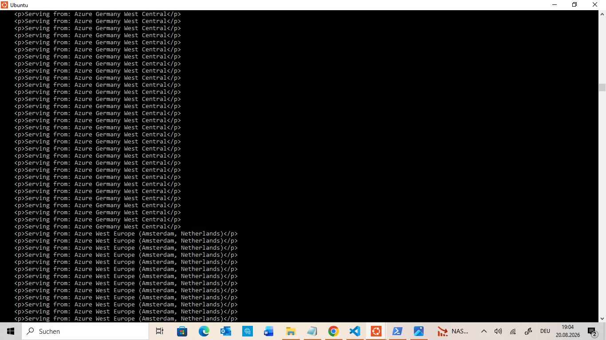
*NGINX's `fail_timeout=10s` window expired, it tried West Europe again on
its own schedule, got a real answer, and started sending traffic back -
nothing was ever manually pointed back at West Europe.*

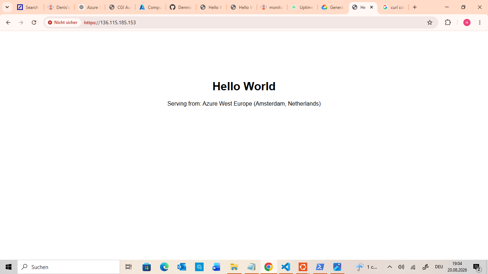
*Back to the baseline state, closing the loop.*

**Requirement 5 done** - a genuinely simulated regional failure, detected
and routed around automatically, watched live across a browser, an
independent monitoring dashboard, and a raw CLI loop, with the recovery
back to normal just as automatic as the failover itself.

### Requirement 3, finished: the live autoscaling demo

The HPA (HorizontalPodAutoscaler - the Kubernetes controller that adds or
removes copies of an app automatically based on measured load) was already
configured, but never actually watched scaling under real traffic until
this point. Baseline first, confirmed before any load started:

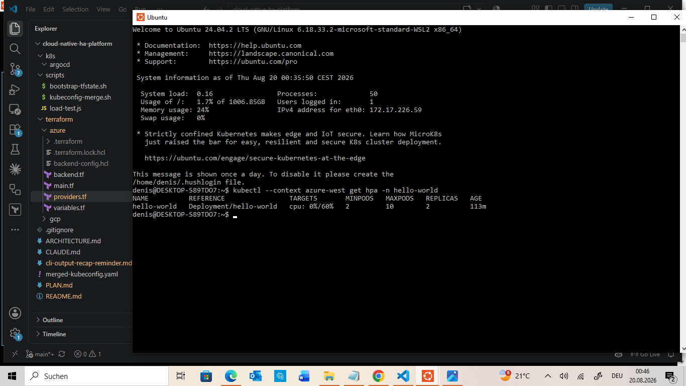
*2 replicas, 0% of the 60% CPU target - the starting point everything else
gets compared against.*

`k6` (the load-testing tool) ramping up against West Europe's real HTTPS
endpoint pushed genuine CPU load, and the HPA reacted on its own -
watched live in `k9s`, a terminal dashboard for browsing a cluster's
resources:

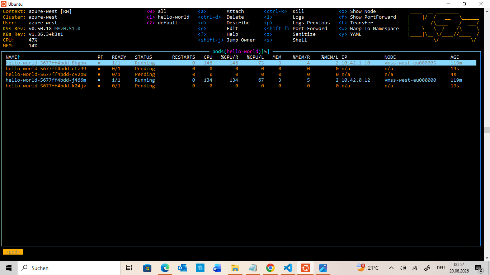
*5 pods total - 2 already `Running`, well over their CPU request (146%
and 134% of it), 3 more `Pending` as the HPA reacts.*

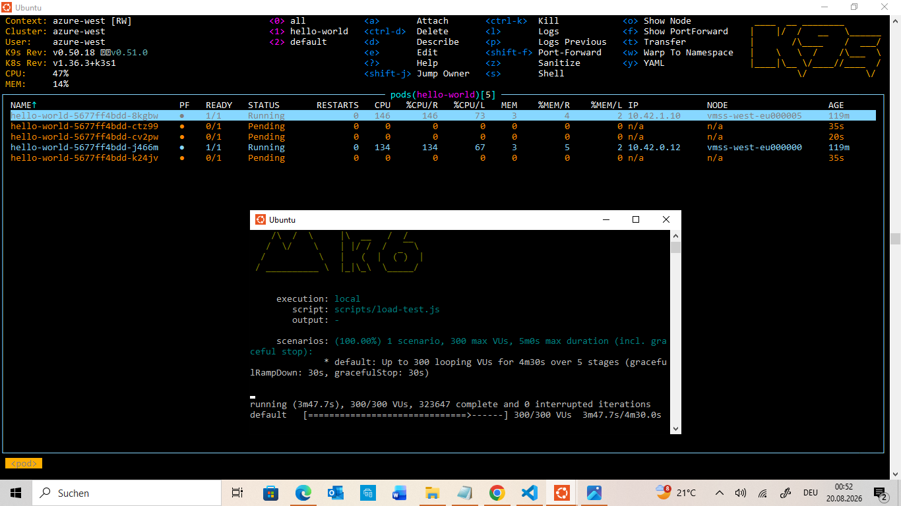
*300 virtual users, genuinely hitting the real endpoint - not staged
traffic.*

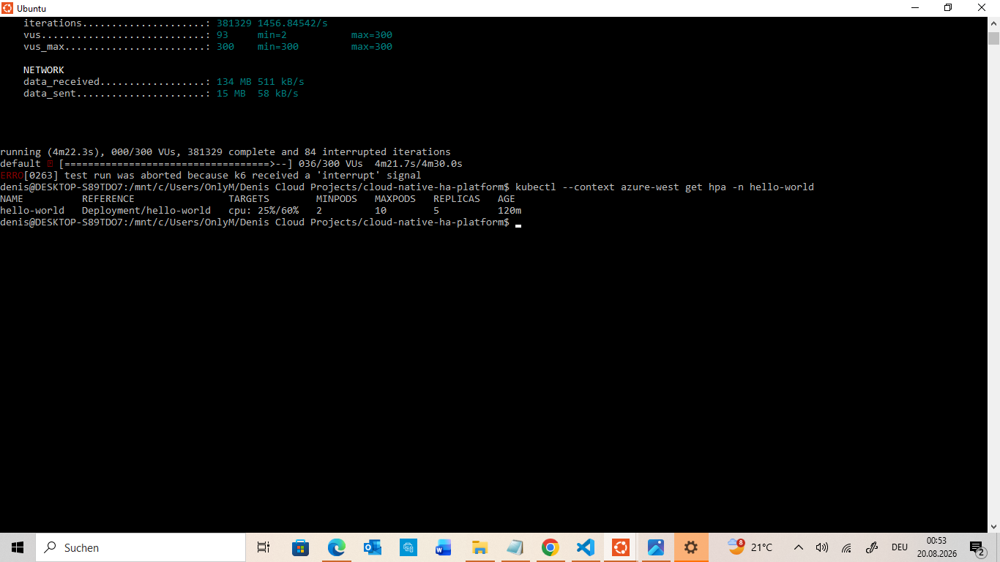
*`REPLICAS: 5`, CPU already cooling back down to 25% as the extra pods
absorb the load - k6's own numbers: 381,329 iterations, roughly 1,457
requests per second at peak.*

### Requirement 3's other half: making round-robin visible, and a real scheduling deadlock along the way

The routing itself was never in question - K3s's Service has load-balanced
across ready pods since the day it was deployed. The problem was purely
one of visibility: both `hello-world` pods in a region mount the exact
same ConfigMap as their web page, so six `curl` calls in a row would have
returned six byte-for-byte identical responses. Correct behavior,
invisible proof. The fix was `k8s/apps/hello-world/base/nginx-config.yaml`
- one extra line of NGINX config, `add_header X-Pod-Name $hostname
always;`, using NGINX's built-in `$hostname` variable, which in
Kubernetes defaults to the pod's own name. Zero application code, zero
change to the page itself - just a label on each response saying which
pod actually answered it.

Pushing that change surfaced a real scheduling problem the moment ArgoCD
tried to roll it out - both `hello-world-west-eu` and
`hello-world-germany-west` Applications went `Synced` (the cluster matched
Git) but `Degraded` (the actual pods weren't healthy), and a new pod sat
`Pending` for over half an hour:

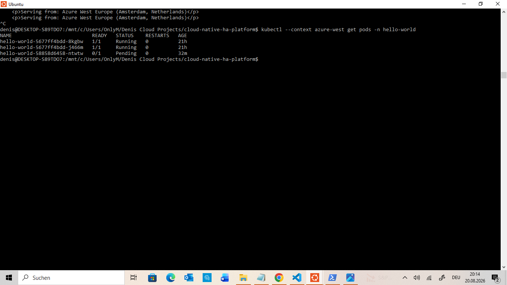
*Two old pods still `Running` (21h old), one new pod `Pending` (32m and
climbing) - the rollout was stuck, not just slow.*

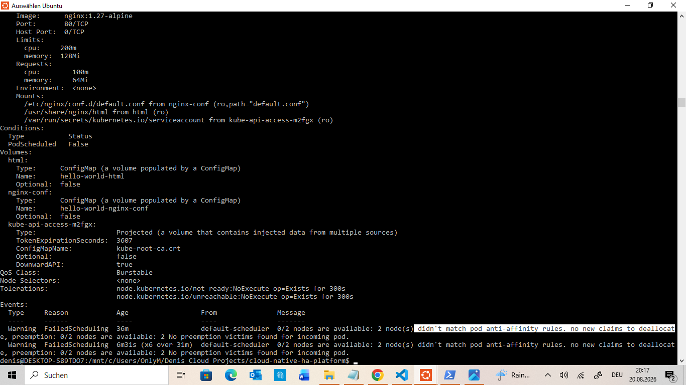
*"0/2 nodes are available: 2 node(s) didn't match pod anti-affinity
rules" - the actual reason, not a guess.*

The cause: two files disagreed with each other. `deployment.yaml`'s pod
anti-affinity was `required` - a hard rule, never two `hello-world` pods
on the same node - which was entirely correct for 2 replicas on 2 nodes.
`hpa.yaml`, separately, allowed scaling up to 10 replicas. Nobody had
checked those two numbers against each other before now: the moment a
rolling update needed a 3rd pod to exist even briefly (Kubernetes' default
strategy creates a replacement before removing the old one), there was no
third node for it to land on, and it deadlocked in `Pending` permanently,
not temporarily.

This is a cost-vs-capacity trade-off, not a mistake in the original
design - the project's "don't spend any money" constraint means the
cluster stays fixed at 2 nodes per region rather than growing to match
whatever the HPA might ask for. In a production system with an actual
budget, the correct fix is a **Cluster Autoscaler** - a separate
controller that watches for pods stuck `Pending` due to no available
node and automatically adds real VM capacity to match, closing this gap
properly instead of working around it. That wasn't built here on purpose,
for the same reason Traffic Manager and a permanent extra node weren't:
it costs real money to run. The fix that shipped instead changes two
things in `deployment.yaml`:

```yaml
strategy:
  type: RollingUpdate
  rollingUpdate:
    maxSurge: 0
    maxUnavailable: 1
```
frees a node by removing an old pod *before* scheduling its replacement,
instead of trying to add a third pod first - matching what a 2-node
region can actually deliver.

```yaml
affinity:
  podAntiAffinity:
    preferredDuringSchedulingIgnoredDuringExecution:
      - weight: 100
        podAffinityTerm: ...
```
softens the anti-affinity rule from "never" to "strongly prefer, but
allow if there's no choice" - so a scale-up past node count stacks pods
onto an already-used node rather than deadlocking. The trade-off, stated
plainly: `required` guarantees losing one node costs exactly one pod;
`preferred` doesn't - if pods end up stacked, one node failure could take
more than one down at once. For a stateless demo app with no real users,
that's a reasonable trade against a hard block on the HPA ever doing its
job.

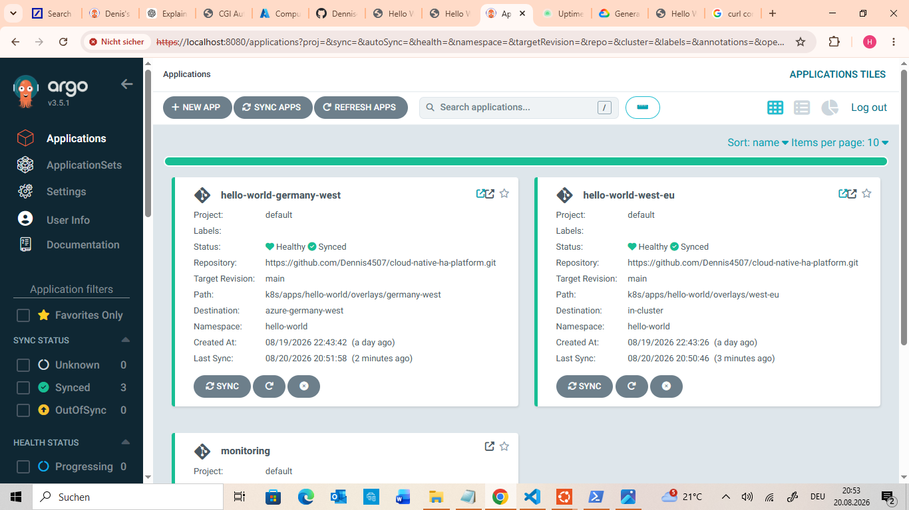
*`Healthy` and `Synced`, both regions - the same signal that caught the
problem now confirming it's gone.*

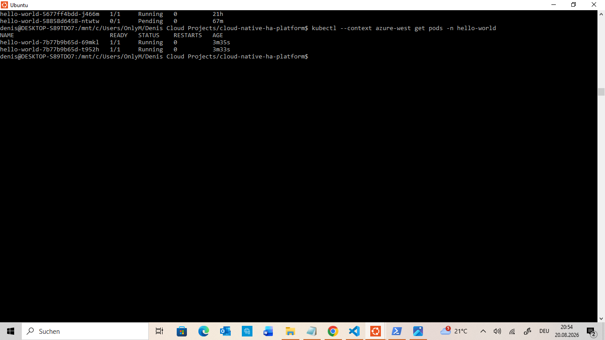
*New pod hashes, both `1/1 Running`, ages in minutes not hours - the
rolling update finally completed once it had somewhere to put the new
pod.*

For the record, the change itself:

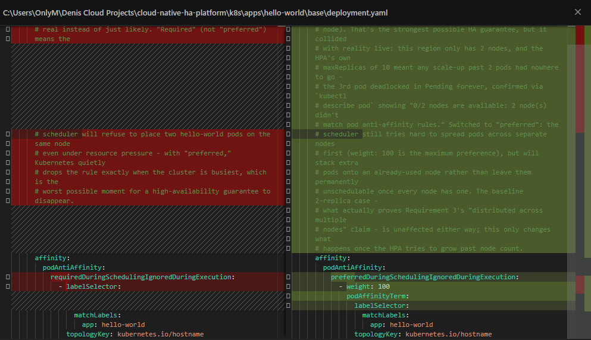

With the cluster healthy again, the round-robin proof - a temporary debug
pod, run from inside the cluster since the Service's ClusterIP isn't
reachable from a laptop directly, curling the Service and reading back the
`X-Pod-Name` header each time - came back clean on the first try: six
requests, alternating cleanly between the two existing pods every single
time.

That alone would have satisfied the requirement, but it's a stronger demo
combined with the autoscaling proof rather than shown separately: the
round-robin curl loop left running continuously (`while true`, instead of
a fixed 6 requests) in one pane, `k6` driving real load against West
Europe's public endpoint in a second, and `k9s` watching the replica count
in a third.

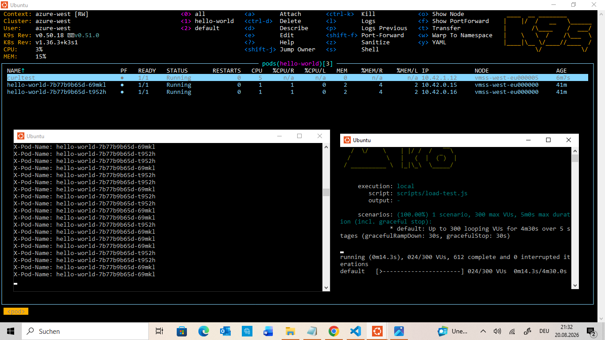
*3 pods total (2 `hello-world` + the temporary debug pod), CPU still low,
k6 at 24 of its eventual 300 virtual users - the "before" state, on
purpose, so the change afterward is obvious by comparison.*

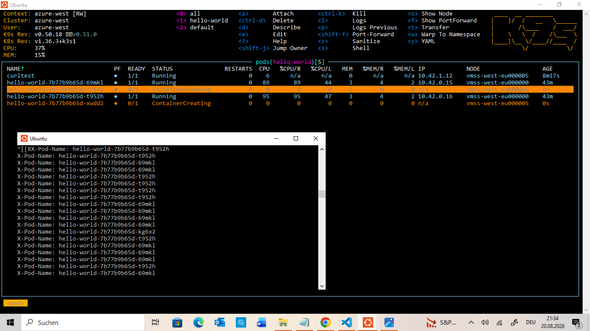
*The two original pods pushed to 89% and 95% of their CPU request - well
past the 60% target - with new pods already `ContainerCreating` in
response. This is the HPA reacting to genuine measured load, not a timer.*

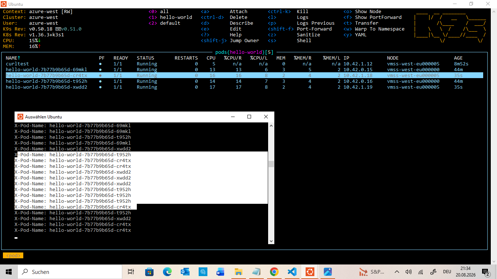
*The curl loop's output (right pane) is no longer alternating between 2
names - it's cycling through 4, matching the 4 `hello-world` pods now
`Running` in `k9s` (left pane). The same scale-up, watched from two
independent angles at the same moment.*

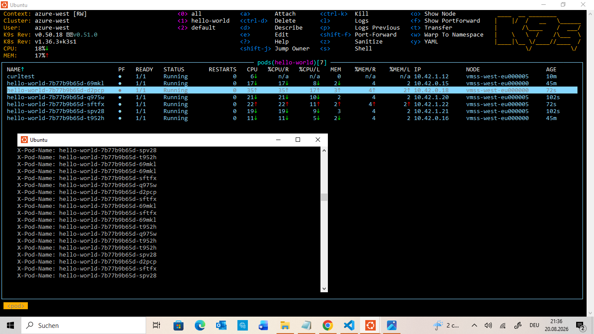
*7 pods total (6 `hello-world` + the debug pod), and the curl loop rotating
across all 6 real pod names - `spv28`, `t952h`, `69mkl`, `sftfx`, `q975w`,
`d2pcp` - genuine round-robin across a genuinely autoscaled fleet, both
mechanisms proven live, at the same time, from the same commands.*

**Requirement 3 is fully done.** Not just "the HPA can add pods" and
separately "the Service can route between pods," shown one after another
- one continuous run where the panel watches the pool of pods grow under
real load and watches every new pod join the routing rotation the moment
it's ready, live.

### Uptime Kuma, live and watching both regions

Requirement 6 asks for a description of how availability would be
assessed - Uptime Kuma is what turns that description into something
actually watched happening, not just written down. Deployed the same way
as everything else in this project now: through ArgoCD, from Git, not a
manual `kubectl apply`.

Two monitors, one per region, each checking that region's real public
HTTPS endpoint directly - with one setting that genuinely mattered:
"Ignore TLS/SSL error for HTTPS websites" has to be switched on, since
both regions use self-signed certificates Uptime Kuma has never seen
before and would otherwise treat as a failure. The check interval and
timeout were also both shortened from their defaults (30 seconds instead
of 60, a 5-second timeout instead of 24) specifically for the live
demo - the endpoints themselves respond in well under a second when
healthy, so there's no reason to make the panel wait through a generous
default timer to see a real failure reflected on screen later, during the
Requirement 5 failover demo.

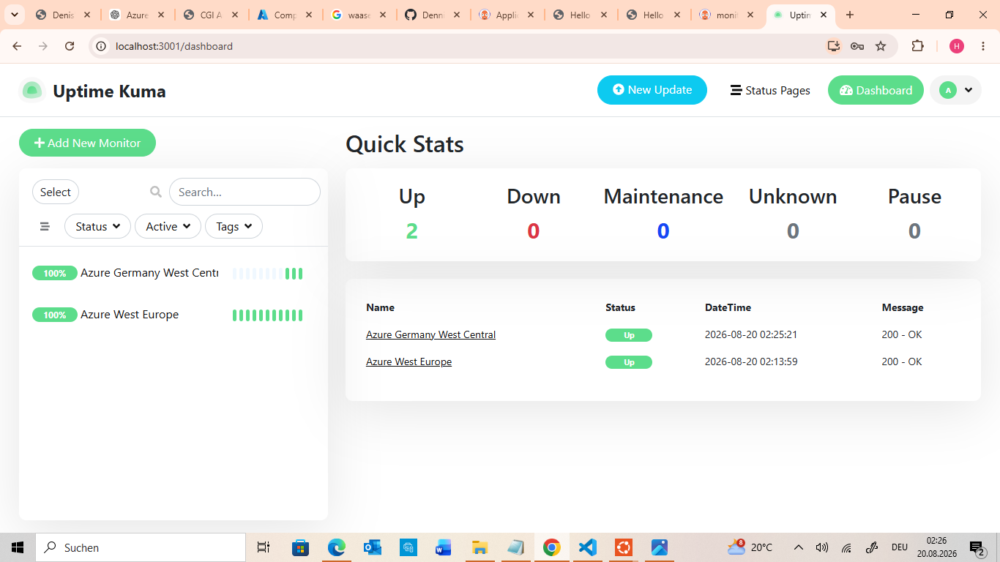
*Both monitors `Up`, `200 - OK`, checked directly against the real
endpoints - not a mockup.*

A third monitor, `(GCP) Failover Proxy`, watches the proxy's own address
independently of the two region monitors above - see the Requirement 5
section for what it caught during the live failover demo.

### The GCP showcase (cherry #2)

GCP (Google Cloud Platform) is the one deliberate differentiator tied
directly to the actual job title this project was written for - the
point being proven is "the same Terraform and Ansible pattern works
identically on a completely different cloud provider," not adding a third
region to the failover story. This VM never runs Hello World and is never
a failover target - it's its own separate showcase, and it also ends up
hosting Requirement 5's proxy as an independent process, for reasons
already covered above.

**Getting the account itself set up** took its own sequence: a fresh GCP
project, isolated from an existing unrelated project already on the same
account (same reasoning as the separate Azure sandbox identity earlier),
the Compute Engine API enabled, and a billing account linked - required by
Google even to stay entirely within the Always Free tier, not itself a
sign of anything being charged.


*A dedicated project, isolated from other work on the same account, with
billing linked - required before Google allows almost anything, free tier
or not.*

**Authenticating Terraform to actually use the account** turned out to be
the first real snag. `gcloud auth application-default login` kept
completing "successfully" while quietly granting a narrower permission
scope than requested - confirmed only once an actual `terraform apply`
failed on it directly:


*`ACCESS_TOKEN_SCOPE_INSUFFICIENT` - the credential file existed and
looked valid, but didn't actually carry the permission Terraform needed
to create anything.*

The fix was requesting exactly one scope explicitly (`cloud-platform`)
instead of the default bundle of several, which stopped Google's consent
screen from silently narrowing what got granted. Once that was sorted,
the same remote state backend already built for Azure could just be
reused - a different `key` (the filename within that same storage
account) keeps this project's state separate from Azure's, without
needing an entirely separate GCP-native backend just for one small VM.


*Same Azure storage account, same backend, a different key - no reason to
build a second one just because the resources being tracked happen to be
on a different cloud.*


*Network, firewall rules, a dedicated identity with no key file, a static
IP, and the VM itself - all live.*

**Then Ansible, same roles, unmodified:**


*One new entry, in the same `k3s_server` group as both Azure regions - a
single K3s server is already a complete cluster on its own, no worker
node needed.*


*Before touching anything else - confirming SSH actually works.*


*The same `common` and `k3s-server` roles already proven on Azure,
pointed at a different cloud's API entirely - zero GCP-specific code in
either role.*


*Same script, same reasoning, one more region added to what it merges.*

**Then the second real incident** - `kubectl` against the new cluster
failed with a TLS handshake timeout, a different and more interesting
problem than a firewall block (already ruled out: the IP matched, and a
raw TCP connection to the port succeeded). The actual cause was visible
directly in K3s's own logs on the node:


*Database queries that should take milliseconds taking 8, 38, even over
60 seconds - K3s's own components failing to reach K3s's own API in time,
which is exactly why a request from outside also timed out.*


*Not a CPU or memory problem - `%wa` (I/O wait) confirms the disk itself
was the bottleneck.*

The root cause: the Always Free tier's storage allowance is specifically
standard (HDD, spinning-disk) persistent disk - confirmed directly from
Google's own documentation before considering any fix, since switching to
faster storage would have introduced real, ongoing cost. K3s's internal
datastore does frequent small writes, which is a poor fit for that
specific kind of disk - and every extra default component (Traefik,
K3s's built-in ServiceLB) added its own constant reconciliation traffic
on top of an already-struggling disk. Neither is needed here, since this
showcase never runs an app requiring an ingress controller or a
LoadBalancer Service - so both got disabled, specifically for this one
node, and K3s was cleanly reinstalled.


*`%wa` dropped from 91.8% to 0.0% - confirmed before even attempting
`kubectl` again.*


*All three clusters - two Azure regions and this one - now live in a
single merged kubeconfig, each reachable by its own context.*

### Checking the cost claim, not just asserting it

The brief's "don't spend any money" rule deserves real evidence, not just
a paragraph promising it was followed.

**GCP is genuinely €0.00**, confirmed directly in Google Cloud's own
billing reports for the `cgi-challenge-ha-platform` project, covering the
full build window:


**Azure is not €0** - worth saying plainly rather than hiding it. Cost
Management, scoped to `rg-ha-platform`, shows real charges - the two
running VMSS instances (`vmss-...eu west`, `vmss-...de west central`) are
the largest line items, plus small amounts for the Load Balancers' Public
IPs and disks:


That's not a contradiction of the "spend zero" rule, for a specific
reason: GCP's Always Free tier is a genuinely permanent, zero-cost offer
for one small VM. Azure has no equivalent free tier at the scale this
project actually needs - a real Kubernetes cluster, in two regions, is
Requirement 1 and Requirement 5's literal graded deliverable, not an
optional extra the brief's rule was written to rule out. The brief's own
wording targets "infrastructure services, domains, or certificates" -
avoidable extras like a purchased domain or a paid DNS failover service,
both of which this project genuinely avoided (see the DNS research table
above). Running compute for the actual Kubernetes cluster isn't in that
category; it's the thing being graded.

**Was there a cheaper VM size (Azure calls this a SKU - Stock Keeping
Unit) that could have worked instead?** Yes, and it was tried first -
`terraform/azure/variables.tf` already documents this: `Standard_B2s` (2
vCPU, 4 GB memory) was the original choice specifically because it's the
smallest size that comfortably runs Kubernetes, chosen to keep cost close
to zero. Azure reported no available capacity for it on this subscription,
in either West Europe or North Europe - a real limitation hit live during
the build, not a preference. `Standard_D2s_v3` replaced it: not the
cheapest possible size, but a mainstream one with no capacity restriction,
and with more memory (8 GB instead of 4 GB) as a side effect.

Checked against Azure's own published retail pricing for West Europe:
`Standard_B2s` is **$0.048 per hour**; `Standard_D2s_v3` is **$0.12 per
hour** - two and a half times more expensive, not a marginal difference.
Had B2s actually been available, the real Azure total shown above would
likely have landed somewhere around €4-5 instead of roughly €12, scaling
down proportionally with the hourly rate. The gap between the two isn't a
design choice; it's the cost of a capacity constraint that had no
workaround on this specific subscription. What *is* a design choice, and
what kept even the D2s_v3 total this low, is deallocating the VMs between
build sessions rather than leaving them running continuously.

### Requirement 5's traffic router, and a six-hour lesson in checking my own work

The same GCP (Google Cloud Platform) showcase VM (Virtual Machine) also runs
Requirement 5's actual traffic router - an NGINX reverse proxy, installed as
a plain systemd service, deliberately independent of the K3s cluster running
alongside it on the same machine. It sits in front of both Azure regions:
West Europe as the primary backend, Germany West Central as a passive-health-
checked backup. If West Europe stops answering, NGINX's own `max_fails` /
`fail_timeout` settings mark it down and start sending traffic to Germany
West Central instead, with no DNS change and no manual step involved.


*All three `kubectl` contexts healthy, and a direct `curl` to the GCP node's
IP already returning `200 OK` from the NGINX that ships with a fresh Ubuntu
image - confirmed clean before the proxy role touched anything.*

Installing that proxy turned into the longest single debugging session of
this whole build - close to six hours, across three separate but related
problems. Documenting it in full because the actual lesson (the third
problem) is more valuable than the demo itself: a clean architecture doesn't
protect you from a sloppy operating habit.

**Problem 1 - the install itself hung.** The Ansible run reached the
`Install NGINX` task and simply stopped producing output.


*No error - the play just stopped advancing after this task started.*

`ps aux | grep -i apt`, run over a second SSH (Secure Shell) session against
the same node, found the actual cause: Ubuntu's own background
`update-notifier/apt-check` process - the thing that silently checks for
available package updates - sitting in Linux process state `D` (marked
`DN+` in the listing below). A `D`-state process is in *uninterruptible
sleep*: the kernel has it blocked on I/O (Input/Output - in this case, disk
reads or writes) that hasn't completed yet, and **`kill -9` cannot touch it**
- `SIGKILL` is delivered to the process, not to the kernel operation it's
waiting on, so the process simply cannot respond to any signal until that
I/O either finishes or the machine reboots. This is the same slow
`pd-standard` (HDD) disk from the earlier I/O-wait incident above, showing
up in a new place: this time it wasn't K3s's own database being slow, it
was Ubuntu's routine update check, and it happened to be holding the exact
same `apt`/`dpkg` package-manager lock that `apt-get install nginx` also
needed.


*`DN+` in the `STAT` column - uninterruptible sleep. This process cannot be
killed; only a reboot (or the I/O finally completing on its own) clears it.*

**Problem 2 - the first fix wasn't the whole fix.** Masking the systemd
timers that normally trigger `apt-check` (`apt-daily.timer`,
`apt-daily-upgrade.timer`, `motd-news.timer`) and rebooting looked like a
complete fix - `systemctl disable --now` reported success, cleanly removing
each timer's symlink. But retrying the playbook stalled again, this time
even earlier, at `Gathering Facts` - before NGINX's own task had even
started. Something *other* than those three known timers was still
triggering the same slow-disk contention on every boot, most likely a
login-banner script or a `cloud-init` step running independently of
systemd's timer system. Rather than keep hunting for that exact remaining
trigger with the clock running, the fix that actually shipped
(`ansible/roles/proxy/tasks/main.yml`) goes one level more direct: `chmod
0000` on `/usr/lib/update-notifier/apt-check` itself, so the program cannot
be executed *at all*, however it gets called. Removing every permission
from the binary makes the question "what's still triggering it?" stop
mattering.


*The masking command succeeded (three timer symlinks removed), and the
retry got further into the play before stalling again - proof the first fix
was real but incomplete, not proof it had failed outright.*

**Problem 3 - the actual root cause, and the one that mattered most.**
After the `chmod 0000` fix, the playbook was retried several more times
over the next hour without any of those retries clearly finishing or
clearly failing - each one looked "stuck" in roughly the same place, which
looked at the time like the same disk problem recurring yet again. It
wasn't. Running `ps aux | grep ansible-playbook` - a check I should have
made standard *before* the very first retry, and didn't - showed two
separate `ansible-playbook` processes running at once, started thirteen
minutes apart, both targeting the same node with `--limit gcp-showcase`.
Each retry had been launched without first confirming the previous one had
actually exited, and every one of those overlapping processes was fighting
the others for the exact same remote `apt`/`dpkg` lock - manufacturing
fresh contention on top of a disk that, by this point, had already been
fixed. Denis caught this himself, correctly, mid-session: *"dont we first
need to check that no other ansible playbook is running? you keep making me
run playbook but not check thats how we ended up with three playbooks."*
That's now a standing rule for every retry going forward, on this project or
any other: check `ps aux | grep ansible-playbook` first, and `pkill -9 -f
ansible-playbook` to clear any leftover process, *before* launching another
one - not after the second or third hang.


*The actual root cause of most of this session's apparent "hanging" -
`ps aux | grep -i apt` shows a clean node with nothing stuck; the real
problem was one command away, in `ps aux | grep ansible-playbook`.*

Once those duplicate processes were killed and the retry was launched alone,
the play ran straight through without a single further pause.


*`PLAY RECAP ... ok=22 changed=6 unreachable=0 failed=0` - the same role
that stalled for hours completed cleanly once it was only running once.*


*`curl -sk https://136.115.185.153/` - the `-k` flag accepts the proxy's own
self-signed certificate, the same free, zero-dependency approach used by
`cert-manager` inside each K3s cluster - returning West Europe's Hello World
HTML, proxied end to end over TLS.*

The honest read on the six hours: the first two problems were real and
worth documenting (a slow Always-Free disk can wedge an unrelated apt
install through nothing more exotic than an OS's own background update
checker), but they were solved within the first ninety minutes. The other
four-plus hours were spent fighting a problem I had personally caused by
retrying without checking - a reminder that in operations work, an
unverified assumption ("that process must have exited by now") costs far
more time than the two seconds it takes to actually check.

## Screenshots

90 screenshots live in [`docs/screenshots/`](docs/screenshots/), numbered in
build order and referenced throughout this document - every one of them is
real output from this actual build, not a mockup. Rather than duplicate that
navigation here, see the [Map](#map--jump-straight-to-what-you-need) at the
top for the fastest way to find a specific one, by requirement or by
incident.

- [x] Requirements 1-5: all live, all demoed, all screenshotted
- [x] Requirements 6-8: written concept docs, each with real supporting
      evidence rather than staged examples - see
      [`requirement-6-monitoring-concept.md`](requirement-6-monitoring-concept.md),
      [`requirement-7-backup-recovery-concept.md`](requirement-7-backup-recovery-concept.md),
      [`requirement-8-dns-debug-runbook.md`](requirement-8-dns-debug-runbook.md)
- [x] Every real incident hit during the build, kept in rather than edited
      out - see the incidents table in the Map
- [x] The cost claim checked against real billing data, not just asserted

## How this is being built

The day-to-day plan, including exactly what's done and what's next, lives in
[PLAN.md](PLAN.md). The deeper architecture reasoning is in
[ARCHITECTURE.md](ARCHITECTURE.md) (currently being rewritten to match the
simplified plan). Every piece of infrastructure code has its own explanatory
comments written directly alongside it, so the reasoning for a decision
lives right next to the decision itself. [docs/cli-output-recap-reminder.md](docs/cli-output-recap-reminder.md)
explains the recurring tool output shown throughout this document - the
Ansible, Terraform, and kubectl fields that appear in screenshot after
screenshot - field by field.

## Author

Denis Riungu — [LinkedIn](https://linkedin.com/in/denis-riungu)
