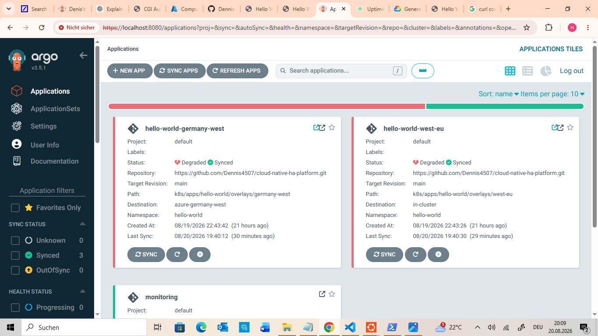

# Monitoring concept — Requirement 6

> CGI's brief asks: *"Describe in high-level terms how you intend to assess
> the availability of the relevant service endpoints of your solution, and
> which cloud-native approach might be appropriate."* This is explicitly a
> description requirement, not a "deploy a full observability stack"
> requirement — a clear, well-reasoned answer earns full credit on its own.
> What follows is that answer, backed by a live, working, lightweight
> version of it, and a comparison against what a larger production system
> would add on top.
>
> [Verify against the full brief →](CGI-Challenge-Brief.md#requirement-6)

## What "the relevant service endpoints" actually are here

Three addresses matter in this platform, and each one answers a different
question if it stops responding:

- **West Europe's Hello World endpoint** — is the primary region serving
  real traffic?
- **Germany West Central's Hello World endpoint** — is the failover target
  itself healthy, independent of whether it's currently receiving traffic?
- **The GCP (Google Cloud Platform) proxy's own address** — is the thing
  routing between the two regions for Requirement 5 itself reachable?

All three are checked the same way: an HTTP (HyperText Transfer Protocol)
request against the real public URL, on a repeating interval, checking for
both a successful response and a valid TLS (Transport Layer Security)
handshake.

## Two layers, not one, and why both are needed

Availability monitoring in this platform happens at two genuinely
different levels, and the distinction matters enough to design around
deliberately rather than treat as two disconnected tools that happen to
both exist.

**External synthetic checks — Uptime Kuma.** This checks the platform from
the outside, the same way an actual visitor's browser would: does this
exact public URL respond with `200 OK` over valid HTTPS, checked every 29
seconds, with TLS certificate errors for the self-signed certificates
deliberately ignored (a setting that has to be switched on, since Uptime
Kuma otherwise treats an unrecognized certificate as a failure).


**Internal resource health — ArgoCD's Healthy/Degraded status.** This asks
a completely different question, checked from inside the cluster's own
control plane rather than over the public internet: are the Kubernetes
resources actually in the state they're supposed to be in? It has no idea
whether the public internet can reach anything at all - it only knows
whether pods, Deployments, and Services match what's declared in Git and
are functioning correctly.

**These two layers caught two different real incidents during this build,
which is a stronger argument for pairing them than any hypothetical would
be.** When a pod-scheduling deadlock happened (documented in the README's
Requirement 3 section - a rolling update stuck a new pod in `Pending`
forever because of an anti-affinity/replica-count mismatch), ArgoCD showed
both regional Applications `Degraded` immediately:



Uptime Kuma, at the exact same time, showed nothing wrong at all - and
correctly so. The 2 original pods were still `Running` and still serving
every real request; only a 3rd, *additional* pod was stuck. From outside
the cluster, the website never went down for a second, so an external
check had genuinely nothing to report. If Uptime Kuma were the only
monitoring layer, this incident would have gone completely unnoticed until
the next deploy failed the same way, or until capacity ran out. That's the
whole argument for the second layer, made concretely rather than
theoretically:


The reverse case is just as real: during the Requirement 5 failover demo,
blocking West Europe's port 80 made Uptime Kuma's West Europe monitor go
red within one or two check intervals - a failure ArgoCD's internal health
view would never have caught, since every Kubernetes resource in that
cluster stayed perfectly healthy the whole time. The pods were fine; the
network path to them from outside was not.


**The pairing, stated plainly:** external checks answer "can a real user
reach it," internal checks answer "is it actually correct underneath."
Neither one substitutes for the other - each catches failures the other
is structurally blind to.

## Which cloud-native approach fits, and what "cloud-native" actually means here

"Cloud-native" describes *how* software is built and run - containerized,
deployed to Kubernetes, managed declaratively - not a requirement that the
tool be a specific cloud provider's own branded product. Uptime Kuma
qualifies: it's a container, deployed through GitOps (a practice where a
Git repository is the single source of truth, with ArgoCD continuously
reconciling reality to match it) the same as everything else in this
platform. Azure Monitor is a different flavor of the same idea - a fully
managed service the cloud provider runs for you, instead of something you
deploy yourself. Both are valid answers here; they sit at different points
on a "do it yourself" versus "let the provider do it" spectrum, and the
right choice depends on scale and budget, not which one is more correct.

**Uptime Kuma was the right-sized choice for this specific challenge:**
one small container, deployed via the same ArgoCD pipeline as everything
else, live in minutes, zero cost, and expressive enough to prove the
concept convincingly on a shared screen. For a production system with a
real budget and a real on-call rotation, two more capable options exist,
each solving a different limitation of a single self-hosted dashboard:

- **Azure Monitor's availability tests** run the same basic check - a
  periodic HTTP probe against a URL - but from multiple real Azure
  datacenters around the world simultaneously, rather than from one single
  location. That matters because a check running from only one place can't
  distinguish "the site is down" from "the network path from this one
  location is down" - a genuinely different failure. Azure Monitor also
  plugs directly into Azure's own alerting: an "action group" can email,
  SMS, or page an on-call engineer automatically the moment a check fails,
  closing the loop from detection to notification without any extra
  wiring.
- **Prometheus with `blackbox-exporter`, visualized in Grafana** is a
  different shape of answer. `blackbox-exporter` does the actual probing
  (HTTP, TCP, and more). Prometheus scrapes it on a schedule and stores
  every result as time-series data - numbers over time, not just up/down.
  Grafana turns that history into dashboards, and Prometheus's own
  `Alertmanager` routes alerts based on trends, not just a single failed
  check. It's more powerful than Uptime Kuma because it remembers history
  and can alert on patterns ("response time has climbed for 20 minutes
  straight" is a useful alert Uptime Kuma can't express) - but it's three
  separate components to run and keep working together, not one.

Neither was built live here - not because they're the wrong answer, but
because a "describe in high-level terms" requirement doesn't need a second
monitoring stack running just to prove the concept is understood. Uptime
Kuma already demonstrates the underlying idea live: repeating synthetic
checks against real endpoints, correctly telling "up" from "down." This
write-up is where the bigger, production-scale version gets its due,
without a second live system to keep healthy for the presentation.

## Closing the loop: detection to notification

A check that only ever gets *looked at* isn't monitoring, in any real
sense - it's a screen someone has to remember to check. The natural next
step, not yet built as of this write-up, is wiring Uptime Kuma's built-in
notification support (it ships with email/SMTP support out of the box, no
custom code needed) so a failing check sends an actual email rather than
only changing a color on a dashboard. That closes the gap between MTTD
(Mean Time To Detect - the time between a failure happening and someone
finding out about it) and MTTR (Mean Time To Recovery, covered in
`requirement-7-backup-recovery-concept.md`) - right now, MTTD depends on a human looking
at the dashboard; a real notification makes it independent of that.

## Where these tools actually live, for reference

Both Uptime Kuma and ArgoCD run as pods (Kubernetes' actual scheduling
unit - here, each pod holds exactly one container) in West Europe only,
never in Germany West Central. That's deliberate for both, for related
reasons: ArgoCD manages both clusters remotely over each one's Kubernetes
API server, rather than running a separate copy in each region. Uptime
Kuma doesn't need to physically sit in Germany West Central to check its
endpoint either - it just sends an HTTP request over the internet to
whatever address it's configured with, the same as a browser anywhere else
in the world would.

Reached locally via `kubectl port-forward`, which connects to a Service,
which in turn routes to whichever pod is currently running it:

```bash
kubectl --context azure-west port-forward svc/uptime-kuma -n monitoring 3001:3001
# then: http://localhost:3001

kubectl --context azure-west port-forward svc/argocd-server -n argocd 8080:443
# then: https://localhost:8080
```
