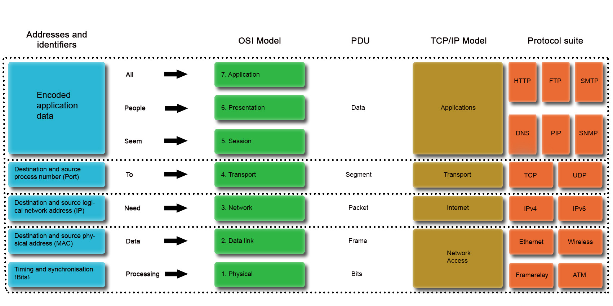
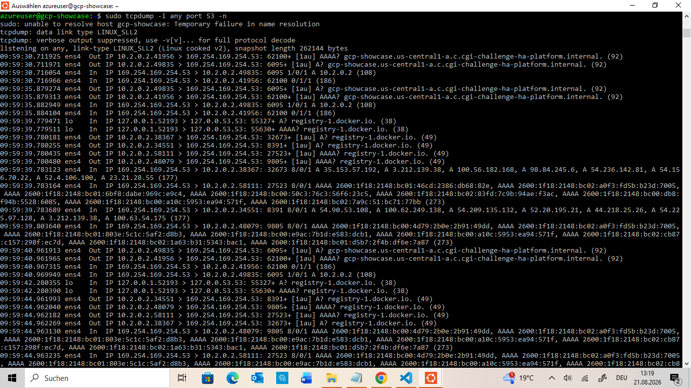

# Infrastructure debugging: Requirement 8

> CGI's brief asks: *"Let's assume one of your AKS nodes experiences DNS
> hiccups. Find a way to debug and analyze the network packets on the
> node. Explain why you have chosen this method."* AKS is Azure
> Kubernetes Service, Azure's managed Kubernetes. Like Requirements 6
> and 7, this asks for a description. A clear, well-reasoned methodology
> earns full credit.
>
> [Verify against the full brief →](CGI-Challenge-Brief.md#requirement-8)

## The mental model

For DNS and connectivity problems, the TCP/IP model is a useful
framework: work down from the application, through transport, IP
connectivity, and the network interface. It helps find *where* a
failure is, instead of guessing which command to run first. The steps
below follow that order, starting broad, and only reaching for
packet-level analysis once the layers above stop giving new
information.


*Above: a reference from earlier CCNA (Cisco Certified Network
Associate) study, not something built for this demo. DNS and `tcpdump`
both sit at different layers here. DNS is an Application-layer
protocol; `tcpdump` sees everything below it, all the way down to
Network Access, which is exactly why it can catch a failure DNS's own
error messages can't explain on their own.*

## 1. Application layer: what's actually visible

Start with `kubectl get pods`. A pod stuck in `ImagePullBackOff`,
`CrashLoopBackOff`, or an app reporting it can't reach something, is
the symptom, not yet the diagnosis. `kubectl describe pod` usually adds
the next clue: an event message naming the failure. The word "lookup"
or "resolve" points specifically at DNS, rather than a rejected
connection or a missing resource.

## 2. Rule out the biggest possible cause

Before assuming this is one node's problem, check if DNS is healthy
cluster-wide: `kubectl get pods -n kube-system -l k8s-app=kube-dns`. If
CoreDNS were down, every pod would fail the same way, a much bigger
incident. If CoreDNS is healthy, the problem is narrower than that.

## 3. Check the node's own configuration

`cat /etc/resolv.conf` shows which DNS server the node is set up to
use. On most Linux systems this is `127.0.0.53`, a local address, not a
real server, because a local service (`systemd-resolved`) forwards
queries to the real one. A correct-looking file only proves the
*intent* is right. Configuration and actual connectivity are different
questions.

## 4. Packet-level analysis, and why this method

Configuration shows what a node is *supposed* to do, not what's
actually happening on the wire. That's the gap packet capture closes,
and why `tcpdump` is the right tool here:

```bash
sudo tcpdump -i any port 53 -n
```
`-i any` watches every interface, `port 53` filters to DNS traffic, and
`-n` stops `tcpdump` doing its own DNS lookups while it runs.


*Above: real DNS traffic, loopback queries to `127.0.0.53` (the local
`systemd-resolved` stub described above), and the actual upstream
queries to `169.254.169.254` it forwards to.*

This can show something no error message can: a query leaving the node
and a reply genuinely arriving, while the pod still fails. That's not a
contradiction. `tcpdump` sees a packet *before* a firewall decides
whether to keep it. A reply can reach the network card and still never
reach the application if something drops it right after. Packet capture
is the only method that can show that gap, which is why it earns a
place here instead of being the first thing reached for.

## 5. Correlate with the actual cause

If packets arrive but never reach the application, the next question is
what's discarding them: `sudo iptables -L INPUT -n -v` lists the node's
firewall rules with a packet counter for each. A non-zero counter next
to a rule blocking port 53 is concrete evidence, not a guess.

## 6. Fix and recovery

Fixing the rule doesn't need the affected pod to be restarted or
recreated. `kubelet` (Kubernetes' node agent) already retries a failed
pull or connection on its own. Watching `kubectl get pods -w` after the
fix shows the workload recover by itself. The platform corrects itself
once the real problem is gone.

## Bridging this back to CGI's actual scenario

CGI's scenario names an AKS node specifically, and this build uses
self-managed K3s, worth saying plainly. The commands above assume a
shell on the node, which on a plain VM means SSH. AKS worker nodes
aren't SSH-reachable by default; Azure keeps them off the public
internet. The AKS-native equivalent is `kubectl debug node/<node-name>`,
which opens a shell into the node without SSH at all. Once inside,
every command above works the same way, because it's still the same
Linux node underneath. Only how you get a shell changes between a
self-managed cluster and AKS. The debugging method itself doesn't.
